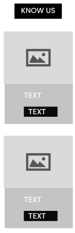

   

<h1 align="center">Universidad Peruana de Ciencias Aplicadas</h1>

<h2 align="center">Ingeniería de Software</h2>

<h3>Aplicaciones Web - TB1</h3>
<ul>
   <li> <strong>Sección:</strong> SW52 </li>
   <li><strong>Docente:</strong> Angel Augusto Velasquez Nuñez</li>
   <li><strong>Ciclo:</strong> 2023-02</li>
   <li><strong>Nombre de la Startup:</strong> TechOps</li>
   <li><strong>Nombre del producto:</strong> Nourishify</li>
</ul>

<h3>Integrantes</h3>

| Alumnos                         |   Codigo   |
| :------------------------------ | :--------: |
| Adrian Gonzalo Melgar Takahashi | U201819465 |
| Diego Jose Acuña Gomez          | U20201C794 |
| Diego Miguel Ramirez Ortega     | U202123548 |
| José Diego Huamani Sánchez      | U202110458 |
| Sebastian Alonso Bustinza Muñoz | U202123362 |

 
<h1 align="center">Nourishify</h1>
 

<ul style="list-style-type: none;">
   <li><h1><a href="#capitulo-1">Capítulo I: Introducción</a></h1></li>
   <li><h3><a href="#startup-profile">1.1. Startup Profile</a></h3></li>
   <ul>
      <li><h3><a href="#descripcion-startup">1.1.1.  Descripción de la Startup</a></h3></li>
      <li><h3><a href="#perfiles-integrantes">1.1.2. Perfiles de integrantes del equipo</a></h2></li>
   </ul>
   <li><h3><a href="#solution-profile">1.2. Solution Profile</a></h3></li>
   <ul>
      <il><h3><a href="#antecedentes-y-problematica">1.2.1 Antecedentes y problemática</a></h3></il>
      <il><h3><a href="#lean-ux-process">1.2.2 Lean UX Process</a></h3></il>
      <ul>
         <il><h3><a href="#lean-ux-problem-statements">1.2.2.1. Lean UX Problem Statements</a></h3></il>
         <il><h3><a href="#lean-ux-assumptions">1.2.2.2. Lean UX Assumptions</a></h3></il>
         <il><h3><a href="#lean-ux-hypothesis-statement">1.2.2.3. Lean UX Hypothesis Statements</a></h3></il>
         <il><h3><a href="#lean-ux-canvas">1.2.2.4. Lean UX Canvas</a></h3></il>
      </ul>
   </ul>
   <il><h3><a href="#segmento-objetico">1.3. Segmentos objetivo</a></h3></il>

<il><h1><a href="#capitulo-2">Capítulo II: Requirements Elicitation & Analysis</a></h1></il>
<il><h3><a href="#competidores">2.1. Competidores</a></h3></il>

   <ul>
      <il><h3><a href="#analisis-competitivo">2.1.1. Análisis competitivo</a></h3></il>
      <il><h3><a href="#estrategias-y-tacticas-frente-a-competidores">2.1.2. Estrategias y tácticas frente a competidores</a></h3></il>
   </ul>
<il><h3><a href="#entrevistas">2.2. Entrevistas</a></h3></il>
   <ul>
      <il><h3><a href="#diseño-de-entrevistas">2.2.1. Diseño de entrevistas</a></h3></il>
      <il><h3><a href="#registro-de-entrevistas">2.2.2. Registro de entrevistas</a></h3></il>
      <il><h3><a href="#analisis-de-entrevistas">2.2.3. Análisis de entrevistas</a></h3></il>
   </ul>
<il><h3><a href="#needfinding">2.3. Needfinding</a></h3></il>
   <ul>
      <il><h3><a href="#user-personas">2.3.1. User Personas</a></h3></il>
      <il><h3><a href="#user-task-matrix">2.3.2. User Task Matrix</a></h3></il>
      <il><h3><a href="#user-journey-mapping">2.3.3. User Journey Mapping</a></h3></il>
      <il><h3><a href="#empathy-mapping">2.3.4. Empathy Mapping</a></h3></il>
      <il><h3><a href="#as-is">2.3.5. As-is Scenario Mapping</a></h3></il>
   </ul>

<il><h1><a href="#capitulo-3">Capítulo III: Requirements Specification</a></h1></il>
<il><h3><a href="#to-be">3.1. To-Be Scenario Mapping</a></h3></il>
<il><h3><a href="#user-stories">3.2. User Stories</a></h3></il>
<il><h3><a href="#impact-mapping">3.3. Impact Mapping</a></h3></il>
<il><h3><a href="#product-backlog">3.4. Product Backlog</a></h3></il>

<il><h1><a href="#capitulo-4">Capítulo IV: Product Design</a></h1></il>
<il><h3><a href="#style-guidelines">4.1. Style Guidelines</a></h3></il>

   <ul>
      <il><h3><a href="#general-style-guidelines">4.1.1. General Style Guidelines</a></h3></il>
      <il><h3><a href="#web-style-guidelines">4.1.2. Web Style Guidelines</a></h3></il>
   </ul>
<il><h3><a href="#information-architecture">4.2. Information Architecture</a></h3></il>
   <ul>
      <il><h3><a href="#organization-systems">4.2.1. Organization Systems</a></h3></il>
      <il><h3><a href="#labeling-systems">4.2.2. Labeling Systems</a></h3></il>
      <il><h3><a href="#meta-tags">4.2.3. SEO Tags and Meta Tags</a></h3></il>
      <il><h3><a href="#searching-systems">4.2.4. Searching Systems</a></h3></il>
      <il><h3><a href="#navigation-systems">4.2.5. Navigation Systems</a></h3></il>
   </ul>
<il><h3><a href="#landing-page-ui-design">4.3. Landing Page UI Design</a></h3></il>
   <ul>
      <il><h3><a href="#landing-page-wireframe">4.3.1. Landing Page Wireframe</a></h3></il>
      <il><h3><a href="#landingpage-mock-up">4.3.2. Landing Page Mock-up</a></h3></il>
   </ul>
<il><h3><a href="#web-applications-ux-ui-design">4.4. Web Applications UX/UI Design</a></h3></il>
   <ul>
      <il><h3><a href="#web-applications-wireframes">4.4.1. Web Applications Wireframes</a></h3></il>
      <il><h3><a href="#web-applications-wireflow-diagrams">4.4.2. Web Applications Wireflow Diagrams</a></h3></il>
      <il><h3><a href="#web-applications-mock-ups">4.4.3. Web Applications Mock-ups</a></h3></il>
      <il><h3><a href="#web-applications-user-flow-diagrams">4.4.4. Web Applications User Flow Diagrams</a></h3></il>
   </ul>
<il><h3><a href="#web-applications-prototyping">4.5. Web Applications Prototyping</a></h3></il>
<il><h3><a href="#domain-driven-software-architecture">4.6. Domain-Driven Software Architecture</a></h3></il>
   <ul>
      <il><h3><a href="#software-architecture-context-diagram">4.6.1. Software Architecture Context Diagram</a></h3></il>
      <il><h3><a href="#software-architecture-container-diagrams">4.6.2. Software Architecture Container Diagrams</a></h3></il>
      <il><h3><a href="#software-architecture-components-diagrams">4.6.3. Software Architecture Components Diagrams</a></h3></il>
   </ul>
<il><h3><a href="#software-object-oriented-design">4.7. Software Object-Oriented Design</a></h3></il>
   <ul>
      <il><h3><a href="#class-diagrams">4.7.1. Class Diagrams</a></h3></il>
      <il><h3><a href="#class-dictionary">4.7.2. Class Dictionary</a></h3></il>
   </ul>
<il><h3><a href="#database-design">4.8. Database Design</a></h3></il>
   <ul>
      <il><h3><a href="#database-diagram">4.8.1. Database Diagram</a></h3></il>
   </ul>

<il><h1><a href="#capitulo-5">Capítulo V: Product Implementation, Validation & Deployment</a></h1></il>
<il><h3><a href="#software-configuration-management">5.1. Software Configuration Management</a></h3></il>

   <ul>
      <il><h3><a href="#software-development-environment-configuration">5.1.1. Software Development Environment Configuration</a></h3></il>
      <il><h3><a href="#source-code-management">5.1.2. Source Code Management</a></h3></il>
      <il><h3><a href="#source-code-style-guide-&-conventions">5.1.3. Source Code Style Guide & Conventions</a></h3></il>
      <il><h3><a href="#software-deployment-configuration">5.1.4. Software Deployment Configuration</a></h3></il>
   </ul>
<il><h3><a href="#landing-page-services-&-applications-implementation">5.2. Landing Page, Services & Applications Implementation</a></h3></il>
   <ul>
      <il><h3><a href="#sprint-1">5.2.1. Sprint 1</a></h3></il>
      <ul>
         <il><h3><a href="#sprint-planning-1">5.2.1.1. Sprint Planning 1</a></h3></il>
         <il><h3><a href="#sprint-backlog-1">5.2.1.2. Sprint Backlog 1</a></h3></il>
         <il><h3><a href="#development-evidence-for-sprint-review">5.2.1.3. Development Evidence for Sprint Review</a></h3></il>
         <il><h3><a href="#testing-suite-rvidence-for-sprint-review">5.2.1.4. Testing Suite Evidence for Sprint Review</a></h3></il>
         <il><h3><a href="#execution-evidence-for-sprint-review">5.2.1.5. Execution Evidence for Sprint Review</a></h3></il>
         <il><h3><a href="#services-documentation-evidence-for-sprint-review">5.2.1.6. Services Documentation Evidence for Sprint Review</a></h3></il>
         <il><h3><a href="#software-deployment-evidence-for-sprint-review">5.2.1.7. Software Deployment Evidence for Sprint Review</a></h3></il>
         <il><h3><a href="#team-collaboration-insights-during-sprint">5.2.1.8. Team Collaboration Insights during Sprint</a></h3></il>
      </ul>
   </ul>
</ul>

 
 
 

<h1><a id="capitulo-1">Capítulo I: Introducción</a></h1>
<h3><a id="startup-profile">1.1. Startup Profile</a></h2>
<h3><a id="descripcion-startup">1.1.1. Descripción de la Startup</a></h3>

En la actualidad existe un número exorbitante de personas que necesitan ayuda para poder mejorar su calidad de vida y salud. Es un hecho innegable que la salud es esencial en nuestra vida diaria, y más aún en un mundo donde los desafíos para mantenernos saludables son cada vez más evidentes.
 
 
En este contexto, Nourishify emerge como una plataforma vanguardista que aborda estas necesidades apremiantes. Nuestro compromiso es claro: brindar una solución integral para ayudar a las personas a alcanzar sus metas de bienestar y nutrición personalizada. Nuestro objetivo fundamental como proyecto es proporcionar una solución accesible y efectiva para mejorar la salud y el bienestar de las personas en todo momento. Creemos firmemente en que la nutrición personalizada es una de las claves para lograr una vida más saludable y plena.
  
 
Nuestra visión es simple pero ambiciosa, queremos ser líderes en la industria de la nutrición personalizada y el bienestar. Creemos que todos merecen tener acceso a soluciones de salud efectivas y personalizadas. Aspiramos a expandir nuestra presencia y llevar nuestros servicios a personas en todo el mundo, para que puedan disfrutar de una vida más saludable y equilibrada.

<h3><a id="perfiles-integrantes">1.1.2. Perfiles de integrantes del equipo</a></h3>
<h3><a id="solution-profile">1.2. Solution Profile</a></h3>
<h3><a id="antecedentes-y-problematica">1.2.1 Antecedentes y problemática</a></h3>
<h3><a id="lean-ux-process">1.2.2 Lean UX Process</a></h3>
<h3><a id="lean-ux-problem-statements">1.2.2.1. Lean UX Problem Statements</a></h3>

En el contexto de la nutrición y el bienestar, enfrentamos una serie de desafíos significativos que afectan la salud y la calidad de vida de las personas. Cada vez más, las personas se encuentran insatisfechas con las soluciones actuales en términos de asesoramiento nutricional personalizado.
  
Los problemas predominantes incluyen la dificultad para acceder a planes de alimentación personalizados y efectivos, la falta de orientación adecuada, la confusión sobre las opciones disponibles y la falta de seguimiento y ajustes personalizados en sus programas de salud. Este panorama ha llevado a una problemática importante: muchas personas evitan buscar asesoramiento nutricional debido a la complejidad y falta de personalización en las soluciones actuales. Esto tiene un impacto negativo en su capacidad para alcanzar sus metas de salud y bienestar.
  
El desafío que enfrentamos es evidente: ¿Cómo podemos garantizar que las personas reciban asesoramiento nutricional integral, efectivo y beneficioso para su salud, en un formato cómodo y altamente personalizado? ¿Cómo podemos simplificar el proceso y eliminar la confusión, permitiendo a las personas transformar su salud y bienestar de manera efectiva?

<h3><a id="lean-ux-assumptions">1.2.2.2. Lean UX Assumptions</a></h3>

<h4>Bussines Outcomes</h4>

   <ul>
      <li>Desarrollar una plataforma nutricional sólida: Establecer una plataforma en línea que sea intuitiva y eficaz para brindar a nuestros usuarios recomendaciones nutricionales personalizadas y lograr una mayor retención de usuarios.</li>
      <li>Construir una sólida presencia en el mercado de la nutrición: Establecer una posición de confianza en el mercado de la nutrición personalizada, demostrando resultados efectivos y calidad en el servicio de nuestros nutricionistas y expertos en salud.</li>
      <li>Atraer interés de la industria del bienestar: Generar interés y asociaciones con empresas relacionadas con el bienestar y la nutrición, aumentando así nuestros ingresos a través de acuerdos de publicidad y promoción.
      </li>
      <li>Lograr rentabilidad económica: Ofrecer planes de suscripción asequibles y flexibles que generen ingresos que superen nuestros costos operativos, garantizando así la sostenibilidad financiera de Nourishify.</li>
      <li>Mantener una alta tasa de retención: Implementar estrategias de retención efectivas para asegurarnos de que los usuarios sigan utilizando nuestra plataforma a largo plazo.</li>
   </ul>

<h4>User</h4>

   <ul>
      <li>Clientes: que quieren perder peso, deportistas o atletas, personas con objetivos de ganancia muscular, necesidades dietéticas, problemas de salud</li>
      <li>Nutricionistas</li>
      <li>Gimnasios
      </li>
   </ul>

<h4>User Outcomes</h4>

   <h5>Clientes</h5>
   <ul>
      <li>Proporcionar a los clientes las herramientas necesarias para mejorar su salud general y bienestar a través de una alimentación adecuada y personalizada.</li>
      <li>Ayudar a los clientes a alcanzar y mantener sus objetivos de fitness, ya sea pérdida de peso, ganancia muscular o cualquier otro objetivo relacionado con la nutrición.</li>
      <li>Ofrecer a los clientes una experiencia de usuario intuitiva y conveniente que les permita acceder fácilmente a planes de nutrición personalizados y realizar un seguimiento de su progreso.
      </li>
      <li>Facilitar la interacción de los clientes con nutricionistas expertos y profesionales de la salud para recibir orientación y ajustes personalizados en sus planes de nutrición.
      </li>
   </ul>

   <h5>Nutricionistas</h5>
   <ul>
      <li>Permitir a los nutricionistas llegar a un público más amplio y atraer a nuevos clientes interesados en mejorar su dieta y salud.</li>
      <li>Facilitar la gestión de los pacientes y el seguimiento de su progreso nutricional a través de la plataforma, lo que les permite ofrecer asesoramiento más efectivo.</li>
   </ul>

   <h5>Gimnasios</h5>
   <ul>
      <li>Distinguirse de la competencia al ofrecer asesoramiento nutricional personalizado a los miembros, lo que mejora la experiencia general en el gimnasio.</li>
      <li>Aumentar la retención de miembros al proporcionar servicios adicionales relacionados con la salud y el bienestar, como planes de nutrición personalizados.</li>
      <li>Utilizar la plataforma Nourishify para promocionar sus servicios y establecimiento, llegando a una audiencia más amplia de posibles clientes.
      </li>
      <li>Facilitar la interacción de los clientes con nutricionistas expertos y profesionales de la salud para recibir orientación y ajustes personalizados en sus planes de nutrición.
      </li>
   </ul>

<h4>Features</h4>

   <ul>
      <li>Perfil del Usuario y Registro de Datos de Salud: Proporciona a los usuarios la capacidad de crear perfiles personalizados y registrar su información de salud actual, incluyendo objetivos de nutrición, preferencias alimenticias y restricciones dietéticas.</li>
      <li>Búsqueda de Nutricionistas: Ofrece a los usuarios la posibilidad de buscar y visualizar a los nutricionistas disponibles en la plataforma, junto con sus calificaciones y los precios de sus servicios de asesoramiento dietético.</li>
      <li>Planes de Nutrición Personalizados: Proporciona planes de nutrición personalizados elaborados por nutricionistas expertos, diseñados para ayudar a los usuarios a alcanzar sus objetivos de bienestar, ya sea pérdida de peso, ganancia muscular o necesidades dietéticas específicas.
      </li>
      <li>Seguimiento del Progreso: Permite a los usuarios realizar un seguimiento de su progreso nutricional, accediendo a información sobre su dieta, resultados de análisis y recomendaciones de sus nutricionistas.
      </li>
      <li>Conexión con Profesionales de la Salud: Facilita la comunicación y la interacción entre los usuarios y los nutricionistas, permitiendo ajustes personalizados en los planes de nutrición según el progreso.
      </li>
   </ul>

<h4>Suposiciones de negocio</h4>

<ol>
  <li><strong>Creo que mis usuarios necesitan</strong> acceso a información detallada sobre su plan de nutrición personalizado y orientación sobre cómo seguirlo para lograr sus objetivos de salud y bienestar. Esto debe estar disponible en línea, de manera accesible y personalizada.</li>
  <li><strong>Estas necesidades se pueden resolver</strong> con una plataforma que permita a los nutricionistas crear planes de nutrición personalizados para sus clientes y proporcionar orientación detallada sobre la dieta y el seguimiento de su progreso. Los clientes deben poder acceder a esta información en línea de manera conveniente.</li>
  <li><strong>Mis clientes iniciales son</strong> los clientes que buscan perder peso, atletas, personas con objetivos de ganancia muscular, necesidades dietéticas específicas y problemas de salud relacionados con la nutrición. Además, incluye a los nutricionistas que brindan orientación nutricional personalizada.</li>
  <li><strong>l valor #1 que un cliente quiere de mi servicio es</strong> recibir planes de nutrición personalizados que sean efectivos y los ayuden a alcanzar sus objetivos de salud. Para los nutricionistas, el valor principal es poder brindar un servicio de alta calidad y efectivo a sus clientes.</li>
  <li><strong>El cliente también puede obtener beneficios adicionales</strong>, como el acceso a un seguimiento detallado de su progreso nutricional y recomendaciones personalizadas. Además, los nutricionistas pueden beneficiarse al llegar a un público más amplio y obtener ingresos adicionales.</li>
  <li><strong>Voy a adquirir la mayoría de mis clientes a través de</strong> estrategias de marketing en línea, incluyendo anuncios en redes sociales y la promoción de historias de éxito de clientes que utilizan Nourishify.</li>
  <li><strong>Haremos dinero a través de</strong> planes de suscripción asequibles para los clientes que deseen un acceso más detallado a su progreso nutricional y recomendaciones. También podemos establecer acuerdos con nutricionistas que utilizan la plataforma y obtener un porcentaje de sus ingresos.</li>
  <li><strong>Mi competencia principal en el mercado serán</strong> las aplicaciones y servicios relacionados con la nutrición y el bienestar que ofrecen soluciones similares.</li>
  <li><strong>Los venceremos debido a </strong>nuestra propuesta de valor única, que incluye planes de nutrición altamente personalizados y un seguimiento detallado del progreso. Esto garantiza que los clientes obtengan resultados efectivos. Los nutricionistas se beneficiarán al poder ofrecer servicios de alta calidad a un público más amplio.</li>
  <li><strong>Mi mayor riesgo de producto son</strong> posibles problemas técnicos en la plataforma que puedan afectar el acceso de los clientes a su información nutricional y recomendaciones. La seguridad de los datos también es una preocupación importante.</li>
  <li><strong>Resolveremos esto a través de</strong> inversiones constantes en el desarrollo y mantenimiento de la plataforma, con actualizaciones regulares y medidas de seguridad sólidas para proteger la privacidad de los usuarios y la integridad de sus datos.</li>
</ol>

<h4>Suposiciones de usuario</h4>

<ol>
   <li>
      <strong>¿Quién es el usuario?</strong>
      <ul>
         <li>Pacientes que buscan mejorar su salud y bienestar a través de una nutrición personalizada. Esto incluye a personas que desean perder peso, atletas, aquellos con objetivos de ganancia muscular y personas con necesidades dietéticas específicas.</li>
         <li>Nutricionistas y profesionales de la salud que utilizan la plataforma para brindar orientación nutricional personalizada a los pacientes.</li>
         <li>Gimnasios que desean ofrecer servicios de asesoramiento nutricional personalizado a sus miembros.</li>
      </ul>
   </li>
   <li>
      <strong>¿Dónde encaja nuestro producto en su trabajo o vida?</strong>
      <ul>
         <li>Para los pacientes, Nourishify encaja en su vida en el área de la salud y el bienestar, ya que les ayuda a mejorar sus hábitos alimenticios y alcanzar sus objetivos de nutrición.</li>
         <li>Para los nutricionistas y profesionales de la salud, Nourishify encaja en su trabajo al proporcionarles una plataforma para crear planes de nutrición personalizados y brindar orientación a sus clientes de manera efectiva.</li>
         <li>Para los gimnasios, Nourishify encaja en su oferta de servicios al permitirles ofrecer asesoramiento nutricional personalizado a sus miembros, mejorando así la experiencia en el gimnasio.</li>
      </ul>
   </li>
   <li>
      <strong>¿Cómo y cuándo es usado nuestro producto?</strong>
      <ul>
         <li>Los pacientes utilizan Nourishify para acceder a planes de nutrición personalizados y realizar un seguimiento de su progreso nutricional. Lo utilizan según sus necesidades, como parte de su rutina diaria para mantener una dieta saludable.</li>
         <li>Los nutricionistas y profesionales de la salud utilizan Nourishify para crear planes de nutrición personalizados y brindar orientación a los pacientes. Lo utilizan durante sus sesiones de consulta y para el seguimiento continuo.</li>
         <li>Los gimnasios utilizan Nourishify para ofrecer servicios de asesoramiento nutricional personalizado a sus miembros como parte de su oferta general de bienestar.</li>
      </ul>
   </li>
   <li>
      <strong>¿Qué problema tendría nuestro producto y cómo se pueden resolver?</strong>
      <ul>
         <li>Nuestro producto podría enfrentar problemas relacionados con la usabilidad, como una interfaz confusa o un diseño poco intuitivo. Esto podría frustrar a los usuarios.</li>
         <li>Para resolver estos problemas, debemos realizar pruebas de usabilidad y recopilar comentarios de los usuarios para mejorar constantemente la experiencia del usuario.</li>
      </ul>
   </li>
   <li>
      <strong>¿Qué características son importantes?</strong>
      <ul>
         <li>Características importantes incluyen la capacidad de acceder a planes de nutrición personalizados, realizar un seguimiento del progreso nutricional, recibir recomendaciones de nutricionistas y profesionales de la salud, y garantizar la seguridad de los datos de los usuarios.</li>
      </ul>
   </li>
   <li>
      <strong>¿Cómo debe verse nuestro servicio y cómo debe comportarse?</strong>
      <ul>
         <li>Nourishify debe tener una apariencia amigable, moderna y atractiva que sea agradable para los usuarios. Debe comportarse como una plataforma eficiente y confiable que brinde información nutricional precisa y orientación personalizada de manera efectiva.</li>
      </ul>
   </li>
</ol>

<h3><a id="lean-ux-hypothesis-statement">1.2.2.3. Lean UX Hypothesis Statements</a></h3>

 <ul>
    <li>
        <strong>1ra Hipótesis:</strong>
        <ul>
            <li>Creemos que proporcionar a los usuarios planes de nutrición personalizados y acceso a su progreso nutricional a través de nuestra aplicación tendrá un impacto positivo en su compromiso con una alimentación saludable.</li>
            <li>Sabremos que hemos tenido éxito cuando observemos un aumento del 15% en la retención mensual de usuarios y una disminución del 10% en las solicitudes de cancelación de suscripciones premium.</li>
        </ul>
    </li>
    <li>
        <strong>2da Hipótesis:</strong>
        <ul>
            <li>Creemos que ofrecer a los nutricionistas una plataforma para crear planes de nutrición personalizados y comunicarse eficazmente con los pacientes mejorará su capacidad para brindar un servicio de alta calidad.</li>
            <li>Sabremos que hemos tenido éxito cuando notemos que los nutricionistas aumentan su tasa de pacientes atendidos en un 25% en los primeros tres meses de uso de nuestra plataforma, y recibamos comentarios positivos de los pacientes sobre la calidad de la atención recibida.</li>
        </ul>
    </li>
    <li>
        <strong>3ra Hipótesis:</strong>
        <ul>
            <li>Creemos que brindar a los gimnasios la capacidad de ofrecer asesoramiento nutricional personalizado como parte de sus servicios mejorará la retención de sus miembros y atraerá a nuevos clientes.</li>
            <li>Sabremos que hemos tenido éxito cuando veamos un aumento del 20% en la retención de miembros en los gimnasios que utilizan Nourishify y un aumento del 15% en la inscripción de nuevos miembros a través de recomendaciones de usuarios satisfechos.</li>
        </ul>
    </li>
</ul>
   
<h3><a id="lean-ux-canvas">1.2.2.4. Lean UX Canvas</a></h3>

  
    
  <a href="https://app.mural.co/t/upc1597/m/upc1597/1693899400664/ffc20849ad07b21d494621bf9e431f3d84d60dc6?sender=ua4e539ff8dd2efd17b101960">Enlace al Mural</a>

<h3><a id="segmento-objetico">1.3. Segmentos objetivo</a></h3>

<h1><a id="capitulo-2">Capítulo II: Requirements Elicitation & Analysis</a></h3>
<h3><a id="competidores">2.1. Competidores</a></h3>
<h3><a id="analisis-competitivo">2.1.1. Análisis competitivo</a></h3>

También conocido como <q>análisis competitivo de UX</q>, es una parte excelsa y fundamental para los procesos relacionados con la investigación, lo cual nos permite adentrarnos en la búsqueda de conocimientos de todas las posibles soluciones relevantes que podamos ofrecer para el mercado escogido; asimismo, nos permite evaluar los diseños de soluciones de nuestros competidores - ya sean de índoles directas o indirectas - para compararlo al enfoque al cual nosotros abordamos.

Dicho proceso comparativo, es uno de los más preciados para extraer información relevante debido a la reconsideración de las múltiples características que se tiene del producto, el cambio del flujo de los usuarios, inclusive la renovación del producto para perfeccionar las experiencias de usuarios (Ortega, 2022).

<i>Matriz de competidores del startup TechOps</i>

| Competitive Analysis Landscape |
| ------------------------------ |

| ¿Por qué llevar a cabo este análisis? | Este análisis nos permitirá conocer nuestra posición frente a nuestros competidores Además, podremos identificar nuestras fortalezas y debilidades. |
| ------------------------------------- | --------------------------------------------------------------------------------------------------------------------------------------------------- |
|                                       | ¿Qué es lo que brindan y, lo mas importante, en que se basan dichas empresas en el mercado al cual nuestro startup se está encaminando?             |

| Competidores                                                              | 
 
                                                                                                                                                                                                                                                                                                                      | 
 
                                                                                               | 
 
                                                                                                                                                                                                                                                                                                       | 
 
                                                                                                                                                                                                                                                                                      |
| ------------------------------------------------------------------------- | ----------------------------------------------------------------------------------------------------------------------------------------------------------------------------------------------------------------------------------------------------------------------------------------------------------------------------------------------------------------------------------------------------------- | --------------------------------------------------------------------------------------------------------------------------------------------------------------------------------------------------------------------------------- | ------------------------------------------------------------------------------------------------------------------------------------------------------------------------------------------------------------------------------------------------------------------------------------------------------------------------------------------------------------------------------------------------------------------------- | ------------------------------------------------------------------------------------------------------------------------------------------------------------------------------------------------------------------------------------------------------------------------------------------------------------------------------------------------------------------------------------------------------------ |
| <strong> > Overview</strong>                                              | 
Nuestra plataforma online ofrece ayuda y asesoramiento a las personas a lograr el objetivo de alcanzar el propósito que están buscando, mezclando motivación, una buena alimentación y una buena rutina de ejercicios para que todo lo que te propongas se haga realidad. <blockquote cite ="Nourishify_team">Ese camino, no lo aplaces, enfocaté...que ya vamos a comenzar.</blockquote> 
 | 
Aplicación que tiene el objetivo de ayudar a las personas a cumplir su propósito de baja de peso y/o mantenerse para gozar de un muy buen estado de salud.
                                                       | 
Aplicación multiplataforma - tanto para dispositivos móviles como para dispositivos Web - que ofrece a los usuarios una experiencia nutricional única, centralizando el enfoque que quiere ligar o alcanzar dicha persona. Mediante profesionales de la salud y colaboración motivacional de deportistas mundiales hacen que el el objetivo de lograr tus metas sea mas inspirador y motivador a la vez.
 | 
Aplicación de ayuda alimentaria y física para todas las personas; esto lo desarrolla mediante un enfoque de la ciencia nutricional y especialistas en nutrición, lo cual globaliza un mundo para un auge corporal óptimamente saludable. 
                                                                                                                                                   |
| <strong> > Ventaja competitiva ¿Qué valor ofrece a los clientes?</strong> | 
Nuestra plataforma está enfocada en fomentar la actividad y el cuidado físico de las personas en el Perú; por lo que, por medio de nutricionista especializados en el tema de bienestar físico, podrán ayudar a motivar a más usuarios a cambiar su aspecto y verse con un mejor porte.
                                                                                                    | 
Acorde al platillo que el usuario va a consumir, lo selecciona en el <em>aplicación</em> para así establecerle un plan saludable
                                                                                 | 
Delegación de un nutricionista que ayudara a la persona establecer su plan alimenticio como físico dependiendo al objetivo que desee alcanzar. Por otra parte, ellos monitorearan tu aspecto físico para que ante cualquier duda o problema, puedan brindarte sugerencias y recomendaciones mas acorde y centralizadas. 
                                                                                 | 
Uso de la inteligencia artificial con el <em>Big Data</em> para proporcionar análisis estadísticos de la persona así como sugerencias alimentarias como desafíos físicos que le permita continuar con su progreso diario.
                                                                                                                                                                   |
| <strong> > Mercado objetivo</strong>                                      | 
Público general; personas mayores de 18 años del Perú
                                                                                                                                                                                                                                                                                                                                      | 
Público general; personas mayores de 18 años
                                                                                                                                                                     | 
Público general; personas mayores de 18 años
                                                                                                                                                                                                                                                                                                                                                             | 
Público general; personas mayores de 18 años
                                                                                                                                                                                                                                                                                                                                                |
| <strong> > Estrategias de Marketing</strong>                              | 
Publicidad mediante los diversos medios digitales (Redes sociales) y/o mediante anuncios que se puedan encontrar en la Web.
                                                                                                                                                                                                                                                                | 
Publicidad mediante redes sociales.
                                                                                                                                                                              | 
Publicidad por medio de las redes sociales así como plataformas de streaming y de videos.
                                                                                                                                                                                                                                                                                                                | 
Publicidad por mediación de medios audiovisuales y redes sociales.
                                                                                                                                                                                                                                                                                                                          |
| <strong> > Productos & servicios</strong>                                 | 
Asesorías alimentarias mediante sesiones virtuales con nutricionistas, planes de guías deportivas para lograr el objetivo que el usuario desea alcanzar con su físico - inclusive uno mismo puede armar su propia rutina - así como el ofrecimiento de ubicaciones de los gimnasios más cercanos para que uno mismo pueda ir a entrenar.
                                                   | 
Guía de plan alimentario que indica al usuario la cantidad de calorías que contiene el platillo que esta por consumir; permitiendo evaluar su decisión y recomendarle otras comidas más acorde para perder peso.
 | 
Ofrece una guía, tanto alimentaria como planes de entrenamiento físico, en base a la elección que el mismo usuario decida, donde tendrá que tomar en cuenta en que marco físico se quiere enfocar - ya sea <q>runners</q>, futbolistas, ciclistas o clase mundial -.
                                                                                                                                     | 
Ofrece dietas y planes alimenticios acorde a la edad de la persona y el propósito que esta intentando lograr. A su vez, mediante una encuesta semanal, el usuario podrá indicar el progreso que poco a poco va logrando, donde esos datos se alojan y permitirán establecer un historial personalizado de la persona acerca de su avance - permitiéndole brindar recomendaciones extras -. 
 |
| <strong> > Precios & Costos</strong>                                      | 
Planes desde S/.26.00 - S/.250.00 
                                                                                                                                                                                                                                                                                                                                                         | 
Planes desde S/.15.50 por día
                                                                                                                                                                                    | 
Planes desde los €29.00 - €238.00 
                                                                                                                                                                                                                                                                                                                                                                       | 
Planes básicos desde €29.99 - €59.99 y planes para <q>Runners</q> desde €39.99 - €399.99 
                                                                                                                                                                                                                                                                                                   |
| <strong> > Canales de distribución (Web y/o Móvil)</strong>               | 
Plataforma Web
                                                                                                                                                                                                                                                                                                                                                                             | 
Plataforma Web y Móvil
                                                                                                                                                                                           | 
Plataforma Web y Móvil
                                                                                                                                                                                                                                                                                                                                                                                   | 
Plataforma Móvil
                                                                                                                                                                                                                                                                                                                                                                            |
| <strong> > Fortalezas</strong>                                            | 
Plataforma interactiva y de fácil uso para un mejor desenvolvimiento en la navegación. Oportunidades de crecimiento laboral para los nutricionistas practicantes y dueños de gimnasios.
                                                                                                                                                                                                    | 
Cuentan con una gran base de datos de los platillos y sus ingredientes para determinarnos cuantas calorías contiene y si es recomendable que lo consumiéramos.
                                                   | 
Equipo sólido muy reconocido en aspectos de salud (cuentas con muchos años de experiencia). Cuenta con un catalogo muy solvente en base a la elección que tome el usuario para lograr ese aspecto físico.
                                                                                                                                                                                                | 
>Enfoque ligado al aspecto físico como psicológico para motivar a las personas continuar una vida llena de cambios alimenticios saludables y así poder tener un mejor estado de salud emocional.
                                                                                                                                                                                            |
| <strong> > Debilidades</strong>                                           | 
Insuficiencia en los aspectos de manejo y gestión de negocios; por otra parte, no contamos con conocimientos acerca del ámbito de las <em>ciberseguridad</em>.
                                                                                                                                                                                                                             | 
Diseño web un tanto simple y carece de variedad de interacciones.
                                                                                                                                                | 
Falta de interacciones y animaciones entre los botones e imágenes.
                                                                                                                                                                                                                                                                                                                                       | 
Carencia de un diseño web atractivo. Adicionalmente, presenta problemas en el rendimiento al realizar una interacción en la pagina (mucho tiempo de espera).
                                                                                                                                                                                                                                |
| <strong> > Oportunidades</strong>                                         | 
Convenios con instituciones de la salud; Reactivación de eventos dedicados a promulgar la salud física y alimentaria en el Perú.
                                                                                                                                                                                                                                                           | 
Posibilidad de colaborar con otros países así incrementar su lista de platillos y determine las calorías que contiene cada porción.
                                                                              | 
Colaborar con organizaciones y/o equipos deportivos internacionales para mejorar el alcance y por consiguiente, que permita progresar la plataforma.
                                                                                                                                                                                                                                                     | 
Respaldarse de ingenieros de software y especialistas en temas de salud física para actualizar dichas tecnologías de <q>Big Data y machine learning</q> a encontrar un nuevo rumbo a sus vidas. 
                                                                                                                                                                                            |
| <strong> > Amenazas</strong>                                              | 
Alto índice de competitividad entre las aplicaciones con fines de salud y/o cuidado físico - un poco complicado destacarnos ante la gran marea de estos que hay en el mercado -.
                                                                                                                                                                                                           | 
Alto índice de competitividad entre las aplicaciones con fines de salud y/o cuidado físico - un poco complicado destacarnos ante la gran marea de estos que hay en el mercado -
                                  | 
Alto índice de competitividad entre las aplicaciones con fines de salud y/o cuidado físico - un poco complicado destacarnos ante la gran marea de estos que hay en el mercado -
                                                                                                                                                                                                                          | 
Alto índice de competitividad entre las aplicaciones con fines de salud y/o cuidado físico - un poco complicado destacarnos ante la gran marea de estos que hay en el mercado -
                                                                                                                                                                                                             |

 

<i>Nota:</i> Para este análisis, se tomó en consideración a los siguientes competidores en correspondencia de sus plataformas web  lo cual nos sirvieron para elaborar esta matriz.

<h3><a id="strategias-y-tacticas-frente-a-competidores">2.1.2. Estrategias y tácticas frente a competidores</a></h3>
<h3><a id="entrevistas">2.2. Entrevistas</a></h3>
<h3><a id="diseño-de-entrevistas">2.2.1. Diseño de entrevistas</a></h3>
<h3><a id="registro-de-entrevistas">2.2.2. Registro de entrevistas</a></h3>

### **Usuario cliente**

<h4>Entrevista 1</h4>

| Nombre | Apellido | Edad |
| :----- | :------- | :--: |
| Dummy  | Dummy    | 100  |

<strong>URL: </strong> <a href="https://" target="_blank">Entrevista Dummy Dummy</a>

Resumen entrevista:

 

<h4>Entrevista 2</h4>

| Nombre | Apellido | Edad |
| :----- | :------- | :--: |
| Dummy  | Dummy    | 100  |

<strong>URL: </strong> <a href="https://" target="_blank">Entrevista Dummy Dummy</a>

Resumen entrevista:

 

### **Usuario dueño de gimnasios**

<h4>Entrevista 1</h4>

| Nombre | Apellido | Edad |
| :----- | :------- | :--: |
| Donny  | Enriquez |  28  |

<strong>URL: </strong> <a href="https://www.youtube.com/watch?v=yE_6UbkDLLw" target="_blank"> Entrevista Donny Enriquez</a>

Resumen entrevista: Trabaja como dueño de un gimnasio. Indica que se mantiene activo realizando ejercicios de manera diaria. Como dueño de gimnasio indica que su interes con el tema de la nutrición personalizada y el bienestar es bastante alto ,ya que, el sentirse bien con uno mismo no solo en el enfoque de los ejercisios, sino tambien en la alimentación es sumamente importante para las personas. Donny a consultado con un nutricionista desde los 20 años ya que presentaba obesidad y esto dificultaba su día a día ,ya incluso, afectando su salid. Donny cree en base a su experiencia que en el fitness una correcta alimentación juega un papel más importante que el ejercicio, para la mayoria de personas una buena alimentación representa un 70% del esfuerzo para ponerse en forma y los ejercicios solo un 30% , ya que, sin una buena alimentación los resulatados que se buscan con el ejercicio son practicamente nulos.   Donny indica que la idea de ofrecer un servicio de nutrición si surgio al momento de estar planeando su gimnasio pero al final opto por enfocarse más en las maquinas y la experiensia que iba a experimentar sus clientes debido a los altos costos y mantenimiento de contar con un nutricionista en el mismo gimnasio. 
Por ultimo, Donny nos dice que la idea de Nourishify le parece una muy interesante y atractiva alianza para tanto los dueños de gimnasios como para los mismos usuarios, ya que, al tener todo centralizado en la plataforma facilitaria los distintos tramites que los usuarios tienen que realizar y para los dueños de gimnasios la facilidad de poder contar con planes de nutricion personalisados para sus clientes seria un plus enorme.

<h4>Entrevista 2</h4>

| Nombre | Apellido | Edad |
| :----- | :------- | :--: |
| Piero  | Palomino |  26  |

<strong>URL: </strong> <a href="https://www.youtube.com/watch?v=NiJW1QRLt_w" target="_blank">Entrevista Piero Palomino</a>

Resumen entrevista: Piero Palomino se dedica unicamente a la administración de su gimnasio. Todas las mañanas sale a entrenar y luego pasa el resto del día en el gym gestionando y ayudando en cualquier tipo de inconveniente o consulta que pueda surgir. Piero nos indica que el tema de la nutrición personalisada y el vienestar es un tema que lo apasiona mucho ,ya que, este es un complemento de suma importancia al momento de desarrollar el plan de ejercicio y poder lograrlo satisfactoriamente. Piero desde hace 3 años sigue un plan de alimentación creado por un nutricionista.   Piero cree que la implementación de la tecnologia lo puede ayudar a mantener un mejor orden de sus comidas y caloria consumidas al día a día lo que le permite ser mas eficiente. Piero cree que la nutrició es una parte fundamental en el fitness, indica que el 70% de esfuerzo es tener una nutrición balanceada y el otro 30% los ejercicios que se realicen, como ejemplo da que una persona que se sigue un plan de nutrición puede obtener los mismos resultados en una hora que una persona que entrena 4 horas pero descuida su nutrición. Para culminar, Piero nos dice que cree que la manera en que Nourishify podria ayudarlo a brindar una mejor experiencia a sus clientes es al momento de prestar asesorias con nutrisionistas y haciendo entender a sus clientes la importancia que tiene mantener una dieta balanceada. Y reclaca la importancia de que la plataforma cuente con una cartera de usuarios amplia para que los gimnasios se vean a traidos a utilizar la plataforma.

### **Usuario dueño de nutricionista**

<h3><a id="analisis-de-entrevistas">2.2.3. Análisis de entrevistas</a></h3>
<h3><a id="needfinding">2.3. Needfinding</a></h3>

Para los que no saben que es <em>Needfinding</em>, es una fragmento crucial y a su vez fundamental, el cual consiste en la búsqueda de ciertas necesidades; de las cuales, por medio del proceso de investigación, podamos identificar las necesidades del mercado para llegar a una determina solución.

<blockquote cite="http://lec-estudios.cl/estudios-de-needfinding"> A partir de entrevistas en profundidad, se busca determinar las expectativas y necesidades de futuros usuarios, con el propósito de definir lineamientos que puedan guiar el desarrollo de nuevos proyectos de toda índole (Laboratorios de Estudios Cotidiano, 2018).</blockquote>

 

Por ende, dichas necesidades concretas que presentan dichos usuarios nos permite indagar la forma de innovar ideas cada vez mejores.

<h3><a id="user-personas">2.3.1. User Personas</a></h3>
<h3><a id="user-task-matrix">2.3.2. User Task Matrix</a></h3>

Se realiza un análisis de las principales funciones detectadas en la problemática. Esto basado por los comentarios obtenidos de los 2 segmentos de usuario: Cliente, Dueño de gimnasio y Nutricionista.

<table class=MsoNormalTable border=0 cellspacing=0 cellpadding=0 width=665
 style='border-collapse:collapse;mso-table-layout-alt:fixed;mso-padding-alt:
 0cm .5pt 0cm .5pt'>
 <tr style='mso-yfti-irow:0;mso-yfti-firstrow:yes'>
  <td width=95 rowspan=2 valign=top style='width:71.25pt;border:solid black 1.0pt;
  border-right:none;mso-border-top-alt:solid black .5pt;mso-border-left-alt:
  solid black .5pt;mso-border-bottom-alt:solid black .5pt;padding:2.75pt 2.75pt 2.75pt 2.75pt'>
  
Task Matrix

  </td>
  <td width=190 colspan=2 valign=top style='width:142.5pt;border:solid black 1.0pt;
  border-right:none;mso-border-top-alt:solid black .5pt;mso-border-left-alt:
  solid black .5pt;mso-border-bottom-alt:solid black .5pt;padding:2.75pt 2.75pt 2.75pt 2.75pt'>
  
Cliente

  </td>
  <td width=190 colspan=2 valign=top style='width:142.5pt;border:solid black 1.0pt;
  border-right:none;mso-border-top-alt:solid black .5pt;mso-border-left-alt:
  solid black .5pt;mso-border-bottom-alt:solid black .5pt;padding:2.75pt 2.75pt 2.75pt 2.75pt'>
  
Dueño de gimnasio

  </td>
  <td width=190 colspan=2 valign=top style='width:142.5pt;border:solid black 1.0pt;
  mso-border-alt:solid black .5pt;padding:2.75pt 2.75pt 2.75pt 2.75pt'>
  
Nutricionista

  </td>
 </tr>
 <tr style='mso-yfti-irow:1'>
  <td width=95 valign=top style='width:71.25pt;border-top:none;border-left:
  solid black 1.0pt;border-bottom:solid black 1.0pt;border-right:none;
  mso-border-left-alt:solid black .5pt;mso-border-bottom-alt:solid black .5pt;
  padding:2.75pt 2.75pt 2.75pt 2.75pt'>
  
Frecuencia

  </td>
  <td width=95 valign=top style='width:71.25pt;border-top:none;border-left:
  solid black 1.0pt;border-bottom:solid black 1.0pt;border-right:none;
  mso-border-left-alt:solid black .5pt;mso-border-bottom-alt:solid black .5pt;
  padding:2.75pt 2.75pt 2.75pt 2.75pt'>
  
Importancia

  </td>
  <td width=95 valign=top style='width:71.25pt;border-top:none;border-left:
  solid black 1.0pt;border-bottom:solid black 1.0pt;border-right:none;
  mso-border-left-alt:solid black .5pt;mso-border-bottom-alt:solid black .5pt;
  padding:2.75pt 2.75pt 2.75pt 2.75pt'>
  
Frecuencia

  </td>
  <td width=95 valign=top style='width:71.25pt;border-top:none;border-left:
  solid black 1.0pt;border-bottom:solid black 1.0pt;border-right:none;
  mso-border-left-alt:solid black .5pt;mso-border-bottom-alt:solid black .5pt;
  padding:2.75pt 2.75pt 2.75pt 2.75pt'>
  
Importancia

  </td>
  <td width=95 valign=top style='width:71.25pt;border-top:none;border-left:
  solid black 1.0pt;border-bottom:solid black 1.0pt;border-right:none;
  mso-border-left-alt:solid black .5pt;mso-border-bottom-alt:solid black .5pt;
  padding:2.75pt 2.75pt 2.75pt 2.75pt'>
  
Frecuencia

  </td>
  <td width=95 valign=top style='width:71.25pt;border:solid black 1.0pt;
  border-top:none;mso-border-left-alt:solid black .5pt;mso-border-bottom-alt:
  solid black .5pt;mso-border-right-alt:solid black .5pt;padding:2.75pt 2.75pt 2.75pt 2.75pt'>
  
Importancia

  </td>
 </tr>
 <tr style='mso-yfti-irow:2'>
  <td width=95 valign=top style='width:71.25pt;border-top:none;border-left:
  solid black 1.0pt;border-bottom:solid black 1.0pt;border-right:none;
  mso-border-left-alt:solid black .5pt;mso-border-bottom-alt:solid black .5pt;
  padding:2.75pt 2.75pt 2.75pt 2.75pt'>
  
Tener una
  comunicación continua durante la duración del plan nutricional<o:p></o:p>

  </td>
  <td width=95 valign=top style='width:71.25pt;border-top:none;border-left:
  solid black 1.0pt;border-bottom:solid black 1.0pt;border-right:none;
  mso-border-left-alt:solid black .5pt;mso-border-bottom-alt:solid black .5pt;
  padding:2.75pt 2.75pt 2.75pt 2.75pt'>
  
Siempte

  </td>
  <td width=95 valign=top style='width:71.25pt;border-top:none;border-left:
  solid black 1.0pt;border-bottom:solid black 1.0pt;border-right:none;
  mso-border-left-alt:solid black .5pt;mso-border-bottom-alt:solid black .5pt;
  padding:2.75pt 2.75pt 2.75pt 2.75pt'>
  
Alta

  </td>
  <td width=95 valign=top style='width:71.25pt;border-top:none;border-left:
  solid black 1.0pt;border-bottom:solid black 1.0pt;border-right:none;
  mso-border-left-alt:solid black .5pt;mso-border-bottom-alt:solid black .5pt;
  padding:2.75pt 2.75pt 2.75pt 2.75pt'>
  
Siempre

  </td>
  <td width=95 valign=top style='width:71.25pt;border-top:none;border-left:
  solid black 1.0pt;border-bottom:solid black 1.0pt;border-right:none;
  mso-border-left-alt:solid black .5pt;mso-border-bottom-alt:solid black .5pt;
  padding:2.75pt 2.75pt 2.75pt 2.75pt'>
  
Alta

  </td>
  <td width=95 valign=top style='width:71.25pt;border-top:none;border-left:
  solid black 1.0pt;border-bottom:solid black 1.0pt;border-right:none;
  mso-border-left-alt:solid black .5pt;mso-border-bottom-alt:solid black .5pt;
  padding:2.75pt 2.75pt 2.75pt 2.75pt'>
  
A veces

  </td>
  <td width=95 valign=top style='width:71.25pt;border:solid black 1.0pt;
  border-top:none;mso-border-left-alt:solid black .5pt;mso-border-bottom-alt:
  solid black .5pt;mso-border-right-alt:solid black .5pt;padding:2.75pt 2.75pt 2.75pt 2.75pt'>
  
 Alta

  </td>
 </tr>
 <tr style='mso-yfti-irow:3'>
  <td width=95 valign=top style='width:71.25pt;border-top:none;border-left:
  solid black 1.0pt;border-bottom:solid black 1.0pt;border-right:none;
  mso-border-left-alt:solid black .5pt;mso-border-bottom-alt:solid black .5pt;
  padding:2.75pt 2.75pt 2.75pt 2.75pt'>
  
Ver el progreso
  hacia las metas<o:p></o:p>

  </td>
  <td width=95 valign=top style='width:71.25pt;border-top:none;border-left:
  solid black 1.0pt;border-bottom:solid black 1.0pt;border-right:none;
  mso-border-left-alt:solid black .5pt;mso-border-bottom-alt:solid black .5pt;
  padding:2.75pt 2.75pt 2.75pt 2.75pt'>
  
Siempre

  </td>
  <td width=95 valign=top style='width:71.25pt;border-top:none;border-left:
  solid black 1.0pt;border-bottom:solid black 1.0pt;border-right:none;
  mso-border-left-alt:solid black .5pt;mso-border-bottom-alt:solid black .5pt;
  padding:2.75pt 2.75pt 2.75pt 2.75pt'>
  
Alta

  </td>
  <td width=95 valign=top style='width:71.25pt;border-top:none;border-left:
  solid black 1.0pt;border-bottom:solid black 1.0pt;border-right:none;
  mso-border-left-alt:solid black .5pt;mso-border-bottom-alt:solid black .5pt;
  padding:2.75pt 2.75pt 2.75pt 2.75pt'>
  
A veces

  </td>
  <td width=95 valign=top style='width:71.25pt;border-top:none;border-left:
  solid black 1.0pt;border-bottom:solid black 1.0pt;border-right:none;
  mso-border-left-alt:solid black .5pt;mso-border-bottom-alt:solid black .5pt;
  padding:2.75pt 2.75pt 2.75pt 2.75pt'>
  
Media

  </td>
  <td width=95 valign=top style='width:71.25pt;border-top:none;border-left:
  solid black 1.0pt;border-bottom:solid black 1.0pt;border-right:none;
  mso-border-left-alt:solid black .5pt;mso-border-bottom-alt:solid black .5pt;
  padding:2.75pt 2.75pt 2.75pt 2.75pt'>
  
A veces

  </td>
  <td width=95 valign=top style='width:71.25pt;border:solid black 1.0pt;
  border-top:none;mso-border-left-alt:solid black .5pt;mso-border-bottom-alt:
  solid black .5pt;mso-border-right-alt:solid black .5pt;padding:2.75pt 2.75pt 2.75pt 2.75pt'>
  
Baja

  </td>
 </tr>
 <tr style='mso-yfti-irow:4'>
  <td width=95 valign=top style='width:71.25pt;border-top:none;border-left:
  solid black 1.0pt;border-bottom:solid black 1.0pt;border-right:none;
  mso-border-left-alt:solid black .5pt;mso-border-bottom-alt:solid black .5pt;
  padding:2.75pt 2.75pt 2.75pt 2.75pt'>
  
Ver reviews

  </td>
  <td width=95 valign=top style='width:71.25pt;border-top:none;border-left:
  solid black 1.0pt;border-bottom:solid black 1.0pt;border-right:none;
  mso-border-left-alt:solid black .5pt;mso-border-bottom-alt:solid black .5pt;
  padding:2.75pt 2.75pt 2.75pt 2.75pt'>
  
Siempre

  </td>
  <td width=95 valign=top style='width:71.25pt;border-top:none;border-left:
  solid black 1.0pt;border-bottom:solid black 1.0pt;border-right:none;
  mso-border-left-alt:solid black .5pt;mso-border-bottom-alt:solid black .5pt;
  padding:2.75pt 2.75pt 2.75pt 2.75pt'>
  
Alta

  </td>
  <td width=95 valign=top style='width:71.25pt;border-top:none;border-left:
  solid black 1.0pt;border-bottom:solid black 1.0pt;border-right:none;
  mso-border-left-alt:solid black .5pt;mso-border-bottom-alt:solid black .5pt;
  padding:2.75pt 2.75pt 2.75pt 2.75pt'>
  
Siempre

  </td>
  <td width=95 valign=top style='width:71.25pt;border-top:none;border-left:
  solid black 1.0pt;border-bottom:solid black 1.0pt;border-right:none;
  mso-border-left-alt:solid black .5pt;mso-border-bottom-alt:solid black .5pt;
  padding:2.75pt 2.75pt 2.75pt 2.75pt'>
  
Alta

  </td>
  <td width=95 valign=top style='width:71.25pt;border-top:none;border-left:
  solid black 1.0pt;border-bottom:solid black 1.0pt;border-right:none;
  mso-border-left-alt:solid black .5pt;mso-border-bottom-alt:solid black .5pt;
  padding:2.75pt 2.75pt 2.75pt 2.75pt'>
  
A veces

  </td>
  <td width=95 valign=top style='width:71.25pt;border:solid black 1.0pt;
  border-top:none;mso-border-left-alt:solid black .5pt;mso-border-bottom-alt:
  solid black .5pt;mso-border-right-alt:solid black .5pt;padding:2.75pt 2.75pt 2.75pt 2.75pt'>
  
Bajo

  </td>
 </tr>
 <tr style='mso-yfti-irow:5'>
  <td width=95 valign=top style='width:71.25pt;border-top:none;border-left:
  solid black 1.0pt;border-bottom:solid black 1.0pt;border-right:none;
  mso-border-left-alt:solid black .5pt;mso-border-bottom-alt:solid black .5pt;
  padding:2.75pt 2.75pt 2.75pt 2.75pt'>
  
Registrar el
  plan nutricional personalizado<o:p></o:p>

  </td>
  <td width=95 valign=top style='width:71.25pt;border-top:none;border-left:
  solid black 1.0pt;border-bottom:solid black 1.0pt;border-right:none;
  mso-border-left-alt:solid black .5pt;mso-border-bottom-alt:solid black .5pt;
  padding:2.75pt 2.75pt 2.75pt 2.75pt'>
  
Nunca

  </td>
  <td width=95 valign=top style='width:71.25pt;border-top:none;border-left:
  solid black 1.0pt;border-bottom:solid black 1.0pt;border-right:none;
  mso-border-left-alt:solid black .5pt;mso-border-bottom-alt:solid black .5pt;
  padding:2.75pt 2.75pt 2.75pt 2.75pt'>
  
Baja

  </td>
  <td width=95 valign=top style='width:71.25pt;border-top:none;border-left:
  solid black 1.0pt;border-bottom:solid black 1.0pt;border-right:none;
  mso-border-left-alt:solid black .5pt;mso-border-bottom-alt:solid black .5pt;
  padding:2.75pt 2.75pt 2.75pt 2.75pt'>
  
Nunca

  </td>
  <td width=95 valign=top style='width:71.25pt;border-top:none;border-left:
  solid black 1.0pt;border-bottom:solid black 1.0pt;border-right:none;
  mso-border-left-alt:solid black .5pt;mso-border-bottom-alt:solid black .5pt;
  padding:2.75pt 2.75pt 2.75pt 2.75pt'>
  
Baja

  </td>
  <td width=95 valign=top style='width:71.25pt;border-top:none;border-left:
  solid black 1.0pt;border-bottom:solid black 1.0pt;border-right:none;
  mso-border-left-alt:solid black .5pt;mso-border-bottom-alt:solid black .5pt;
  padding:2.75pt 2.75pt 2.75pt 2.75pt'>
  
Siempre

  </td>
  <td width=95 valign=top style='width:71.25pt;border:solid black 1.0pt;
  border-top:none;mso-border-left-alt:solid black .5pt;mso-border-bottom-alt:
  solid black .5pt;mso-border-right-alt:solid black .5pt;padding:2.75pt 2.75pt 2.75pt 2.75pt'>
  
Alto

  </td>
 </tr>
 <tr style='mso-yfti-irow:6'>
  <td width=95 valign=top style='width:71.25pt;border-top:none;border-left:
  solid black 1.0pt;border-bottom:solid black 1.0pt;border-right:none;
  mso-border-left-alt:solid black .5pt;mso-border-bottom-alt:solid black .5pt;
  padding:2.75pt 2.75pt 2.75pt 2.75pt'>
  
Publicidad de planes
  de nutrición<o:p></o:p>

  </td>
  <td width=95 valign=top style='width:71.25pt;border-top:none;border-left:
  solid black 1.0pt;border-bottom:solid black 1.0pt;border-right:none;
  mso-border-left-alt:solid black .5pt;mso-border-bottom-alt:solid black .5pt;
  padding:2.75pt 2.75pt 2.75pt 2.75pt'>
  
Nunca

  </td>
  <td width=95 valign=top style='width:71.25pt;border-top:none;border-left:
  solid black 1.0pt;border-bottom:solid black 1.0pt;border-right:none;
  mso-border-left-alt:solid black .5pt;mso-border-bottom-alt:solid black .5pt;
  padding:2.75pt 2.75pt 2.75pt 2.75pt'>
  
Baja

  </td>
  <td width=95 valign=top style='width:71.25pt;border-top:none;border-left:
  solid black 1.0pt;border-bottom:solid black 1.0pt;border-right:none;
  mso-border-left-alt:solid black .5pt;mso-border-bottom-alt:solid black .5pt;
  padding:2.75pt 2.75pt 2.75pt 2.75pt'>
  
Alta

  </td>
  <td width=95 valign=top style='width:71.25pt;border-top:none;border-left:
  solid black 1.0pt;border-bottom:solid black 1.0pt;border-right:none;
  mso-border-left-alt:solid black .5pt;mso-border-bottom-alt:solid black .5pt;
  padding:2.75pt 2.75pt 2.75pt 2.75pt'>
  
Alta

  </td>
  <td width=95 valign=top style='width:71.25pt;border-top:none;border-left:
  solid black 1.0pt;border-bottom:solid black 1.0pt;border-right:none;
  mso-border-left-alt:solid black .5pt;mso-border-bottom-alt:solid black .5pt;
  padding:2.75pt 2.75pt 2.75pt 2.75pt'>
  
Nunca

  </td>
  <td width=95 valign=top style='width:71.25pt;border:solid black 1.0pt;
  border-top:none;mso-border-left-alt:solid black .5pt;mso-border-bottom-alt:
  solid black .5pt;mso-border-right-alt:solid black .5pt;padding:2.75pt 2.75pt 2.75pt 2.75pt'>
  
Baja

  </td>
 </tr>
 <tr style='mso-yfti-irow:7;mso-yfti-lastrow:yes'>
  <td width=95 valign=top style='width:71.25pt;border-top:none;border-left:
  solid black 1.0pt;border-bottom:solid black 1.0pt;border-right:none;
  mso-border-left-alt:solid black .5pt;mso-border-bottom-alt:solid black .5pt;
  padding:2.75pt 2.75pt 2.75pt 2.75pt'>
  
Registro de reclamos

  </td>
  <td width=95 valign=top style='width:71.25pt;border-top:none;border-left:
  solid black 1.0pt;border-bottom:solid black 1.0pt;border-right:none;
  mso-border-left-alt:solid black .5pt;mso-border-bottom-alt:solid black .5pt;
  padding:2.75pt 2.75pt 2.75pt 2.75pt'>
  
Siempre

  </td>
  <td width=95 valign=top style='width:71.25pt;border-top:none;border-left:
  solid black 1.0pt;border-bottom:solid black 1.0pt;border-right:none;
  mso-border-left-alt:solid black .5pt;mso-border-bottom-alt:solid black .5pt;
  padding:2.75pt 2.75pt 2.75pt 2.75pt'>
  
Alta

  </td>
  <td width=95 valign=top style='width:71.25pt;border-top:none;border-left:
  solid black 1.0pt;border-bottom:solid black 1.0pt;border-right:none;
  mso-border-left-alt:solid black .5pt;mso-border-bottom-alt:solid black .5pt;
  padding:2.75pt 2.75pt 2.75pt 2.75pt'>
  
Siempre

  </td>
  <td width=95 valign=top style='width:71.25pt;border-top:none;border-left:
  solid black 1.0pt;border-bottom:solid black 1.0pt;border-right:none;
  mso-border-left-alt:solid black .5pt;mso-border-bottom-alt:solid black .5pt;
  padding:2.75pt 2.75pt 2.75pt 2.75pt'>
  
Alta

  </td>
  <td width=95 valign=top style='width:71.25pt;border-top:none;border-left:
  solid black 1.0pt;border-bottom:solid black 1.0pt;border-right:none;
  mso-border-left-alt:solid black .5pt;mso-border-bottom-alt:solid black .5pt;
  padding:2.75pt 2.75pt 2.75pt 2.75pt'>
  
Siempre

  </td>
  <td width=95 valign=top style='width:71.25pt;border:solid black 1.0pt;
  border-top:none;mso-border-left-alt:solid black .5pt;mso-border-bottom-alt:
  solid black .5pt;mso-border-right-alt:solid black .5pt;padding:2.75pt 2.75pt 2.75pt 2.75pt'>
  
Alta

  </td>
 </tr>
</table>

<h3><a id="user-journey-mapping">2.3.3. User Journey Mapping</a></h3>
<h3><a id="empathy-mapping">2.3.4. Empathy Mapping</a></h3>
<h3><a id="as-is">2.3.5. As-is Scenario Mapping</a></h3>

<h1><a id="capitulo-3">Capítulo III: Requirements Specification</a></h1>
<h3><a id="to-be">3.1. To-Be Scenario Mapping</a></h3>
<h3><a id="user-stories">3.2. User Stories</a></h3>
Epics

<table>
  <thead>
    <tr>
      <th>ID</th>
      <th>Título</th>
      <th>Descripción</th>
      <th>Relacionado con (Epics ID)</th>
    </tr>
  </thead>
  <tbody>
    <tr>
      <td>EP01</td>
      <td>Gestión de Cuenta</td>
      <td>Como usuario deseo acceder a mi cuenta privada para entrar a la plataforma.</td>
      <td>EP01</td>
    </tr>
    <tr>
      <td>EP02</td>
      <td>Gestión de Perfil</td>
      <td>Como usuario, deseo realizar cambios en mi perfil para que este se encuentre actualizado.</td>
      <td>EP02</td>
    </tr>
    <tr>
      <td>EP03</td>
      <td>Gestión de Contrataciones</td>
      <td>Como cliente interesado, deseo contratar a un profesional en nutrición para que atienda mis necesidades.</td>
      <td>EP03</td>
    </tr>
    <tr>
      <td>EP04</td>
      <td>Seguimiento del Progreso</td>
      <td>Como usuario, deseo realizar un seguimiento efecto de mi progreso nutricional</td>
      <td>EP04</td>
    </tr>
    <tr>
      <td>EP05</td>
      <td>Gestión de Calificaciones</td>
      <td>Como cliente, deseo calificar la atención del nutriólogo para que los demás clientes tengan referencias de él.</td>
      <td>EP05</td>
    </tr>
    <tr>
      <td>EP06</td>
      <td>Información del gimnasio</td>
      <td>Como dueño de gimnasio, deseo ofrecer información del gimnasio para que los clientes sepan más de ella.</td>
      <td>EP06</td>
    </tr>
  </tbody>
</table>

Imagen de Epics en Pivotal Tracker

   

 <a href="https://www.pivotaltracker.com/n/projects/2674928">Enlace al pivotal tracker</a>

 
 
 
User Stories

 
A continuación, se redactarán las historias de usuario de nuestra aplicación. Estas manifestarán las necesidades que tiene cada uno de los involucrados en la Plataforma. Es decir, se representarán los requisitos que tiene la app. Además, se mostrarán los criterios de aceptación que contendrán cada uno de los posibles escenarios que involucran a cada US. Finalmente, se mostrarán las Epics con las que están relacionados

<table class=MsoNormalTable border=0 cellspacing=0 cellpadding=0 width=737
 style='border-collapse:collapse;mso-table-layout-alt:fixed;mso-yfti-tbllook:
 1184;mso-padding-alt:0cm 5.4pt 0cm 5.4pt'>
 <tr style='mso-yfti-irow:0;mso-yfti-firstrow:yes;height:29.75pt'>
  <td width=84 style='width:63.0pt;border:solid black 1.0pt;padding:5.0pt 5.0pt 5.0pt 5.0pt;
  height:29.75pt'>
  
User&nbsp;&nbsp;<o:p></o:p>

  
Story ID<o:p></o:p>

  </td>
  <td width=96 style='width:72.0pt;border:solid black 1.0pt;border-left:none;
  mso-border-left-alt:solid black 1.0pt;padding:5.0pt 5.0pt 5.0pt 5.0pt;
  height:29.75pt'>
  
Título&nbsp;<o:p></o:p>

  </td>
  <td width=113 style='width:84.75pt;border:solid black 1.0pt;border-left:none;
  mso-border-left-alt:solid black 1.0pt;padding:5.0pt 5.0pt 5.0pt 5.0pt;
  height:29.75pt'>
  
Descripción&nbsp;<o:p></o:p>

  </td>
  <td width=385 style='width:288.75pt;border:solid black 1.0pt;border-left:
  none;mso-border-left-alt:solid black 1.0pt;padding:5.0pt 5.0pt 5.0pt 5.0pt;
  height:29.75pt'>
  
Criterios de&nbsp;&nbsp;<o:p></o:p>

  
Aceptación<o:p></o:p>

  </td>
  <td width=59 style='width:44.35pt;border:solid black 1.0pt;border-left:none;
  mso-border-left-alt:solid black 1.0pt;padding:5.0pt 5.0pt 5.0pt 5.0pt;
  height:29.75pt'>
  
Relacionado con (Epics ID)<o:p></o:p>

  </td>
 </tr>
 <tr style='mso-yfti-irow:1;height:29.75pt'>
  <td width=84 style='width:63.0pt;border:solid black 1.0pt;border-top:none;
  mso-border-top-alt:solid black 1.0pt;padding:5.0pt 5.0pt 5.0pt 5.0pt;
  height:29.75pt'>
  
HU01<o:p></o:p>

  </td>
  <td width=96 style='width:72.0pt;border-top:none;border-left:none;border-bottom:
  solid black 1.0pt;border-right:solid black 1.0pt;mso-border-top-alt:solid black 1.0pt;
  mso-border-left-alt:solid black 1.0pt;padding:5.0pt 5.0pt 5.0pt 5.0pt;
  height:29.75pt'>
  
Registrar
  Cuenta<o:p></o:p>

  </td>
  <td width=113 style='width:84.75pt;border-top:none;border-left:none;
  border-bottom:solid black 1.0pt;border-right:solid black 1.0pt;mso-border-top-alt:
  solid black 1.0pt;mso-border-left-alt:solid black 1.0pt;padding:5.0pt 5.0pt 5.0pt 5.0pt;
  height:29.75pt'>
  
Como
  usuario, deseo crear una nueva cuenta para entrar a la plataforma.<o:p></o:p>

  </td>
  <td width=385 style='width:288.75pt;border-top:none;border-left:none;
  border-bottom:solid black 1.0pt;border-right:solid black 1.0pt;mso-border-top-alt:
  solid black 1.0pt;mso-border-left-alt:solid black 1.0pt;padding:5.0pt 5.0pt 5.0pt 5.0pt;
  height:29.75pt'>
  
<b>E01: Ingreso correcto de datos</b><o:p></o:p>

  
<b>CA01:</b><o:p></o:p>

  
<b>Dado que </b>el usuario se encuentra en el formulario de registro<o:p></o:p>

  
<b>Cuando </b>ingresa su nombre, correo, ubicación, edad, número de celular,
  contraseña y apellidos correctos, y elige su rol <o:p></o:p>

  
<b>Entonces </b>se registra su nueva cuenta<o:p></o:p>

  
<o:p>&nbsp;</o:p>

  
<b>E02: Ingreso incorrecto de datos</b><o:p></o:p>

  
<b>CA02:</b><o:p></o:p>

  
<b>Dado que </b>el usuario se encuentra en el formulario de registro<o:p></o:p>

  
<b>Cuando </b>ingresa su ubicación, correo, edad, número de celular, contraseña y
  apellidos correctos, y elige su rol, pero su nombre está con caracteres no
  permitidos<o:p></o:p>

  
<b>Entonces </b>sale una equis roja al lado de la casilla con el mensaje de nombre
  incorrecto<o:p></o:p>

  
<b>CA03:</b><o:p></o:p>

  
<b>Dado que </b>el usuario se encuentra en el formulario de registro<o:p></o:p>

  
<b>Cuando </b>ingresa su nombre, correo, edad, número de celular, contraseña y
  apellidos correctos, y elige su rol, pero su ubicación está con caracteres no
  permitidos<o:p></o:p>

  
<b>Entonces </b>Sale una equis roja al lado de la casilla con el mensaje de ubicación
  incorrecta<o:p></o:p>

  
<b>CA04:</b><o:p></o:p>

  
<b>Dado que </b>el usuario se encuentra en el formulario de registro<o:p></o:p>

  
<b>Cuando </b>ingresa su nombre, correo, ubicación, número de celular, contraseña y
  apellidos correctos, y elige su rol, pero su edad está con caracteres no
  permitidos<o:p></o:p>

  
<b>Entonces </b>Sale una equis roja al lado de la casilla con el mensaje de edad
  incorrecta<o:p></o:p>

  
<b>CA05:</b><o:p></o:p>

  
<b>Dado que </b>el usuario se encuentra en el formulario de registro<o:p></o:p>

  
<b>Cuando </b>ingresa su nombre, correo, edad, número de celular, contraseña y
  ubicación correctas, y elige su rol, pero sus apellidos están con caracteres
  no permitidos<o:p></o:p>

  
<b>Entonces </b>Sale una equis roja al lado de la casilla con el mensaje de apellido
  incorrecto<o:p></o:p>

  
<b>CA06:</b><o:p></o:p>

  
<b>Dado que </b>el usuario se encuentra en el formulario de registro<o:p></o:p>

  
<b>Cuando </b>ingresa su nombre, apellidos, edad, número de celular, contraseña y
  ubicación correctas, y elige su rol, pero su correo está con caracteres no
  permitidos<o:p></o:p>

  
<b>Entonces </b>Sale una equis roja al lado de la casilla con el mensaje de correo
  incorrecto<o:p></o:p>

  
<b>CA07:</b><o:p></o:p>

  
<b>Dado que </b>el usuario se encuentra en el formulario de registro<o:p></o:p>

  
<b>Cuando </b>ingresa su nombre, correo, edad, número de celular, ubicación,
  contraseña y apellidos correctos, pero no elige su rol<o:p></o:p>

  
<b>Entonces </b>Sale un mensaje que advierte que no se ha seleccionado rol en la
  plataforma.<o:p></o:p>

  </td>
  <td width=59 style='width:44.35pt;border-top:none;border-left:none;
  border-bottom:solid black 1.0pt;border-right:solid black 1.0pt;mso-border-top-alt:
  solid black 1.0pt;mso-border-left-alt:solid black 1.0pt;padding:5.0pt 5.0pt 5.0pt 5.0pt;
  height:29.75pt'>
  
EP01<o:p></o:p>

  </td>
 </tr>
 <tr style='mso-yfti-irow:2;height:29.75pt'>
  <td width=84 style='width:63.0pt;border:solid black 1.0pt;border-top:none;
  mso-border-top-alt:solid black 1.0pt;padding:5.0pt 5.0pt 5.0pt 5.0pt;
  height:29.75pt'>
  
HU02<o:p></o:p>

  </td>
  <td width=96 style='width:72.0pt;border-top:none;border-left:none;border-bottom:
  solid black 1.0pt;border-right:solid black 1.0pt;mso-border-top-alt:solid black 1.0pt;
  mso-border-left-alt:solid black 1.0pt;padding:5.0pt 5.0pt 5.0pt 5.0pt;
  height:29.75pt'>
  
Iniciar
  Sesión<o:p></o:p>

  </td>
  <td width=113 style='width:84.75pt;border-top:none;border-left:none;
  border-bottom:solid black 1.0pt;border-right:solid black 1.0pt;mso-border-top-alt:
  solid black 1.0pt;mso-border-left-alt:solid black 1.0pt;padding:5.0pt 5.0pt 5.0pt 5.0pt;
  height:29.75pt'>
  
Como
  usuario, deseo ingresar con mi cuenta ya creada para tener mis datos ya
  guardados.<o:p></o:p>

  </td>
  <td width=385 style='width:288.75pt;border-top:none;border-left:none;
  border-bottom:solid black 1.0pt;border-right:solid black 1.0pt;mso-border-top-alt:
  solid black 1.0pt;mso-border-left-alt:solid black 1.0pt;padding:5.0pt 5.0pt 5.0pt 5.0pt;
  height:29.75pt'>
  
<b>E01: Ingreso correcto de datos</b><o:p></o:p>

  
<b>CA01</b><b>:</b><o:p></o:p>

  
<b>Dado que </b>el usuario se encuentra en el formulario de inicio de sesión<o:p></o:p>

  
<b>Cuando </b>ingresa su correo y contraseña de manera correcta<o:p></o:p>

  
<b>Entonces </b>ingresa a la plataforma con la sesión iniciada<o:p></o:p>

  
<o:p>&nbsp;</o:p>

  
<b>E02: Ingreso incorrecto de datos</b><o:p></o:p>

  
<b>CA02</b><b>:</b><o:p></o:p>

  
<b>Dado que </b>el usuario se encuentra en el formulario de inicio de sesión<o:p></o:p>

  
<b>Cuando </b>ingresa mi correo correcto, pero su contraseña incorrecta<o:p></o:p>

  
<b>Entonces </b>Sale un mensaje que advierte que se ingresó el correo o la contraseña
  de manera incorrecta.<o:p></o:p>

  
<b>CA03</b><b>:</b><o:p></o:p>

  
<b>Dado que </b>el usuario se encuentra en el formulario de inicio de sesión<o:p></o:p>

  
<b>Cuando </b>ingresa su contraseña correcta, pero su correo incorrecto<o:p></o:p>

  
<b>Entonces </b>Sale un mensaje que advierte que se ingresó el correo o la contraseña
  de manera incorrecta.<o:p></o:p>

  </td>
  <td width=59 style='width:44.35pt;border-top:none;border-left:none;
  border-bottom:solid black 1.0pt;border-right:solid black 1.0pt;mso-border-top-alt:
  solid black 1.0pt;mso-border-left-alt:solid black 1.0pt;padding:5.0pt 5.0pt 5.0pt 5.0pt;
  height:29.75pt'>
  
EP01<o:p></o:p>

  </td>
 </tr>
 <tr style='mso-yfti-irow:3;height:29.75pt'>
  <td width=84 style='width:63.0pt;border:solid black 1.0pt;border-top:none;
  mso-border-top-alt:solid black 1.0pt;padding:5.0pt 5.0pt 5.0pt 5.0pt;
  height:29.75pt'>
  
HU03<o:p></o:p>

  </td>
  <td width=96 style='width:72.0pt;border-top:none;border-left:none;border-bottom:
  solid black 1.0pt;border-right:solid black 1.0pt;mso-border-top-alt:solid black 1.0pt;
  mso-border-left-alt:solid black 1.0pt;padding:5.0pt 5.0pt 5.0pt 5.0pt;
  height:29.75pt'>
  
Cerrar
  Sesión<o:p></o:p>

  </td>
  <td width=113 style='width:84.75pt;border-top:none;border-left:none;
  border-bottom:solid black 1.0pt;border-right:solid black 1.0pt;mso-border-top-alt:
  solid black 1.0pt;mso-border-left-alt:solid black 1.0pt;padding:5.0pt 5.0pt 5.0pt 5.0pt;
  height:29.75pt'>
  
Como
  usuario, deseo cerrar sesión para que esta no se quede abierta en el
  buscador.<o:p></o:p>

  </td>
  <td width=385 style='width:288.75pt;border-top:none;border-left:none;
  border-bottom:solid black 1.0pt;border-right:solid black 1.0pt;mso-border-top-alt:
  solid black 1.0pt;mso-border-left-alt:solid black 1.0pt;padding:5.0pt 5.0pt 5.0pt 5.0pt;
  height:29.75pt'>
  
<b>E01: No hay acciones en proceso<o:p></o:p></b>

  
<b>CA01</b><b>:</b><o:p></o:p>

  
<b>Dado que </b>el usuario se encuentra dentro de la plataforma<o:p></o:p>

  
<b>Cuando </b>presiona la opción de cerrar sesión y no tiene una contratación ni una
  reseña en proceso<o:p></o:p>

  
<b>Entonces </b>se cierra sesión correctamente<o:p></o:p>

  
<o:p>&nbsp;</o:p>

  
<b>E02: Hay acciones en proceso<o:p></o:p></b>

  
<b>CA02</b><b>:</b><o:p></o:p>

  
<b>Dado que </b>el usuario se encuentra dentro de la plataforma<o:p></o:p>

  
<b>Cuando </b>presiona la opción de cerrar sesión y no tiene una contratación en
  proceso, pero sí una reseña<o:p></o:p>

  
<b>Entonces </b>sale un mensaje que advierte que aún hay acciones en proceso<o:p></o:p>

  
<b>CA03<o:p></o:p></b>

  
<b>Dado que </b>el usuario se encuentra dentro de la plataforma<o:p></o:p>

  
<b>Cuando </b>presiona la opción de cerrar sesión y no tiene una reseña en proceso,
  pero sí una contratación<o:p></o:p>

  
<b>Entonces </b>sale un mensaje que advierte que aún hay acciones en proceso<b><o:p></o:p></b>

  </td>
  <td width=59 style='width:44.35pt;border-top:none;border-left:none;
  border-bottom:solid black 1.0pt;border-right:solid black 1.0pt;mso-border-top-alt:
  solid black 1.0pt;mso-border-left-alt:solid black 1.0pt;padding:5.0pt 5.0pt 5.0pt 5.0pt;
  height:29.75pt'>
  
EP01<o:p></o:p>

  </td>
 </tr>
 <tr style='mso-yfti-irow:4;height:29.75pt'>
  <td width=84 style='width:63.0pt;border:solid black 1.0pt;border-top:none;
  mso-border-top-alt:solid black 1.0pt;padding:5.0pt 5.0pt 5.0pt 5.0pt;
  height:29.75pt'>
  
HU04<o:p></o:p>

  </td>
  <td width=96 style='width:72.0pt;border-top:none;border-left:none;border-bottom:
  solid black 1.0pt;border-right:solid black 1.0pt;mso-border-top-alt:solid black 1.0pt;
  mso-border-left-alt:solid black 1.0pt;padding:5.0pt 5.0pt 5.0pt 5.0pt;
  height:29.75pt'>
  
Recuperar
  Cuenta<o:p></o:p>

  </td>
  <td width=113 style='width:84.75pt;border-top:none;border-left:none;
  border-bottom:solid black 1.0pt;border-right:solid black 1.0pt;mso-border-top-alt:
  solid black 1.0pt;mso-border-left-alt:solid black 1.0pt;padding:5.0pt 5.0pt 5.0pt 5.0pt;
  height:29.75pt'>
  
Como
  usuario, deseo que me brinden mis datos de inicio de sesión por un medio
  externo para recuperar mi cuenta.<o:p></o:p>

  </td>
  <td width=385 style='width:288.75pt;border-top:none;border-left:none;
  border-bottom:solid black 1.0pt;border-right:solid black 1.0pt;mso-border-top-alt:
  solid black 1.0pt;mso-border-left-alt:solid black 1.0pt;padding:5.0pt 5.0pt 5.0pt 5.0pt;
  height:29.75pt'>
  
<b>E01: Ingreso correcto de datos</b><o:p></o:p>

  
<b>CA01</b><b>:</b><o:p></o:p>

  
<b>Dado que </b>el usuario se encuentra en el formulario de recuperar cuenta por
  correo electrónico<o:p></o:p>

  
<b>Cuando </b>ingresa un correo válido<o:p></o:p>

  
<b>Entonces </b>se envía la contraseña en un email<o:p></o:p>

  
<o:p>&nbsp;</o:p>

  
<b>E02: Ingreso incorrecto de datos</b><o:p></o:p>

  
<b>CA02</b><b>:</b><o:p></o:p>

  
<b>Dado que </b>el usuario se encuentra en el formulario de recuperar cuenta por
  correo electrónico<o:p></o:p>

  
<b>Cuando </b>ingresa un correo no afiliado<o:p></o:p>

  
<b>Entonces </b>sale un mensaje que advierte que el correo no es válido<b><o:p></o:p></b>

  </td>
  <td width=59 style='width:44.35pt;border-top:none;border-left:none;
  border-bottom:solid black 1.0pt;border-right:solid black 1.0pt;mso-border-top-alt:
  solid black 1.0pt;mso-border-left-alt:solid black 1.0pt;padding:5.0pt 5.0pt 5.0pt 5.0pt;
  height:29.75pt'>
  
EP01<o:p></o:p>

  </td>
 </tr>
 <tr style='mso-yfti-irow:5;height:29.75pt'>
  <td width=84 style='width:63.0pt;border:solid black 1.0pt;border-top:none;
  mso-border-top-alt:solid black 1.0pt;padding:5.0pt 5.0pt 5.0pt 5.0pt;
  height:29.75pt'>
  
HU05<o:p></o:p>

  </td>
  <td width=96 style='width:72.0pt;border-top:none;border-left:none;border-bottom:
  solid black 1.0pt;border-right:solid black 1.0pt;mso-border-top-alt:solid black 1.0pt;
  mso-border-left-alt:solid black 1.0pt;padding:5.0pt 5.0pt 5.0pt 5.0pt;
  height:29.75pt'>
  
Visualización
  de Perfil<o:p></o:p>

  </td>
  <td width=113 style='width:84.75pt;border-top:none;border-left:none;
  border-bottom:solid black 1.0pt;border-right:solid black 1.0pt;mso-border-top-alt:
  solid black 1.0pt;mso-border-left-alt:solid black 1.0pt;padding:5.0pt 5.0pt 5.0pt 5.0pt;
  height:29.75pt'>
  
Como
  usuario, deseo ingresar a mi perfil para observar todos mis datos.<o:p></o:p>

  </td>
  <td width=385 style='width:288.75pt;border-top:none;border-left:none;
  border-bottom:solid black 1.0pt;border-right:solid black 1.0pt;mso-border-top-alt:
  solid black 1.0pt;mso-border-left-alt:solid black 1.0pt;padding:5.0pt 5.0pt 5.0pt 5.0pt;
  height:29.75pt'>
  
<b>E01: Sesión ya iniciada</b><o:p></o:p>

  
<b>CA01</b><b>:</b><o:p></o:p>

  
<b>Dado que </b>el usuario se encuentra dentro de la plataforma<o:p></o:p>

  
<b>Cuando </b>inicia sesión y presiona la opción de ver perfil<o:p></o:p>

  
<b>Entonces </b>se le concede acceso a su perfil<b><o:p></o:p></b>

  </td>
  <td width=59 style='width:44.35pt;border-top:none;border-left:none;
  border-bottom:solid black 1.0pt;border-right:solid black 1.0pt;mso-border-top-alt:
  solid black 1.0pt;mso-border-left-alt:solid black 1.0pt;padding:5.0pt 5.0pt 5.0pt 5.0pt;
  height:29.75pt'>
  
EP02<o:p></o:p>

  </td>
 </tr>
 <tr style='mso-yfti-irow:6;height:29.75pt'>
  <td width=84 style='width:63.0pt;border:solid black 1.0pt;border-top:none;
  mso-border-top-alt:solid black 1.0pt;padding:5.0pt 5.0pt 5.0pt 5.0pt;
  height:29.75pt'>
  
HU06<o:p></o:p>

  </td>
  <td width=96 style='width:72.0pt;border-top:none;border-left:none;border-bottom:
  solid black 1.0pt;border-right:solid black 1.0pt;mso-border-top-alt:solid black 1.0pt;
  mso-border-left-alt:solid black 1.0pt;padding:5.0pt 5.0pt 5.0pt 5.0pt;
  height:29.75pt'>
  
Cambio
  de Foto<o:p></o:p>

  </td>
  <td width=113 style='width:84.75pt;border-top:none;border-left:none;
  border-bottom:solid black 1.0pt;border-right:solid black 1.0pt;mso-border-top-alt:
  solid black 1.0pt;mso-border-left-alt:solid black 1.0pt;padding:5.0pt 5.0pt 5.0pt 5.0pt;
  height:29.75pt'>
  
Como
  usuario, deseo ingresar una foto de perfil para que las personas con las que
  realizo algún contrato tengan una representación mía.<o:p></o:p>

  </td>
  <td width=385 style='width:288.75pt;border-top:none;border-left:none;
  border-bottom:solid black 1.0pt;border-right:solid black 1.0pt;mso-border-top-alt:
  solid black 1.0pt;mso-border-left-alt:solid black 1.0pt;padding:5.0pt 5.0pt 5.0pt 5.0pt;
  height:29.75pt'>
  
<b>E01: Ingreso de una foto con un tamaño menor al límite</b><o:p></o:p>

  
<b>CA01</b><b>:</b><o:p></o:p>

  
<b>Dado que </b>el usuario
  se encuentra en su perfil de usuario<o:p></o:p>

  
<b>Cuando </b>presiona
  subir foto e ingresa una imagen correcta<o:p></o:p>

  
<b>Entonces </b>se cambia
  la foto de perfil<o:p></o:p>

  
<o:p>&nbsp;</o:p>

  
<b>E02: Ingreso de una foto con un tamaño mayor al límite</b><o:p></o:p>

  
<b>CA02:</b><o:p></o:p>

  
<b>Dado que </b>el usuario
  se encuentra en su perfil de usuario<o:p></o:p>

  
<b>Cuando </b>presiona
  subir foto e ingresa una imagen que excede el tamaño permitido<o:p></o:p>

  
<b>Entonces </b>se cambia la foto de perfil por un recorte de la imagen ingresada<b><o:p></o:p></b>

  </td>
  <td width=59 style='width:44.35pt;border-top:none;border-left:none;
  border-bottom:solid black 1.0pt;border-right:solid black 1.0pt;mso-border-top-alt:
  solid black 1.0pt;mso-border-left-alt:solid black 1.0pt;padding:5.0pt 5.0pt 5.0pt 5.0pt;
  height:29.75pt'>
  
EP02<o:p></o:p>

  </td>
 </tr>
 <tr style='mso-yfti-irow:7;height:29.75pt'>
  <td width=84 style='width:63.0pt;border:solid black 1.0pt;border-top:none;
  mso-border-top-alt:solid black 1.0pt;padding:5.0pt 5.0pt 5.0pt 5.0pt;
  height:29.75pt'>
  
HU07<o:p></o:p>

  </td>
  <td width=96 style='width:72.0pt;border-top:none;border-left:none;border-bottom:
  solid black 1.0pt;border-right:solid black 1.0pt;mso-border-top-alt:solid black 1.0pt;
  mso-border-left-alt:solid black 1.0pt;padding:5.0pt 5.0pt 5.0pt 5.0pt;
  height:29.75pt'>
  
Cambio
  de Ubicación<o:p></o:p>

  </td>
  <td width=113 style='width:84.75pt;border-top:none;border-left:none;
  border-bottom:solid black 1.0pt;border-right:solid black 1.0pt;mso-border-top-alt:
  solid black 1.0pt;mso-border-left-alt:solid black 1.0pt;padding:5.0pt 5.0pt 5.0pt 5.0pt;
  height:29.75pt'>
  
Como
  usuario, deseo cambia mi lugar de residencia para que este se encuentre con
  mi dirección actual.<o:p></o:p>

  </td>
  <td width=385 style='width:288.75pt;border-top:none;border-left:none;
  border-bottom:solid black 1.0pt;border-right:solid black 1.0pt;mso-border-top-alt:
  solid black 1.0pt;mso-border-left-alt:solid black 1.0pt;padding:5.0pt 5.0pt 5.0pt 5.0pt;
  height:29.75pt'>
  
<b>E01: Ingreso correcto de datos</b><o:p></o:p>

  
<b>CA01:</b><o:p></o:p>

  
<b>Dado que </b>el usuario se encuentra en su perfil de usuario<o:p></o:p>

  
<b>Cuando </b>presiona la opción de modificar ubicación e ingresa una correcta<o:p></o:p>

  
<b>Entonces </b>se cambia la ubicación del usuario<o:p></o:p>

  
<o:p>&nbsp;</o:p>

  
<b>E02: Ingreso incorrecto de datos</b><o:p></o:p>

  
<b>CA02:</b><o:p></o:p>

  
<b>Dado que </b>el usuario se encuentra en su perfil de usuario<o:p></o:p>

  
<b>Cuando </b>presiona la opción de modificar ubicación e ingresa caracteres no
  permitidos<o:p></o:p>

  
<b>Entonces </b>sale un mensaje que advierta que se ingresó una ubicación incorrecta<b><o:p></o:p></b>

  </td>
  <td width=59 style='width:44.35pt;border-top:none;border-left:none;
  border-bottom:solid black 1.0pt;border-right:solid black 1.0pt;mso-border-top-alt:
  solid black 1.0pt;mso-border-left-alt:solid black 1.0pt;padding:5.0pt 5.0pt 5.0pt 5.0pt;
  height:29.75pt'>
  
EP02<o:p></o:p>

  </td>
 </tr>
 <tr style='mso-yfti-irow:8;height:29.75pt'>
  <td width=84 style='width:63.0pt;border:solid black 1.0pt;border-top:none;
  mso-border-top-alt:solid black 1.0pt;padding:5.0pt 5.0pt 5.0pt 5.0pt;
  height:29.75pt'>
  
HU08<o:p></o:p>

  </td>
  <td width=96 style='width:72.0pt;border-top:none;border-left:none;border-bottom:
  solid black 1.0pt;border-right:solid black 1.0pt;mso-border-top-alt:solid black 1.0pt;
  mso-border-left-alt:solid black 1.0pt;padding:5.0pt 5.0pt 5.0pt 5.0pt;
  height:29.75pt'>
  
Cambio
  de Número Telefónico<o:p></o:p>

  </td>
  <td width=113 style='width:84.75pt;border-top:none;border-left:none;
  border-bottom:solid black 1.0pt;border-right:solid black 1.0pt;mso-border-top-alt:
  solid black 1.0pt;mso-border-left-alt:solid black 1.0pt;padding:5.0pt 5.0pt 5.0pt 5.0pt;
  height:29.75pt'>
  
Como
  usuario, deseo cambiar mi número de teléfono o celular para que puedan contactarse
  conmigo<o:p></o:p>

  </td>
  <td width=385 style='width:288.75pt;border-top:none;border-left:none;
  border-bottom:solid black 1.0pt;border-right:solid black 1.0pt;mso-border-top-alt:
  solid black 1.0pt;mso-border-left-alt:solid black 1.0pt;padding:5.0pt 5.0pt 5.0pt 5.0pt;
  height:29.75pt'>
  
<b>E01: Ingreso correcto de datos</b><o:p></o:p>

  
<b>CA01:</b><o:p></o:p>

  
<b>Dado que </b>el usuario se encuentra en su perfil de usuario<o:p></o:p>

  
<b>Cuando </b>presiona la opción de modificar número telefónico e ingresa uno
  correcta<o:p></o:p>

  
<b>Entonces </b>se cambia el número del usuario<o:p></o:p>

  
<o:p>&nbsp;</o:p>

  
<b>E02: Ingreso incorrecto de datos</b><o:p></o:p>

  
<b>CA02</b><b>:</b><o:p></o:p>

  
<b>Dado que </b>el usuario se encuentra en su perfil de usuario<o:p></o:p>

  
<b>Cuando </b>presiona la opción de modificar número telefónico e ingresa caracteres
  no permitidos<o:p></o:p>

  
<b>Entonces </b>sale un mensaje que advierta que se ingresó un número incorrecto<o:p></o:p>

  
<b>CA03</b><b>:</b><o:p></o:p>

  
<b>Dado que </b>el usuario se encuentra en su perfil de usuario<o:p></o:p>

  
<b>Cuando </b>presiona la opción de modificar número telefónico e ingresa uno
  inexistente<o:p></o:p>

  
<b>Entonces </b>sale un mensaje que advierta que se ingresó un número incorrecto<b><o:p></o:p></b>

  </td>
  <td width=59 style='width:44.35pt;border-top:none;border-left:none;
  border-bottom:solid black 1.0pt;border-right:solid black 1.0pt;mso-border-top-alt:
  solid black 1.0pt;mso-border-left-alt:solid black 1.0pt;padding:5.0pt 5.0pt 5.0pt 5.0pt;
  height:29.75pt'>
  
EP02<o:p></o:p>

  </td>
 </tr>
 <tr style='mso-yfti-irow:9;height:29.75pt'>
  <td width=84 style='width:63.0pt;border:solid black 1.0pt;border-top:none;
  mso-border-top-alt:solid black 1.0pt;padding:5.0pt 5.0pt 5.0pt 5.0pt;
  height:29.75pt'>
  
HU09<o:p></o:p>

  </td>
  <td width=96 style='width:72.0pt;border-top:none;border-left:none;border-bottom:
  solid black 1.0pt;border-right:solid black 1.0pt;mso-border-top-alt:solid black 1.0pt;
  mso-border-left-alt:solid black 1.0pt;padding:5.0pt 5.0pt 5.0pt 5.0pt;
  height:29.75pt'>
  
Cambio
  de Correo Afiliado<o:p></o:p>

  </td>
  <td width=113 style='width:84.75pt;border-top:none;border-left:none;
  border-bottom:solid black 1.0pt;border-right:solid black 1.0pt;mso-border-top-alt:
  solid black 1.0pt;mso-border-left-alt:solid black 1.0pt;padding:5.0pt 5.0pt 5.0pt 5.0pt;
  height:29.75pt'>
  
Como
  usuario, deseo cambiar de correo afiliado a mi cuenta para que esta se
  encuentre vinculada al que más utilizo.<o:p></o:p>

  </td>
  <td width=385 style='width:288.75pt;border-top:none;border-left:none;
  border-bottom:solid black 1.0pt;border-right:solid black 1.0pt;mso-border-top-alt:
  solid black 1.0pt;mso-border-left-alt:solid black 1.0pt;padding:5.0pt 5.0pt 5.0pt 5.0pt;
  height:29.75pt'>
  
<b>E01: Ingreso correcto de datos</b><o:p></o:p>

  
<b>CA01</b><b>:</b><o:p></o:p>

  
<b>Dado que </b>el usuario se encuentra en su perfil de usuario<o:p></o:p>

  
<b>Cuando </b>presiona la opción de modificar correo e ingresa uno correcta<o:p></o:p>

  
<b>Entonces </b>se cambia el correo del usuario<o:p></o:p>

  
<o:p>&nbsp;</o:p>

  
<b>E02: Ingreso incorrecto de datos</b><o:p></o:p>

  
<b>CA02</b><b>:</b><o:p></o:p>

  
<b>Dado que </b>el usuario se encuentra en su perfil de usuario<o:p></o:p>

  
<b>Cuando </b>presiona la opción de modificar número correo e ingresa caracteres no permitidos<o:p></o:p>

  
<b>Entonces </b>sale un mensaje que advierta que se ingresó un correo incorrecto<o:p></o:p>

  
<b>CA03</b><b>:</b><o:p></o:p>

  
<b>Dado que </b>el usuario se encuentra en su perfil de usuario<o:p></o:p>

  
<b>Cuando </b>presiona la opción de modificar correo e ingresa uno inexistente<o:p></o:p>

  
<b>Entonces </b>sale un mensaje que advierta que se ingresó un correo incorrecto<b><o:p></o:p></b>

  </td>
  <td width=59 style='width:44.35pt;border-top:none;border-left:none;
  border-bottom:solid black 1.0pt;border-right:solid black 1.0pt;mso-border-top-alt:
  solid black 1.0pt;mso-border-left-alt:solid black 1.0pt;padding:5.0pt 5.0pt 5.0pt 5.0pt;
  height:29.75pt'>
  
EP02<o:p></o:p>

  </td>
 </tr>
 <tr style='mso-yfti-irow:10;height:29.75pt'>
  <td width=84 style='width:63.0pt;border:solid black 1.0pt;border-top:none;
  mso-border-top-alt:solid black 1.0pt;padding:5.0pt 5.0pt 5.0pt 5.0pt;
  height:29.75pt'>
  
HU10<o:p></o:p>

  </td>
  <td width=96 style='width:72.0pt;border-top:none;border-left:none;border-bottom:
  solid black 1.0pt;border-right:solid black 1.0pt;mso-border-top-alt:solid black 1.0pt;
  mso-border-left-alt:solid black 1.0pt;padding:5.0pt 5.0pt 5.0pt 5.0pt;
  height:29.75pt'>
  
Cambio
  de Nombre<o:p></o:p>

  </td>
  <td width=113 style='width:84.75pt;border-top:none;border-left:none;
  border-bottom:solid black 1.0pt;border-right:solid black 1.0pt;mso-border-top-alt:
  solid black 1.0pt;mso-border-left-alt:solid black 1.0pt;padding:5.0pt 5.0pt 5.0pt 5.0pt;
  height:29.75pt'>
  
Como
  usuario, deseo cambiar mi nombre en mi perfil para que este se encuentre
  escrito correctamente.<o:p></o:p>

  </td>
  <td width=385 style='width:288.75pt;border-top:none;border-left:none;
  border-bottom:solid black 1.0pt;border-right:solid black 1.0pt;mso-border-top-alt:
  solid black 1.0pt;mso-border-left-alt:solid black 1.0pt;padding:5.0pt 5.0pt 5.0pt 5.0pt;
  height:29.75pt'>
  
<b>E01: Ingreso correcto de datos</b><o:p></o:p>

  
<b>CA01</b><b>:</b><o:p></o:p>

  
<b>Dado que </b>el usuario se encuentra en su perfil de usuario<o:p></o:p>

  
<b>Cuando </b>presiona la opción de modificar nombre e ingresa uno correcta<o:p></o:p>

  
<b>Entonces </b>se cambia el nombre del usuario<o:p></o:p>

  
<o:p>&nbsp;</o:p>

  
<b>E02: Ingreso incorrecto de datos</b><o:p></o:p>

  
<b>CA02</b><b>:</b><o:p></o:p>

  
<b>Dado que </b>el usuario se encuentra en su perfil de usuario<o:p></o:p>

  
<b>Cuando </b>presiona la opción de modificar nombre e ingresa caracteres no
  permitidos<o:p></o:p>

  
<b>Entonces </b>sale un mensaje que advierta que se ingresó un nombre incorrecto<b><o:p></o:p></b>

  </td>
  <td width=59 style='width:44.35pt;border-top:none;border-left:none;
  border-bottom:solid black 1.0pt;border-right:solid black 1.0pt;mso-border-top-alt:
  solid black 1.0pt;mso-border-left-alt:solid black 1.0pt;padding:5.0pt 5.0pt 5.0pt 5.0pt;
  height:29.75pt'>
  
EP02<o:p></o:p>

  </td>
 </tr>
 <tr style='mso-yfti-irow:11;height:29.75pt'>
  <td width=84 style='width:63.0pt;border:solid black 1.0pt;border-top:none;
  mso-border-top-alt:solid black 1.0pt;padding:5.0pt 5.0pt 5.0pt 5.0pt;
  height:29.75pt'>
  
HU11<o:p></o:p>

  </td>
  <td width=96 style='width:72.0pt;border-top:none;border-left:none;border-bottom:
  solid black 1.0pt;border-right:solid black 1.0pt;mso-border-top-alt:solid black 1.0pt;
  mso-border-left-alt:solid black 1.0pt;padding:5.0pt 5.0pt 5.0pt 5.0pt;
  height:29.75pt'>
  
Ingreso
  de Historial médico<o:p></o:p>

  </td>
  <td width=113 style='width:84.75pt;border-top:none;border-left:none;
  border-bottom:solid black 1.0pt;border-right:solid black 1.0pt;mso-border-top-alt:
  solid black 1.0pt;mso-border-left-alt:solid black 1.0pt;padding:5.0pt 5.0pt 5.0pt 5.0pt;
  height:29.75pt'>
  
Como cliente
  con historial médico, deseo ingresar el historial para que el profesional que
  contrate sepa mi situación<o:p></o:p>

  </td>
  <td width=385 style='width:288.75pt;border-top:none;border-left:none;
  border-bottom:solid black 1.0pt;border-right:solid black 1.0pt;mso-border-top-alt:
  solid black 1.0pt;mso-border-left-alt:solid black 1.0pt;padding:5.0pt 5.0pt 5.0pt 5.0pt;
  height:29.75pt'>
  
<b>E01: Ingreso correcto de datos</b><o:p></o:p>

  
<b>CA01</b><b>:</b><o:p></o:p>

  
<b>Dado que </b>el usuario se encuentra en el formulario de adjuntar historial medico<o:p></o:p>

  
<b>Cuando </b>ingresa un archivo pdf<o:p></o:p>

  
<b>Entonces </b>se ingresan los datos generales y el historial médico del cliente<o:p></o:p>

  
<o:p>&nbsp;</o:p>

  
<b>E02: Ingreso incorrecto de datos</b><o:p></o:p>

  
<b>CA02</b><b>:</b><o:p></o:p>

  
<b>Dado que </b>el usuario se encuentra en el formulario de adjuntar historial médico<o:p></o:p>

  
<b>Cuando </b>ingresa datos generales y un archivo que no es pdf<o:p></o:p>

  
<b>Entonces </b>saldrá un mensaje que advierte que no se admiten archivos que no sean pdf<b><o:p></o:p></b>

  </td>
  <td width=59 style='width:44.35pt;border-top:none;border-left:none;
  border-bottom:solid black 1.0pt;border-right:solid black 1.0pt;mso-border-top-alt:
  solid black 1.0pt;mso-border-left-alt:solid black 1.0pt;padding:5.0pt 5.0pt 5.0pt 5.0pt;
  height:29.75pt'>
  
EP02<o:p></o:p>

  </td>
 </tr>
 <tr style='mso-yfti-irow:12;height:29.75pt'>
  <td width=84 style='width:63.0pt;border:solid black 1.0pt;border-top:none;
  mso-border-top-alt:solid black 1.0pt;padding:5.0pt 5.0pt 5.0pt 5.0pt;
  height:29.75pt'>
  
HU12<o:p></o:p>

  </td>
  <td width=96 style='width:72.0pt;border-top:none;border-left:none;border-bottom:
  solid black 1.0pt;border-right:solid black 1.0pt;mso-border-top-alt:solid black 1.0pt;
  mso-border-left-alt:solid black 1.0pt;padding:5.0pt 5.0pt 5.0pt 5.0pt;
  height:29.75pt'>
  
Ingreso
  de Curriculum Vitae<o:p></o:p>

  </td>
  <td width=113 style='width:84.75pt;border-top:none;border-left:none;
  border-bottom:solid black 1.0pt;border-right:solid black 1.0pt;mso-border-top-alt:
  solid black 1.0pt;mso-border-left-alt:solid black 1.0pt;padding:5.0pt 5.0pt 5.0pt 5.0pt;
  height:29.75pt'>
  
Como
  profesional de la nutrición, deseo ingresar mi CV a la plataforma para que
  los clientes sepan cuáles son mis capacidades como profesional. <o:p></o:p>

  </td>
  <td width=385 style='width:288.75pt;border-top:none;border-left:none;
  border-bottom:solid black 1.0pt;border-right:solid black 1.0pt;mso-border-top-alt:
  solid black 1.0pt;mso-border-left-alt:solid black 1.0pt;padding:5.0pt 5.0pt 5.0pt 5.0pt;
  height:29.75pt'>
  
<b>E01: Ingreso correcto de datos</b><o:p></o:p>

  
<b>CA01</b><b>:</b><o:p></o:p>

  
<b>Dado que </b>el usuario se encuentra en el formulario de adjuntar CV<o:p></o:p>

  
<b>Cuando </b>ingresa un archivo pdf<o:p></o:p>

  
<b>Entonces </b>se ingresa el CV del profesional de nutrición <o:p></o:p>

  
<o:p>&nbsp;</o:p>

  
<b>E02: Ingreso incorrecto de datos</b><o:p></o:p>

  
<b>CA02</b><b>:</b><o:p></o:p>

  
<b>Dado que </b>el usuario se encuentra en el formulario de adjuntar CV<o:p></o:p>

  
<b>Cuando </b>ingresa un archivo que no es pdf<o:p></o:p>

  
<b>Entonces </b>sale un mensaje que advierte que no se admiten archivos que no sean pdf<b><o:p></o:p></b>

  </td>
  <td width=59 style='width:44.35pt;border-top:none;border-left:none;
  border-bottom:solid black 1.0pt;border-right:solid black 1.0pt;mso-border-top-alt:
  solid black 1.0pt;mso-border-left-alt:solid black 1.0pt;padding:5.0pt 5.0pt 5.0pt 5.0pt;
  height:29.75pt'>
  
EP02<o:p></o:p>

  </td>
 </tr>
 <tr style='mso-yfti-irow:13;height:29.75pt'>
  <td width=84 style='width:63.0pt;border:solid black 1.0pt;border-top:none;
  mso-border-top-alt:solid black 1.0pt;padding:5.0pt 5.0pt 5.0pt 5.0pt;
  height:29.75pt'>
  
HU13<o:p></o:p>

  </td>
  <td width=96 style='width:72.0pt;border-top:none;border-left:none;border-bottom:
  solid black 1.0pt;border-right:solid black 1.0pt;mso-border-top-alt:solid black 1.0pt;
  mso-border-left-alt:solid black 1.0pt;padding:5.0pt 5.0pt 5.0pt 5.0pt;
  height:29.75pt'>
  
Ingreso
  de Información de gimnasio <o:p></o:p>

  </td>
  <td width=113 style='width:84.75pt;border-top:none;border-left:none;
  border-bottom:solid black 1.0pt;border-right:solid black 1.0pt;mso-border-top-alt:
  solid black 1.0pt;mso-border-left-alt:solid black 1.0pt;padding:5.0pt 5.0pt 5.0pt 5.0pt;
  height:29.75pt'>
  
Como dueño
  o administrador de gimnasio, deseo ingresar la información de mi gimnasio a
  la plataforma para que los usuarios sepan sobre las características de mi
  gimnasio<o:p></o:p>

  </td>
  <td width=385 style='width:288.75pt;border-top:none;border-left:none;
  border-bottom:solid black 1.0pt;border-right:solid black 1.0pt;mso-border-top-alt:
  solid black 1.0pt;mso-border-left-alt:solid black 1.0pt;padding:5.0pt 5.0pt 5.0pt 5.0pt;
  height:29.75pt'>
  
<b>E01: Ingreso correcto de datos</b><o:p></o:p>

  
<b>CA01</b><b>:</b><o:p></o:p>

  
<b>Dado que </b>el usuario se encuentra en el formulario de adjuntar información del gimnasio<o:p></o:p>

  
<b>Cuando </b>ingresa un archivo pdf<o:p></o:p>

  
<b>Entonces </b>se ingresan la información del gimnasio<o:p></o:p>

  
<o:p>&nbsp;</o:p>

  
<b>E02: Ingreso incorrecto de datos</b><o:p></o:p>

  
<b>CA02</b><b>:</b><o:p></o:p>

  
<b>Dado que </b>el usuario se encuentra en el formulario de adjuntar información del
  gimnasio<o:p></o:p>

  
<b>Cuando </b>ingresa datos generales y un archivo que no es pdf<o:p></o:p>

  
<b>Entonces </b>saldrá un mensaje que advierte que no se admiten archivos que no sean pdf<b><o:p></o:p></b>

  </td>
  <td width=59 style='width:44.35pt;border-top:none;border-left:none;
  border-bottom:solid black 1.0pt;border-right:solid black 1.0pt;mso-border-top-alt:
  solid black 1.0pt;mso-border-left-alt:solid black 1.0pt;padding:5.0pt 5.0pt 5.0pt 5.0pt;
  height:29.75pt'>
  
<a
  style='mso-comment-reference:djag_1;mso-comment-date:20230904T1112'>EP02</a><![if !supportAnnotations]><a
  class=msocomanchor id="_anchor_1"
  onmouseover="msoCommentShow('_anchor_1','_com_1')"
  onmouseout="msoCommentHide('_com_1')" href="#_msocom_1" language=JavaScript
  name="_msoanchor_1">[djag1]</a><![endif]>&nbsp;<o:p></o:p>

  </td>
 </tr>
 <tr style='mso-yfti-irow:14;height:29.75pt'>
  <td width=84 style='width:63.0pt;border:solid black 1.0pt;border-top:none;
  mso-border-top-alt:solid black 1.0pt;padding:5.0pt 5.0pt 5.0pt 5.0pt;
  height:29.75pt'>
  
HU14<o:p></o:p>

  </td>
  <td width=96 style='width:72.0pt;border-top:none;border-left:none;border-bottom:
  solid black 1.0pt;border-right:solid black 1.0pt;mso-border-top-alt:solid black 1.0pt;
  mso-border-left-alt:solid black 1.0pt;padding:5.0pt 5.0pt 5.0pt 5.0pt;
  height:29.75pt'>
  
Búsqueda
  por nombre<o:p></o:p>

  </td>
  <td width=113 style='width:84.75pt;border-top:none;border-left:none;
  border-bottom:solid black 1.0pt;border-right:solid black 1.0pt;mso-border-top-alt:
  solid black 1.0pt;mso-border-left-alt:solid black 1.0pt;padding:5.0pt 5.0pt 5.0pt 5.0pt;
  height:29.75pt'>
  
Como
  cliente, deseo ingresar el nombre del especialista que estoy buscando para
  encontrarlo de manera más rápida.<o:p></o:p>

  </td>
  <td width=385 style='width:288.75pt;border-top:none;border-left:none;
  border-bottom:solid black 1.0pt;border-right:solid black 1.0pt;mso-border-top-alt:
  solid black 1.0pt;mso-border-left-alt:solid black 1.0pt;padding:5.0pt 5.0pt 5.0pt 5.0pt;
  height:29.75pt'>
  
<b>E01: Hay Coincidencias</b><o:p></o:p>

  
<b>CA01</b><b>:</b><o:p></o:p>

  
<b>Dado que </b>el usuario se encuentra en el menú principal de la plataforma<o:p></o:p>

  
<b>Cuando </b>ingresa un nombre correcto en la barra de búsqueda y sí existen
  especialistas con ese nombre<o:p></o:p>

  
<b>Entonces </b>Se muestran los profesionales de la salud que coincidan con el nombre<o:p></o:p>

  
<o:p>&nbsp;</o:p>

  
<b>E02: No hay coincidencias</b><o:p></o:p>

  
<b>CA02:</b><o:p></o:p>

  
<b>Dado que </b>el usuario se encuentra en el menú principal de la plataforma<o:p></o:p>

  
<b>Cuando </b>ingresa un nombre en la barra de búsqueda y no existen especialistas
  con ese nombre<o:p></o:p>

  
<b>Entonces </b>Se muestra un mensaje que dice que no existen profesionales con el
  nombre ingresado<b><o:p></o:p></b>

  </td>
  <td width=59 style='width:44.35pt;border-top:none;border-left:none;
  border-bottom:solid black 1.0pt;border-right:solid black 1.0pt;mso-border-top-alt:
  solid black 1.0pt;mso-border-left-alt:solid black 1.0pt;padding:5.0pt 5.0pt 5.0pt 5.0pt;
  height:29.75pt'>
  
EP03<o:p></o:p>

  </td>
 </tr>
 <tr style='mso-yfti-irow:15;height:29.75pt'>
  <td width=84 style='width:63.0pt;border:solid black 1.0pt;border-top:none;
  mso-border-top-alt:solid black 1.0pt;padding:5.0pt 5.0pt 5.0pt 5.0pt;
  height:29.75pt'>
  
HU15<o:p></o:p>

  </td>
  <td width=96 style='width:72.0pt;border-top:none;border-left:none;border-bottom:
  solid black 1.0pt;border-right:solid black 1.0pt;mso-border-top-alt:solid black 1.0pt;
  mso-border-left-alt:solid black 1.0pt;padding:5.0pt 5.0pt 5.0pt 5.0pt;
  height:29.75pt'>
  
Agregación
  de Filtros<o:p></o:p>

  </td>
  <td width=113 style='width:84.75pt;border-top:none;border-left:none;
  border-bottom:solid black 1.0pt;border-right:solid black 1.0pt;mso-border-top-alt:
  solid black 1.0pt;mso-border-left-alt:solid black 1.0pt;padding:5.0pt 5.0pt 5.0pt 5.0pt;
  height:29.75pt'>
  
Como cliente,
  deseo añadir filtros en la búsqueda de los profesionales para que solo
  aparezcan los que cumplen con el criterio que solicito.<o:p></o:p>

  </td>
  <td width=385 style='width:288.75pt;border-top:none;border-left:none;
  border-bottom:solid black 1.0pt;border-right:solid black 1.0pt;mso-border-top-alt:
  solid black 1.0pt;mso-border-left-alt:solid black 1.0pt;padding:5.0pt 5.0pt 5.0pt 5.0pt;
  height:29.75pt'>
  
<b>E01: Hay resultados</b><o:p></o:p>

  
<b>CA01:</b><o:p></o:p>

  
<b>Dado que </b>el usuario se encuentra en el menú de filtros de búsqueda<o:p></o:p>

  
<b>Cuando </b>selecciona las opciones que quiero que cumpla el especialista con esas
  características<o:p></o:p>

  
<b>Entonces </b>se muestran los profesionales que cumplan con lo solicitado<o:p></o:p>

  
<o:p>&nbsp;</o:p>

  
<b>E02: No hay resultados</b><o:p></o:p>

  
<b>CA02</b><b>:</b><o:p></o:p>

  
<b>Dado que </b>el usuario se encuentra en el menú de filtros de búsqueda<o:p></o:p>

  
<b>Cuando </b>selecciona las opciones que quiero que cumpla el especialista y no con
  esas características<o:p></o:p>

  
<b>Entonces </b>se muestra un mensaje que dice que no existen especialistas que
  cumplan los datos ingresados<b><o:p></o:p></b>

  </td>
  <td width=59 style='width:44.35pt;border-top:none;border-left:none;
  border-bottom:solid black 1.0pt;border-right:solid black 1.0pt;mso-border-top-alt:
  solid black 1.0pt;mso-border-left-alt:solid black 1.0pt;padding:5.0pt 5.0pt 5.0pt 5.0pt;
  height:29.75pt'>
  
EP03<o:p></o:p>

  </td>
 </tr>
 <tr style='mso-yfti-irow:16;height:29.75pt'>
  <td width=84 style='width:63.0pt;border:solid black 1.0pt;border-top:none;
  mso-border-top-alt:solid black 1.0pt;padding:5.0pt 5.0pt 5.0pt 5.0pt;
  height:29.75pt'>
  
HU16<o:p></o:p>

  </td>
  <td width=96 style='width:72.0pt;border-top:none;border-left:none;border-bottom:
  solid black 1.0pt;border-right:solid black 1.0pt;mso-border-top-alt:solid black 1.0pt;
  mso-border-left-alt:solid black 1.0pt;padding:5.0pt 5.0pt 5.0pt 5.0pt;
  height:29.75pt'>
  
Visualización
  de Perfiles de Profesionales<o:p></o:p>

  </td>
  <td width=113 style='width:84.75pt;border-top:none;border-left:none;
  border-bottom:solid black 1.0pt;border-right:solid black 1.0pt;mso-border-top-alt:
  solid black 1.0pt;mso-border-left-alt:solid black 1.0pt;padding:5.0pt 5.0pt 5.0pt 5.0pt;
  height:29.75pt'>
  
Como
  cliente deseo ingresar al perfil del profesional
  que busco para informarme más acerca de él.<o:p></o:p>

  </td>
  <td width=385 style='width:288.75pt;border-top:none;border-left:none;
  border-bottom:solid black 1.0pt;border-right:solid black 1.0pt;mso-border-top-alt:
  solid black 1.0pt;mso-border-left-alt:solid black 1.0pt;padding:5.0pt 5.0pt 5.0pt 5.0pt;
  height:29.75pt'>
  
<b>E01: Selección de especialista</b><o:p></o:p>

  
<b>CA01</b><b>:</b><o:p></o:p>

  
<b>Dado que </b>el usuario se encuentra en la lista de profesionales <o:p></o:p>

  
<b>Cuando </b>presiona el nombre de un especialista<o:p></o:p>

  
<b>Entonces </b>se muestra su perfil<o:p></o:p>

  
<b>CA02</b><b>:</b><o:p></o:p>

  
<b>Dado que </b>el usuario se encuentra en la lista de profesionales de la salud<o:p></o:p>

  
<b>Cuando </b>presiona la foto de un especialista<o:p></o:p>

  
<b>Entonces </b>se muestra su perfil<b><o:p></o:p></b>

  </td>
  <td width=59 style='width:44.35pt;border-top:none;border-left:none;
  border-bottom:solid black 1.0pt;border-right:solid black 1.0pt;mso-border-top-alt:
  solid black 1.0pt;mso-border-left-alt:solid black 1.0pt;padding:5.0pt 5.0pt 5.0pt 5.0pt;
  height:29.75pt'>
  
EP03<o:p></o:p>

  </td>
 </tr>
 <tr style='mso-yfti-irow:17;height:29.75pt'>
  <td width=84 style='width:63.0pt;border:solid black 1.0pt;border-top:none;
  mso-border-top-alt:solid black 1.0pt;padding:5.0pt 5.0pt 5.0pt 5.0pt;
  height:29.75pt'>
  
HU17<o:p></o:p>

  </td>
  <td width=96 style='width:72.0pt;border-top:none;border-left:none;border-bottom:
  solid black 1.0pt;border-right:solid black 1.0pt;mso-border-top-alt:solid black 1.0pt;
  mso-border-left-alt:solid black 1.0pt;padding:5.0pt 5.0pt 5.0pt 5.0pt;
  height:29.75pt'>
  
Selección
  del profesional<o:p></o:p>

  </td>
  <td width=113 style='width:84.75pt;border-top:none;border-left:none;
  border-bottom:solid black 1.0pt;border-right:solid black 1.0pt;mso-border-top-alt:
  solid black 1.0pt;mso-border-left-alt:solid black 1.0pt;padding:5.0pt 5.0pt 5.0pt 5.0pt;
  height:29.75pt'>
  
Como cliente,
  deseo recibir ayuda del profesional y seleccionar horario<o:p></o:p>

  </td>
  <td width=385 style='width:288.75pt;border-top:none;border-left:none;
  border-bottom:solid black 1.0pt;border-right:solid black 1.0pt;mso-border-top-alt:
  solid black 1.0pt;mso-border-left-alt:solid black 1.0pt;padding:5.0pt 5.0pt 5.0pt 5.0pt;
  height:29.75pt'>
  
<b>E01: El horario está disponible</b><o:p></o:p>

  
<b>CA01</b><b>:</b><o:p></o:p>

  
<b>Dado que </b>el usuario se encuentra en la lista de profesionales a disposición de
  acuerdo al plan elegido<o:p></o:p>

  
<b>Cuando </b>selecciona un profesional disponible y el horario<o:p></o:p>

  
<b>Entonces </b>se agenda la reunión tanto en la cuenta del profesional como la del
  cliente<o:p></o:p>

  
<o:p>&nbsp;</o:p>

  
<b>E02: El horario no está disponible</b><o:p></o:p>

  
<b>CA02</b><b>:</b><o:p></o:p>

  
<b>Dado que</b> el usuario se encuentra en la lista de profesionales a disposición de
  acuerdo al plan elegido<o:p></o:p>

  
<b>Cuando </b>selecciona una fecha en la que el profesional tiene agendada otra reunión<o:p></o:p>

  
<b>Entonces </b>sale un mensaje que advierte que el horario seleccionado no se
  encuentra disponible<b><o:p></o:p></b>

  </td>
  <td width=59 style='width:44.35pt;border-top:none;border-left:none;
  border-bottom:solid black 1.0pt;border-right:solid black 1.0pt;mso-border-top-alt:
  solid black 1.0pt;mso-border-left-alt:solid black 1.0pt;padding:5.0pt 5.0pt 5.0pt 5.0pt;
  height:29.75pt'>
  
EP03<o:p></o:p>

  </td>
 </tr>
 <tr style='mso-yfti-irow:18;height:29.75pt'>
  <td width=84 style='width:63.0pt;border:solid black 1.0pt;border-top:none;
  mso-border-top-alt:solid black 1.0pt;padding:5.0pt 5.0pt 5.0pt 5.0pt;
  height:29.75pt'>
  
HU18<o:p></o:p>

  </td>
  <td width=96 style='width:72.0pt;border-top:none;border-left:none;border-bottom:
  solid black 1.0pt;border-right:solid black 1.0pt;mso-border-top-alt:solid black 1.0pt;
  mso-border-left-alt:solid black 1.0pt;padding:5.0pt 5.0pt 5.0pt 5.0pt;
  height:29.75pt'>
  
Visualización
  de Calendario de Citas<o:p></o:p>

  </td>
  <td width=113 style='width:84.75pt;border-top:none;border-left:none;
  border-bottom:solid black 1.0pt;border-right:solid black 1.0pt;mso-border-top-alt:
  solid black 1.0pt;mso-border-left-alt:solid black 1.0pt;padding:5.0pt 5.0pt 5.0pt 5.0pt;
  height:29.75pt'>
  
Como
  Profesional, deseo tener una agenda con el horario de mis reuniones en la
  plataforma para saber mis horas de trabajo.<o:p></o:p>

  </td>
  <td width=385 style='width:288.75pt;border-top:none;border-left:none;
  border-bottom:solid black 1.0pt;border-right:solid black 1.0pt;mso-border-top-alt:
  solid black 1.0pt;mso-border-left-alt:solid black 1.0pt;padding:5.0pt 5.0pt 5.0pt 5.0pt;
  height:29.75pt'>
  
<b>E01: Hay citas agendadas</b><o:p></o:p>

  
<b>CA01</b><b>:</b><o:p></o:p>

  
<b>Dado que </b>el usuario se encuentra en el menú principal de la plataforma<o:p></o:p>

  
<b>Cuando </b>selecciona la opción de agenda y sí lo han contratado para reuniones<o:p></o:p>

  
<b>Entonces </b>aparece una lista con las fechas agendadas desde la más pronta hasta
  la más lejana<o:p></o:p>

  
<o:p>&nbsp;</o:p>

  
<b>E02: Hay citas agendadas</b><o:p></o:p>

  
<b>CA02:</b><o:p></o:p>

  
<b>Dado que </b>el usuario se encuentra en el menú principal de la plataforma<o:p></o:p>

  
<b>Cuando </b>selecciona la opción de agenda y no lo han contratado para reuniones<o:p></o:p>

  
<b>Entonces </b>aparece un mensaje que advierte que no existen reuniones agendadas.<b><o:p></o:p></b>

  </td>
  <td width=59 style='width:44.35pt;border-top:none;border-left:none;
  border-bottom:solid black 1.0pt;border-right:solid black 1.0pt;mso-border-top-alt:
  solid black 1.0pt;mso-border-left-alt:solid black 1.0pt;padding:5.0pt 5.0pt 5.0pt 5.0pt;
  height:29.75pt'>
  
EP03<o:p></o:p>

  </td>
 </tr>
 <tr style='mso-yfti-irow:19;height:29.75pt'>
  <td width=84 style='width:63.0pt;border:solid black 1.0pt;border-top:none;
  mso-border-top-alt:solid black 1.0pt;padding:5.0pt 5.0pt 5.0pt 5.0pt;
  height:29.75pt'>
  
HU20<o:p></o:p>

  </td>
  <td width=96 style='width:72.0pt;border-top:none;border-left:none;border-bottom:
  solid black 1.0pt;border-right:solid black 1.0pt;mso-border-top-alt:solid black 1.0pt;
  mso-border-left-alt:solid black 1.0pt;padding:5.0pt 5.0pt 5.0pt 5.0pt;
  height:29.75pt'>
  
Registro<o:p></o:p>

  
 de avances<o:p></o:p>

  </td>
  <td width=113 style='width:84.75pt;border-top:none;border-left:none;
  border-bottom:solid black 1.0pt;border-right:solid black 1.0pt;mso-border-top-alt:
  solid black 1.0pt;mso-border-left-alt:solid black 1.0pt;padding:5.0pt 5.0pt 5.0pt 5.0pt;
  height:29.75pt'>
  
Como
  profesional de la salud, deseo ingresar los avances obtenidos del paciente <o:p></o:p>

  </td>
  <td width=385 style='width:288.75pt;border-top:none;border-left:none;
  border-bottom:solid black 1.0pt;border-right:solid black 1.0pt;mso-border-top-alt:
  solid black 1.0pt;mso-border-left-alt:solid black 1.0pt;padding:5.0pt 5.0pt 5.0pt 5.0pt;
  height:29.75pt'>
  
<b>E01: Ingreso correcto de datos</b><o:p></o:p>

  
<b>CA01</b><b>:</b><o:p></o:p>

  
<b>Dado que </b>el usuario se encuentra en la lista de clientes<o:p></o:p>

  
<b>Cuando </b>presiona archivar consulta, ingresa el nombre de uno de sus clientes y
  sube los avances en pdf<o:p></o:p>

  
<b>Entonces </b>sale un mensaje que confirma que se archivaron los datos correctamente<o:p></o:p>

  
<o:p>&nbsp;</o:p>

  
<b>E02: Ingreso incorrecto de datos</b><o:p></o:p>

  
<b>CA02</b><b>:</b><o:p></o:p>

  
<b>Dado que </b>el usuario se encuentra en la lista de clientes<o:p></o:p>

  
<b>Cuando </b>presiona archivar consulta, ingresa el nombre de alguien que no es su cliente
  y sube los avances en pdf<o:p></o:p>

  
<b>Entonces </b>sale un mensaje que advierte que no se encontró el cliente<o:p></o:p>

  
<b>CA03</b><b>:</b><o:p></o:p>

  
<b>Dado que </b>el usuario se encuentra en la lista de clientes<o:p></o:p>

  
<b>Cuando </b>presiona archivar consulta, ingresa el nombre de alguien que es su cliente
  y sube los avances en un formato que no es pdf<o:p></o:p>

  
<b>Entonces </b>sale un mensaje que advierte que el formato del archivo subido no es
  correcto<b><o:p></o:p></b>

  </td>
  <td width=59 style='width:44.35pt;border-top:none;border-left:none;
  border-bottom:solid black 1.0pt;border-right:solid black 1.0pt;mso-border-top-alt:
  solid black 1.0pt;mso-border-left-alt:solid black 1.0pt;padding:5.0pt 5.0pt 5.0pt 5.0pt;
  height:29.75pt'>
  
EP04<o:p></o:p>

  </td>
 </tr>
 <tr style='mso-yfti-irow:20;height:29.75pt'>
  <td width=84 style='width:63.0pt;border:solid black 1.0pt;border-top:none;
  mso-border-top-alt:solid black 1.0pt;padding:5.0pt 5.0pt 5.0pt 5.0pt;
  height:29.75pt'>
  
HU21<o:p></o:p>

  </td>
  <td width=96 style='width:72.0pt;border-top:none;border-left:none;border-bottom:
  solid black 1.0pt;border-right:solid black 1.0pt;mso-border-top-alt:solid black 1.0pt;
  mso-border-left-alt:solid black 1.0pt;padding:5.0pt 5.0pt 5.0pt 5.0pt;
  height:29.75pt'>
  
Ingreso
  de plan alimenticio<o:p></o:p>

  </td>
  <td width=113 style='width:84.75pt;border-top:none;border-left:none;
  border-bottom:solid black 1.0pt;border-right:solid black 1.0pt;mso-border-top-alt:
  solid black 1.0pt;mso-border-left-alt:solid black 1.0pt;padding:5.0pt 5.0pt 5.0pt 5.0pt;
  height:29.75pt'>
  
Como
  profesional, deseo ingresar el plan alimenticio que recomiendo al cliente
  para que este lo visualice. <o:p></o:p>

  </td>
  <td width=385 style='width:288.75pt;border-top:none;border-left:none;
  border-bottom:solid black 1.0pt;border-right:solid black 1.0pt;mso-border-top-alt:
  solid black 1.0pt;mso-border-left-alt:solid black 1.0pt;padding:5.0pt 5.0pt 5.0pt 5.0pt;
  height:29.75pt'>
  
<b>E01: Ingreso correcto de datos</b><o:p></o:p>

  
<b>CA01:</b><o:p></o:p>

  
<b>Dado que </b>el usuario se encuentra en el formulario de ingreso de plan
  alimenticio<o:p></o:p>

  
<b>Cuando </b>ingresa el plan alimenticio, los días, etc.<o:p></o:p>

  
<b>Entonces </b>sale un mensaje que confirme que se ingresó el plan alimenticio al
  paciente<o:p></o:p>

  
<o:p>&nbsp;</o:p>

  
<b>E02: Ingreso incorrecto de datos</b><o:p></o:p>

  
<b>CA02</b><b>:</b><o:p></o:p>

  
<b>Dado que </b>el usuario se encuentra en el formulario de ingreso de plan alimenticio<o:p></o:p>

  
<b>Cuando </b>ingresa el plan alimenticio en un formato que no es el correcto, pdf.<o:p></o:p>

  
<b>Entonces </b>sale un mensaje que advierte que se ingresó incorrectamente<o:p></o:p>

  
<b><o:p>&nbsp;</o:p></b>

  </td>
  <td width=59 style='width:44.35pt;border-top:none;border-left:none;
  border-bottom:solid black 1.0pt;border-right:solid black 1.0pt;mso-border-top-alt:
  solid black 1.0pt;mso-border-left-alt:solid black 1.0pt;padding:5.0pt 5.0pt 5.0pt 5.0pt;
  height:29.75pt'>
  
EP04<o:p></o:p>

  </td>
 </tr>
 <tr style='mso-yfti-irow:21;height:29.75pt'>
  <td width=84 style='width:63.0pt;border:solid black 1.0pt;border-top:none;
  mso-border-top-alt:solid black 1.0pt;padding:5.0pt 5.0pt 5.0pt 5.0pt;
  height:29.75pt'>
  
HU22<o:p></o:p>

  </td>
  <td width=96 style='width:72.0pt;border-top:none;border-left:none;border-bottom:
  solid black 1.0pt;border-right:solid black 1.0pt;mso-border-top-alt:solid black 1.0pt;
  mso-border-left-alt:solid black 1.0pt;padding:5.0pt 5.0pt 5.0pt 5.0pt;
  height:29.75pt'>
  
Visualización
  de plan alimenticio <o:p></o:p>

  </td>
  <td width=113 style='width:84.75pt;border-top:none;border-left:none;
  border-bottom:solid black 1.0pt;border-right:solid black 1.0pt;mso-border-top-alt:
  solid black 1.0pt;mso-border-left-alt:solid black 1.0pt;padding:5.0pt 5.0pt 5.0pt 5.0pt;
  height:29.75pt'>
  
Como cliente,
  deseo acceder al plan alimenticio <o:p></o:p>

  </td>
  <td width=385 style='width:288.75pt;border-top:none;border-left:none;
  border-bottom:solid black 1.0pt;border-right:solid black 1.0pt;mso-border-top-alt:
  solid black 1.0pt;mso-border-left-alt:solid black 1.0pt;padding:5.0pt 5.0pt 5.0pt 5.0pt;
  height:29.75pt'>
  
<b>E01: Ya tiene plan alimenticio</b><o:p></o:p>

  
<b>CA01</b><b>:</b><o:p></o:p>

  
<b>Dado que </b>el usuario se encuentra en el historial de su plan alimenticio<o:p></o:p>

  
<b>Cuando </b>ya ha contratado un plan anteriormente<o:p></o:p>

  
<b>Entonces </b>se muestran el plan alimenticio<o:p></o:p>

  
<o:p>&nbsp;</o:p>

  
<b>E02: No hay plan alimenticio</b><o:p></o:p>

  
<b>CA02:</b><o:p></o:p>

  
<b>Dado que </b>el usuario se encuentra en el historial de su plan alimenticio<o:p></o:p>

  
<b>Cuando </b>no ha contratado un plan anteriormente<o:p></o:p>

  
<b>Entonces </b>sale un mensaje que indica que el usuario no ha contratado un plan
  anteriormente.<b><o:p></o:p></b>

  </td>
  <td width=59 style='width:44.35pt;border-top:none;border-left:none;
  border-bottom:solid black 1.0pt;border-right:solid black 1.0pt;mso-border-top-alt:
  solid black 1.0pt;mso-border-left-alt:solid black 1.0pt;padding:5.0pt 5.0pt 5.0pt 5.0pt;
  height:29.75pt'>
  
EP04<o:p></o:p>

  </td>
 </tr>
 <tr style='mso-yfti-irow:22;height:29.75pt'>
  <td width=84 style='width:63.0pt;border:solid black 1.0pt;border-top:none;
  mso-border-top-alt:solid black 1.0pt;padding:5.0pt 5.0pt 5.0pt 5.0pt;
  height:29.75pt'>
  
HU23<o:p></o:p>

  </td>
  <td width=96 style='width:72.0pt;border-top:none;border-left:none;border-bottom:
  solid black 1.0pt;border-right:solid black 1.0pt;mso-border-top-alt:solid black 1.0pt;
  mso-border-left-alt:solid black 1.0pt;padding:5.0pt 5.0pt 5.0pt 5.0pt;
  height:29.75pt'>
  
Ingreso
  de Experiencias<o:p></o:p>

  </td>
  <td width=113 style='width:84.75pt;border-top:none;border-left:none;
  border-bottom:solid black 1.0pt;border-right:solid black 1.0pt;mso-border-top-alt:
  solid black 1.0pt;mso-border-left-alt:solid black 1.0pt;padding:5.0pt 5.0pt 5.0pt 5.0pt;
  height:29.75pt'>
  
Como
  usuario, deseo ingresar mi experiencia con la plataforma para que otros
  clientes conozcan los beneficios de utilizarla.<o:p></o:p>

  </td>
  <td width=385 style='width:288.75pt;border-top:none;border-left:none;
  border-bottom:solid black 1.0pt;border-right:solid black 1.0pt;mso-border-top-alt:
  solid black 1.0pt;mso-border-left-alt:solid black 1.0pt;padding:5.0pt 5.0pt 5.0pt 5.0pt;
  height:29.75pt'>
  
<b>E01: Ingreso de datos correcto</b><o:p></o:p>

  
<b>CA01</b><b>:</b><o:p></o:p>

  
<b>Dado que </b>el usuario se encuentra en el formulario de ingreso de experiencias<o:p></o:p>

  
<b>Cuando </b>ingresa mi experiencia de manera correcta <o:p></o:p>

  
<b>Entonces </b>se muestra esta anécdota con mi nombre en el apartado de experiencias<o:p></o:p>

  
<o:p>&nbsp;</o:p>

  
<b>E02: Ingreso de datos incorrecto</b><o:p></o:p>

  
<b>CA02</b><b>:</b><o:p></o:p>

  
<b>Dado que </b>el usuario se encuentra en el formulario de ingreso de experiencias<o:p></o:p>

  
<b>Cuando </b>ingresa mi experiencia con caracteres no permitidos <o:p></o:p>

  
<b>Entonces </b>sale un mensaje que advierte que se utilizaron caracteres no
  permitidos<o:p></o:p>

  
<b><o:p>&nbsp;</o:p></b>

  </td>
  <td width=59 style='width:44.35pt;border-top:none;border-left:none;
  border-bottom:solid black 1.0pt;border-right:solid black 1.0pt;mso-border-top-alt:
  solid black 1.0pt;mso-border-left-alt:solid black 1.0pt;padding:5.0pt 5.0pt 5.0pt 5.0pt;
  height:29.75pt'>
  
EP05<o:p></o:p>

  </td>
 </tr>
 <tr style='mso-yfti-irow:23;height:29.75pt'>
  <td width=84 style='width:63.0pt;border:solid black 1.0pt;border-top:none;
  mso-border-top-alt:solid black 1.0pt;padding:5.0pt 5.0pt 5.0pt 5.0pt;
  height:29.75pt'>
  
HU24<o:p></o:p>

  </td>
  <td width=96 style='width:72.0pt;border-top:none;border-left:none;border-bottom:
  solid black 1.0pt;border-right:solid black 1.0pt;mso-border-top-alt:solid black 1.0pt;
  mso-border-left-alt:solid black 1.0pt;padding:5.0pt 5.0pt 5.0pt 5.0pt;
  height:29.75pt'>
  
Añadido
  de Reseñas<o:p></o:p>

  </td>
  <td width=113 style='width:84.75pt;border-top:none;border-left:none;
  border-bottom:solid black 1.0pt;border-right:solid black 1.0pt;mso-border-top-alt:
  solid black 1.0pt;mso-border-left-alt:solid black 1.0pt;padding:5.0pt 5.0pt 5.0pt 5.0pt;
  height:29.75pt'>
  
Como cliente,
  deseo agregar una reseña al profesional que contraté para que otros usuarios
  sepan qué tan bueno es su servicio.<o:p></o:p>

  </td>
  <td width=385 style='width:288.75pt;border-top:none;border-left:none;
  border-bottom:solid black 1.0pt;border-right:solid black 1.0pt;mso-border-top-alt:
  solid black 1.0pt;mso-border-left-alt:solid black 1.0pt;padding:5.0pt 5.0pt 5.0pt 5.0pt;
  height:29.75pt'>
  
<b>E01: Ingreso de datos correcto</b><o:p></o:p>

  
<b>CA01:</b><o:p></o:p>

  
<b>Dado que </b>el usuario se encuentra en el formulario de ingreso de reseñas<o:p></o:p>

  
<b>Cuando </b>selecciona la cantidad de estrellas e ingresa un texto correcto<o:p></o:p>

  
<b>Entonces </b>se muestra esta reseña con mi nombre en el apartado de calificaciones
  del profesional<o:p></o:p>

  
<o:p>&nbsp;</o:p>

  
<b>E02: Ingreso de datos incorrecto</b><o:p></o:p>

  
<b>CA02:</b><o:p></o:p>

  
<b>Dado que </b>el usuario se encuentra en el formulario de ingreso de reseñas<o:p></o:p>

  
<b>Cuando </b>selecciona la cantidad de estrellas correcto, pero ingresa un texto
  con caracteres no permitidos<o:p></o:p>

  
<b>Entonces </b>sale un mensaje que advierte que la reseña contiene caracteres no
  permitidos<o:p></o:p>

  
<b>CA03</b><b>:</b><o:p></o:p>

  
<b>Dado que </b>el usuario se encuentra en el formulario de ingreso de reseñas<o:p></o:p>

  
<b>Cuando</b> ingresa un texto correcto, pero no selecciona la cantidad de
  estrellas<o:p></o:p>

  
<b>Entonces </b>sale un mensaje que advierte que no se ha agregado una calificación<b><o:p></o:p></b>

  </td>
  <td width=59 style='width:44.35pt;border-top:none;border-left:none;
  border-bottom:solid black 1.0pt;border-right:solid black 1.0pt;mso-border-top-alt:
  solid black 1.0pt;mso-border-left-alt:solid black 1.0pt;padding:5.0pt 5.0pt 5.0pt 5.0pt;
  height:29.75pt'>
  
EP05<o:p></o:p>

  </td>
 </tr>
 <tr style='mso-yfti-irow:24;height:29.75pt'>
  <td width=84 style='width:63.0pt;border:solid black 1.0pt;border-top:none;
  mso-border-top-alt:solid black 1.0pt;padding:5.0pt 5.0pt 5.0pt 5.0pt;
  height:29.75pt'>
  
HU25<o:p></o:p>

  </td>
  <td width=96 style='width:72.0pt;border-top:none;border-left:none;border-bottom:
  solid black 1.0pt;border-right:solid black 1.0pt;mso-border-top-alt:solid black 1.0pt;
  mso-border-left-alt:solid black 1.0pt;padding:5.0pt 5.0pt 5.0pt 5.0pt;
  height:29.75pt'>
  
Agregar
  Ubicación del Gimnasio<o:p></o:p>

  </td>
  <td width=113 style='width:84.75pt;border-top:none;border-left:none;
  border-bottom:solid black 1.0pt;border-right:solid black 1.0pt;mso-border-top-alt:
  solid black 1.0pt;mso-border-left-alt:solid black 1.0pt;padding:5.0pt 5.0pt 5.0pt 5.0pt;
  height:29.75pt'>
  
Como dueño
  de gimnasio, quiero agregar la ubicación exacta de mi gimnasio en la
  aplicación para que los clientes puedan encontrar fácilmente dónde estamos
  ubicados.<o:p></o:p>

  </td>
  <td width=385 style='width:288.75pt;border-top:none;border-left:none;
  border-bottom:solid black 1.0pt;border-right:solid black 1.0pt;mso-border-top-alt:
  solid black 1.0pt;mso-border-left-alt:solid black 1.0pt;padding:5.0pt 5.0pt 5.0pt 5.0pt;
  height:29.75pt'>
  
<b>E01: Ingreso de ubicación</b><o:p></o:p>

  
<b>CA01:</b><o:p></o:p>

  
<b>Dado que </b>soy el propietario del gimnasio, cuando acceda a la aplicación,
  debería encontrar una opción clara para agregar la ubicación.<o:p></o:p>

  
<b>Cuando </b>ingrese la ubicación, esta debería mostrarse en un mapa para que los
  clientes puedan ver visualmente dónde estamos ubicados.<o:p></o:p>

  
<b>Entonces, </b>la ubicación se muestra correctamente en la aplicación.<o:p></o:p>

  </td>
  <td width=59 style='width:44.35pt;border-top:none;border-left:none;
  border-bottom:solid black 1.0pt;border-right:solid black 1.0pt;mso-border-top-alt:
  solid black 1.0pt;mso-border-left-alt:solid black 1.0pt;padding:5.0pt 5.0pt 5.0pt 5.0pt;
  height:29.75pt'>
  
EP06<o:p></o:p>

  </td>
 </tr>
 <tr style='mso-yfti-irow:25;mso-yfti-lastrow:yes;height:29.75pt'>
  <td width=84 style='width:63.0pt;border:solid black 1.0pt;border-top:none;
  mso-border-top-alt:solid black 1.0pt;padding:5.0pt 5.0pt 5.0pt 5.0pt;
  height:29.75pt'>
  
HU26<o:p></o:p>

  </td>
  <td width=96 style='width:72.0pt;border-top:none;border-left:none;border-bottom:
  solid black 1.0pt;border-right:solid black 1.0pt;mso-border-top-alt:solid black 1.0pt;
  mso-border-left-alt:solid black 1.0pt;padding:5.0pt 5.0pt 5.0pt 5.0pt;
  height:29.75pt'>
  
Describir
  Instalaciones y Servicios<o:p></o:p>

  </td>
  <td width=113 style='width:84.75pt;border-top:none;border-left:none;
  border-bottom:solid black 1.0pt;border-right:solid black 1.0pt;mso-border-top-alt:
  solid black 1.0pt;mso-border-left-alt:solid black 1.0pt;padding:5.0pt 5.0pt 5.0pt 5.0pt;
  height:29.75pt'>
  
Como
  usuario propietario de gimnasio, deseo proporcionar una descripción detallada
  de las instalaciones y servicios disponibles en mi gimnasio en la aplicación
  para que los clientes sepan qué ofrecemos.<o:p></o:p>

  </td>
  <td width=385 style='width:288.75pt;border-top:none;border-left:none;
  border-bottom:solid black 1.0pt;border-right:solid black 1.0pt;mso-border-top-alt:
  solid black 1.0pt;mso-border-left-alt:solid black 1.0pt;padding:5.0pt 5.0pt 5.0pt 5.0pt;
  height:29.75pt'>
  
<b>E01: Agregar descripciones</b><o:p></o:p>

  
<b>CA01:</b><o:p></o:p>

  
<b>Dado que </b>soy el propietario del gimnasio, cuando acceda a la aplicación,
  debería encontrar una sección para agregar descripciones de instalaciones y
  servicios.<o:p></o:p>

  
<b>Cuando</b> agregue un texto descriptivo y detalles sobre cada instalación y
  servicio.<o:p></o:p>

  
<b>Entonces</b>, la información sobre instalaciones y servicios está disponible para
  los clientes.<o:p></o:p>

  </td>
  <td width=59 style='width:44.35pt;border-top:none;border-left:none;
  border-bottom:solid black 1.0pt;border-right:solid black 1.0pt;mso-border-top-alt:
  solid black 1.0pt;mso-border-left-alt:solid black 1.0pt;padding:5.0pt 5.0pt 5.0pt 5.0pt;
  height:29.75pt'>
  
EP06<o:p></o:p>

  </td>
 </tr>
</table>

<h3><a id="impact-mapping">3.3. Impact Mapping</a></h3>
Impact Mapping es una metodología que ayuda de una forma visual a pensar en las metas que realmente queremos lograr para tener el alcance de nuestros usuarios. Por ello usamos esta herramienta con el fin de establecer enfoque y alcanzar las metas de nuestro objetivo principal. De tal manera, que al final del mapa mental identificamos las acciones y funcionalidades que debemos llevar a cabo para formar el proyecto de manera eficiente.
 
 
User: Nutricionista 
 
 

   

 
 
User: Cliente

   

<h3><a id="product-backlog">3.4. Product Backlog</a></h3>

<h1><a id="capitulo-4">Capítulo IV: Product Design</a></h1>
<h3><a id="style-guidelines">4.1. Style Guidelines</a></h3>
<h3><a id="general-style-guidelines">4.1.1. General Style Guidelines</a></h3>
<h3><a id="web-style-guidelines">4.1.2. Web Style Guidelines</a></h3>
<h3><a id="information-architecture">4.2. Information Architecture</a></h3>
En esta sección, definiremos la estructuración de nuestro producto para cada uno de nuestros segmentos objetivo. Abarcaremos diversos componentes que permitirán al usuario a organizar y encontrar su contenido: Organization systems, Labeling systems, SEO Tags and Meta Tags, Searching systems y Navigation systems.
<h3><a id="organization-systems">4.2.1. Organization Systems</a></h3>
A continuación, explicaremos en qué grupos de información se aplicaron los distintos tipos de organización visual para los tres segmentos de Nourishify: clientes, nutricionistas y dueños de gimnasios, así como también en cuales se utiliza algún tipo de categorización.
  
<strong>Segmento 1: Clientes</strong>

Jerárquica:

<ul>
<li>Registro de comidas: Los clientes pueden registrar las comidas que consumen diariamente para hacer un seguimiento de su ingesta nutricional. Esta información se organiza por categorías de alimentos (proteínas, carbohidratos, grasas, etc.).</li>
<li>Plan de comidas: Los clientes pueden acceder a su plan de comidas personalizado. La información se organiza de manera jerárquica, con la comida del día actual en la parte superior, seguida de comidas futuras y pasadas.</li>
<li>Historial de ejercicios: Los clientes pueden ver su historial de ejercicios. La información se organiza cronológicamente, mostrando las sesiones de entrenamiento más recientes primero.</li>
<li>
Perfil del nutricionista: Los clientes pueden acceder al perfil de su nutricionista para obtener información relevante. La información se organiza de acuerdo con su relevancia.</li>
</ul>
Secuencial:
<ul>
<li>Consulta con el nutricionista: Este proceso se divide en pasos, incluyendo la elección de una fecha y hora para la consulta, la descripción de los síntomas o necesidades específicas, el pago y la confirmación de la cita.</li>
</ul>
 
<strong>Segmento 2: Nutricionistas</strong> 
Jerárquica:
<ul>

<li>Lista de clientes: Los nutricionistas pueden ver la lista de clientes asignados a ellos. La información se organiza cronológicamente, con los clientes que tienen citas próximas en la parte superior.</li>
<li>Historial de consultas: Los nutricionistas pueden acceder al historial de consultas de un cliente en particular. La información se organiza cronológicamente por sesiones de consulta.</li>
</ul>
Secuencial:
<ul>
<li>Registro de consulta: Los nutricionistas pueden registrar una nueva consulta con un cliente. El proceso incluye la selección del cliente, el registro de los detalles de la consulta y la emisión de recomendaciones.</li>
</ul>
<strong>Segmento 3: Dueños de gimnasios</strong> 
Jerárquica:
<ul>
<li>Información del gimnasio: Los dueños de gimnasios pueden acceder a la información relevante de su gimnasio, como la ubicación, los servicios ofrecidos y los horarios de apertura. Esta información se organiza de acuerdo con su relevancia.</li>
<li>Registro de empleados: Los dueños de gimnasios pueden registrar a sus empleados. La información se organiza en una lista, categorizada por roles (entrenadores, personal de recepción, etc.).</li>
<li>Estadísticas de membresía: Los dueños de gimnasios pueden ver estadísticas sobre la membresía de su gimnasio. La información se organiza en gráficos y tablas para una fácil visualización.
</li>
</ul>

Matricial:

<ul>
<li>
Panel de control: Los tres segmentos tienen acceso a un panel de control principal donde pueden seleccionar las funciones que desean realizar en ese momento. Estas opciones se organizan en categorías por tipo de función (registro de comidas, consultas, administración del gimnasio, etc.).</li>
<li>
Blog de salud y fitness: Los tres segmentos tienen acceso a un blog con artículos sobre salud y fitness. Los artículos se organizan por categorías (nutrición, ejercicios, consejos, etc.).</li>
</ul>

<h3><a id="labeling-systems">4.2.2. Labeling Systems</a></h3>
A continuación, se mostrará el sistema de etiquetado que permitirá a nuestros visitantes recibir la información que nuestra Landing page ofrece a través de una sola palabra.  
Contamos con cuatro “headings” con fuente sans-serif ubicadas en la parte superior del Landing page:  
<ul>
   <li>Home: Sección seleccionada por defecto dónde los usuarios verán la información más relevante, la cual captará su atención.</li>
   <li>About: Sección dónde el cliente podrá ver nuestra misión, visión, quienes somos y qué hacemos.</li>
   <li>Services: Sección enfocada en listar y detallar los servicios que ofrecemos.</li>
   <li>Contact: Sección dónde se detalla cuáles son nuestros canales de comunicación y nuestra ubicación.</li>
</ul>
<h3><a id="meta-tags">4.2.3. SEO Tags and Meta Tags</a></h3>

A continuación, se mostrarán los SEO Tags y Meta Tags utilizados en el Landing Page con el propósito de aumentar su visibilidad en los motores de búsqueda.
Landing Page:

   

<h3><a id="searching-systems">4.2.4. Searching Systems</a></h3>
A continuación, se mostrarán los sistemas de búsqueda implementados para ayudar a nuestros usuarios a encontrar la información que están buscando. 
Para el Landing Page, no se ha implementado un sistema de búsqueda, ya que la información esta segmentada y enlaza con el menú principal. Por esto mismo, podrán buscar toda la información necesaria para poder identificar lo más importante de nuestra solución, como a que nos dedicamos o cuales son nuestros servicios o principalmente podrán buscar los contactos para que puedan comunicarse con nosotros.

<h3><a id="navigation-systems">4.2.5. Navigation Systems</a></h3>
A continuación, se mostrarán los sistemas de navegación que le permitirán a nuestros usuarios moverse a través de las distintas piezas de contenido o información.  
Como se mencionó anteriormente en el Labeling Systems, contamos con cuatro “headings” en el Landing Page entre los cuales tenemos a Home, About, Services y Contact. Estas secciones son ubicadas como un menú global horizontal a lo largo de la parte superior del Landing page, se dividió la información en estas cuatro secciones con la finalidad de que el cliente no estuviera recorriendo hacia abajo, a través de la barra de desplazamiento vertical, la inmensidad de información disponible. Esto le facilitaría movilizarse a través de nuestro contenido. Por supuesto, la estrategia es que revise primero el Home, dónde se encuentra la información más relevante y la que llamará más su atención, y luego viaje a través del resto del menú de izquierda a derecha.

<h3><a id="landing-page-ui-design">4.3. Landing Page UI Design</a></h3>
Las Landing Pages son herramientas que se utilizan para convertir a los visitantes en potenciales clientes a través de diversas maneras como mensajes llamativos, información sobre tu producto entre otras cosas. Por ello se decidió hacer uso de esta herramienta, en la que diseñamos la versión preliminar para la versión del móvil y para computadoras.  
Para la versión móvil, se presenta el mismo contenido que en la versión de computadoras, pero esta presenta un diseño reorganizado para el tamaño de los dispositivos móviles, presentando un botón que el usuario podrá utilizar para navegar de una forma más cómoda a través de la Landing Page. Además de que es práctico el manejo de las opciones y el diseño que ayuda de forma visual para el usuario.
Para la versión de computadora, se diseñó ventanas con opciones especificadas que ayuden al entendimiento del usuario, con la descripción de cada opción que posee el sitio web para que el usuario no tenga problemas, además la barra de navegación se encuentra en una posición estática para que se encuentre disponible para el usuario en todo momento y pueda navegar a través de la Landing Page de una forma cómoda.

<h3><a id="landing-page-wireframe">4.3.1. Landing Page Wireframe</a></h3>
En esta sección, se presentará base para el diseño del sitio web de nuestro software. Con bases que permitan dar una mejor idea del contenido que mostrará la plataforma y la versión móvil.
El Landing Page debe ser del tamaño adecuado para las pantallas de cada ordenador por lo que la información estará centrada en la pantalla para que sea fácilmente visible para el usuario. 
Buscamos colocar la información precisa sin abrumar para realizar este trabajo. Para esto ayudamos al usuario ofreciéndole una barra de navegación estática que lo facilitará en la navegación por la Landing Page.

 
 
<strong>Desktop Web</strong>

   

 
Diseño del menú del sitio web: Se presenta la base que incluirá las opciones más destacadas para la atención del usuario.

   

Opción que muestra datos para conocer mejor la plataforma.
Servicios para segmentos gimnasio y cliente:

   

Página de referencia para dar a conocer como contactar y la actualidad de la plataforma.

   

Link: https://www.figma.com/file/FnK2DykjCBefplAsaeeLKV/Untitled?type=design&node-id=0%3A1&mode=design&t=gJgfzbRImRbSLSfF-1

<strong>Mobile Web</strong>

Se observa el diseño del bloque de menú de inicio para la accesibilidad del usuario, mostrando el botón que despliega las opciones de navegación.

   

Se visualiza un bloque que indica opciones que incluye en la lista de herramientas del servidor, en un caso determinado, información de la aplicación.

   

   

Se visualiza los servicios para el segmento de gimnasio y cliente.

   

Se muestra el bloque final de la aplicación, detallando contenido de comunicación del servicio y el usuario

   

 
Link:  https://www.figma.com/file/FnK2DykjCBefplAsaeeLKV/Untitled?type=design&node-id=0%3A1&mode=design&t=gJgfzbRImRbSLSfF-1

<h3><a id="landingpage-mock-up">4.3.2. Landing Page Mock-up</a></h3>
Se presenta la versión preliminar en qué consistirá nuestro sitio web, detallando el contenido que tendrá, agregándole los colores respectivos según nuestra guía de estilos y añadiendo imágenes coherentes a la información mostrada para facilitar al usuario un entendimiento más claro de las ideas que tratamos de mostrar. 
  
<strong>Desktop Web Browser</strong>
Se muestra la versión menú de la plataforma, detallando los principales contenidos, opciones que permiten conocer más nuestro sistema al usuario.

   

Al elegir la opción “Meet Us” de la barra de herramientas del menú principal, se muestra 3 elecciones como adquisición del usuario que tendrá libertad de elegir cuál opción es su necesidad para informarse acerca de nuestro proyecto.

   

Se presenta los servicios que posee el usuario a lo largo del consumo del software.
 
 
<strong>Usuarios: Clientes y gimnasios</strong>

   

Se presenta como bloque final de la plataforma, información breve de contacto, y la opción de contactarnos y comentarnos sus dudas y/o necesidades.

   

Link: https://www.figma.com/file/4xDxh5FYrqfFsA5q0P2OWh/Untitled?type=design&node-id=0%3A1&mode=design&t=KNIulrTFAMUSeGXi-1 
  
<strong>Mobile Web Browser</strong> 
Se presenta el bloque de menú principal de la Landing Page en su versión Mobile, junto con sus opciones de mayor interés para nuestro público objetivo y una breve descripción de nuestro software.

   

Se muestra el bloque de “Meet Us”, con información del proceso de nuestros tratamientos asignado, consultas acerca de nuestro proceso del sistema, información de nuestra misión y de nuestras consultas.

   

Se muestra el bloque de servicios que se ofrecen para los clienntes y los gimnasios interesados en nuestro software.

   

   

Se presenta como bloque final de la plataforma, información breve de contacto, y la opción de contactarnos y comentarnos sus dudas y/o necesidades.

   

Link: https://www.figma.com/file/4xDxh5FYrqfFsA5q0P2OWh/Untitled?type=design&node-id=0%3A1&mode=design&t=KNIulrTFAMUSeGXi-1

<h3><a id="web-applications-ux-ui-design">4.4. Web Applications UX/UI Design</a></h3>
<h3><a id="web-applications-wireframes">4.4.1. Web Applications Wireframes</a></h3>
<h3><a id="web-applications-wireflow-diagrams">4.4.2. Web Applications Wireflow Diagrams</a></h3>
<h3><a id="web-applications-mock-ups">4.4.2. Web Applications Mock-ups</a></h3>
<h3><a id="web-applications-user-flow-diagrams">4.4.3. Web Applications User Flow Diagrams</a></h3>
<h3><a id="web-applications-prototyping">4.5. Web Applications Prototyping</a></h3>
<h3><a id="domain-driven-software-architecture">4.6. Domain-Driven Software Architecture</a></h3>
<h3><a id="software-architecture-context-diagram">4.6.1. Software Architecture Context Diagram</a></h3>
<h3><a id="software-architecture-container-diagrams">4.6.2. Software Architecture Container Diagrams</a></h3>
<h3><a id="software-architecture-components-diagrams">4.6.3. Software Architecture Components Diagrams</a></h3>
<h3><a id="software-object-oriented-design">4.7. Software Object-Oriented Design</a></h3>
<h3><a id="class-diagrams">4.7.1. Class Diagrams</a></h3>
<h3><a id="class-dictionary">4.7.2. Class Dictionary</a></h3>
<h3><a id="database-design">4.8. Database Design</a></h3>
<h3><a id="database-diagram">4.8.1. Database Diagram</a></h3>

<h1><a id="capitulo-5">Capítulo V: Product Implementation, Validation & Deployment</a></h1>
<h3><a id="software-configuration-management">5.1. Software Configuration Management</a></h3>
<h3><a id="software-development-environment-configuration">5.1.1. Software Development Environment Configuration</a></h3>
<h3><a id="source-code-management">5.1.2. Source Code Management</a></h3>
<h3><a id="source-code-style-guide-&-conventions">5.1.3. Source Code Style Guide & Conventions</a></h3>
<h3><a id="software-deployment-configuration">5.1.4. Software Deployment Configuration</a></h3>
<h3><a id="landing-page-services-&-applications-implementation">5.2. Landing Page, Services & Applications Implementation</a></h3>
<h3><a id="sprint-1">5.2.1. Sprint 1</a></h3>
<h3><a id="sprint-planning-1">5.2.1.1. Sprint Planning 1</a></h3>
<h3><a id="sprint-backlog-1">5.2.1.2. Sprint Backlog 1</a></h3>
<h3><a id="development-evidence-for-sprint-review">5.2.1.3. Development Evidence for Sprint Review</a></h3>
<h3><a id="testing-suite-rvidence-for-sprint-review">5.2.1.4. Testing Suite Evidence for Sprint Review</a></h3>
<h3><a id="software-deployment-evidence-for-sprint-review">5.2.1.5. Execution Evidence for Sprint Review</a></h3>
<h3><a id="services-documentation-evidence-for-sprint-review">5.2.1.6. Services Documentation Evidence for Sprint Review</a></h3>
<h3><a id="software-deployment-evidence-for-sprint-review">5.2.1.7. Software Deployment Evidence for Sprint Review</a></h3>
<h3><a id="team-collaboration-insights-during-sprint">5.2.1.8. Team Collaboration Insights during Sprint</a></h3>
