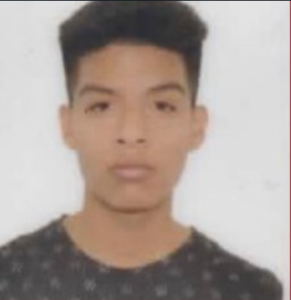
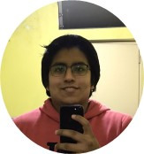

<h1>Capítulo I: Introducción</h1>
<h3>1.1. Startup Profile</h2>
<h3>1.1.1. Descripción de la Startup</h3>

En la actualidad existe un número exorbitante de personas que necesitan ayuda para poder mejorar su calidad de vida y salud. Es un hecho innegable que la salud es esencial en nuestra vida diaria, y más aún en un mundo donde los desafíos para mantenernos saludables son cada vez más evidentes.
 
 
En este contexto, Nourishify emerge como una plataforma vanguardista que aborda estas necesidades apremiantes. Nuestro compromiso es claro: brindar una solución integral para ayudar a las personas a alcanzar sus metas de bienestar y nutrición personalizada. Nuestro objetivo fundamental como proyecto es proporcionar una solución accesible y efectiva para mejorar la salud y el bienestar de las personas en todo momento. Creemos firmemente en que la nutrición personalizada es una de las claves para lograr una vida más saludable y plena.
  
 
Nuestra visión es simple pero ambiciosa, queremos ser líderes en la industria de la nutrición personalizada y el bienestar. Creemos que todos merecen tener acceso a soluciones de salud efectivas y personalizadas. Aspiramos a expandir nuestra presencia y llevar nuestros servicios a personas en todo el mundo, para que puedan disfrutar de una vida más saludable y equilibrada.

<h3>1.1.2. Perfiles de integrantes del equipo</h3>

<table style="border-collapse: collapse; width: 100%;">
  <tr>
    <th style="border: 1px solid #dddddd; padding: 8px; text-align: center;">Foto</th>
    <th style="border: 1px solid #dddddd; padding: 8px; text-align: center;">Miembro</th>
    <th style="border: 1px solid #dddddd; padding: 8px; text-align: center;">Habilidades</th>
    <th style="border: 1px solid #dddddd; padding: 8px; text-align: center;">Codigo</th>
  </tr>
  <tr>
    <td style="border: 1px solid #dddddd; padding: 8px;">
      
    </td>
    <td style="border: 1px solid #dddddd; padding: 8px; text-align: center;">Acuna Diego</td>
    <td style="border: 1px solid #dddddd; padding: 8px; text-align: center;">Mi nombre es Diego Acuña Gomez, resido en Lima y tengo 21 años. Soy estudiante de la carrera de Ingeniería de Software en la Universidad Peruana de Ciencias Aplicadas, actualmente 7mo ciclo. Considero que tengo habilidades en programación con C++, Javascript y Python. Me comprometo a ayudar al trabajo y desarrollo de nuestro trabajo.</td>
    <td style="border: 1px solid #dddddd; padding: 8px; text-align: center;">u20201c794</td>
  </tr>
  <tr>
    <td style="border: 1px solid #dddddd; padding: 8px;">
      
    </td>
    <td style="border: 1px solid #dddddd; padding: 8px; text-align: center;">Melgar Takahashi, Adrian Gonzalo</td>
    <td style="border: 1px solid #dddddd; padding: 8px; text-align: center;">Soy un entusiasta de la tecnología en diversas facetas, y también disfruto colaborar en proyectos en equipo. En cuanto a mis habilidades, sobresale mi experiencia en liderazgo, conocimientos en metodologías ágiles, competencia en codificación utilizando lenguajes como HTML, CSS, JavaScript y Python, y experiencia en la gestión de bases de datos como MySQL, SQL Server y MongoDB.</td>
    <td style="border: 1px solid #dddddd; padding: 8px; text-align: center;">u201819465</td>

  </tr>
  
  <tr>
    <td style="border: 1px solid #dddddd; padding: 8px;">
      
    </td>
    <td style="border: 1px solid #dddddd; padding: 8px; text-align: center;">Gonzales, Antonella</td>
    <td style="border: 1px solid #dddddd; padding: 8px; text-align: center;">Soy Antonella Frida Gonzales Gomez, como estudiante de la carrera de Ingeniería de Software, contribuiré al equipo mis conocimientos fundamentales en algunos lenguajes de programación. Estos conocimientos me permitirán participar activamente en la creación y desarrollo de proyectos además tengo un enfoque responsable hacia mi trabajo y tareas asignadas. Entiendo la importancia de cumplir con plazos y metas establecidas, lo que contribuye al flujo de trabajo del equipo y al éxito general del proyecto.</td>
    <td style="border: 1px solid #dddddd; padding: 8px; text-align: center;">U20211C403</td>
  </tr>
   <tr>
    <td style="border: 1px solid #dddddd; padding: 8px;">
      
    </td>
    <td style="border: 1px solid #dddddd; padding: 8px; text-align: center;">Martel, Gabriel</td>
    <td style="border: 1px solid #dddddd; padding: 8px; text-align: center;">Soy estudiante de 5º ciclo de la carrera de ingenieria de software. Soy una persona empatica y responsable con habilidades para aprender. Aporto a mi equipo con conocientos de programacion en distintos lenguajes y entornos. Puedo trabajar en equipo y soy un poco perfeccionista.</td>
    <td style="border: 1px solid #dddddd; padding: 8px; text-align: center;">u202121584</td>
  </tr>
</table>

     
   &lt;
   <a href="../student-outcome.md">Previous</a>
   &boxh;
   <a href="./2-solution-profile.md">Next</a>
   &gt;
     

