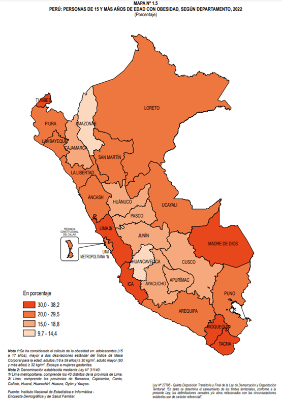

<h3>1.2. Solution Profile</h3>
<h3>1.2.1 Antecedentes y problemática</h3>

<strong>What - ¿Cuál es el problema?</strong> 
El problema que se ha identificado es que muchas personas tienen una alimentación descuidada y desequilibrada, lo cual está teniendo un impacto negativo en su salud y forma física. Además, las personas que desean mejorar su aspecto físico, pero siguen manteniendo malos hábitos alimenticio, están prolongando los resultados.

<strong>When - ¿Cuándo sucede el problema?</strong> 
El problema ocurre al momento de ingerir alimentos y la persona no es consciente del valor nutricional que la comida le está aportando o si esos alimentos perjudican a su salud.

<strong>Where - ¿Dónde surge el problema?</strong> 
EL problema ocurre en los ambientes donde se consumen alimentos, especialmente donde el control de la información nutricional de la comida es nulo. Por ejemplo, los restaurantes y carretillas. Incluso en los hogares, al momento de preparar una comida, también se puede presentar este problema.

<strong>Who - ¿Quiénes son afectados por el problema?</strong> 
Los principales afectados son:
<ul>
   <li>Las personas que no tienen un buen hábito alimenticio.</li>
   <li>Las personas que hacen deporte, pero tienen desórdenes alimenticios.</li>
</ul>

<strong>Why - ¿Cuál es la causa del problema?</strong> 
Una de las principales causas del problema radica en el desconocimiento de las calorías que se están consumiendo por alimento. Esto generando un descontrol en la ingesta calórica diaria, lo que puede resultar en un aumento de peso.

<strong>How - ¿Cómo se llevan a cabo los hechos?</strong> 
Cuando la persona está consumiendo alimentos, pero pasa por alto los nutrientes que la comida le está aportando. Esto generando una ingesta calórica descontrolada y desequilibrada que puede tener un impacto significativo en su bienestar a largo plazo.

<strong>How much- ¿Cuál es la magnitud del problema?</strong> 
Según INEI (2022), recopilo que en todo el país, el 25,6% de ciudadanos mayores de 15 años padece de obesidad. Del total, Lima representa el 29,4% y se considera un nivel elevado. De esta forma, se identifica la necesidad de un servicio que permita asesorar sobre la nutrición y la importancia de una alimentación saludable

   

     
   &lt;
   <a href="./1-startup-profile.md">Previous</a>
   &boxh;
   <a href="./3-lean-ux-process.md">Next</a>
   &gt;
     

