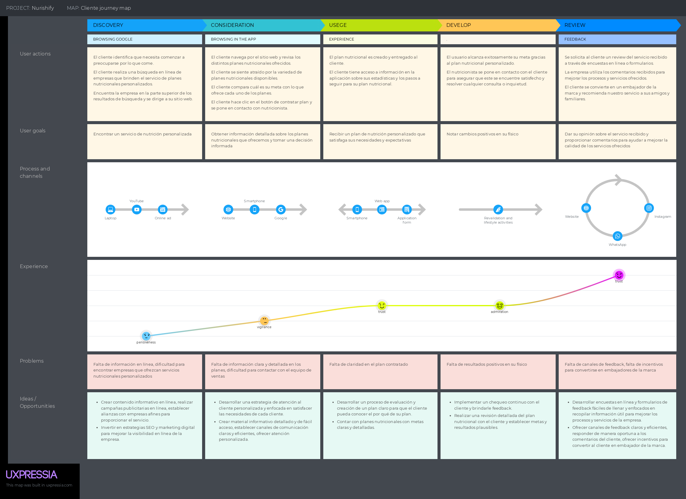
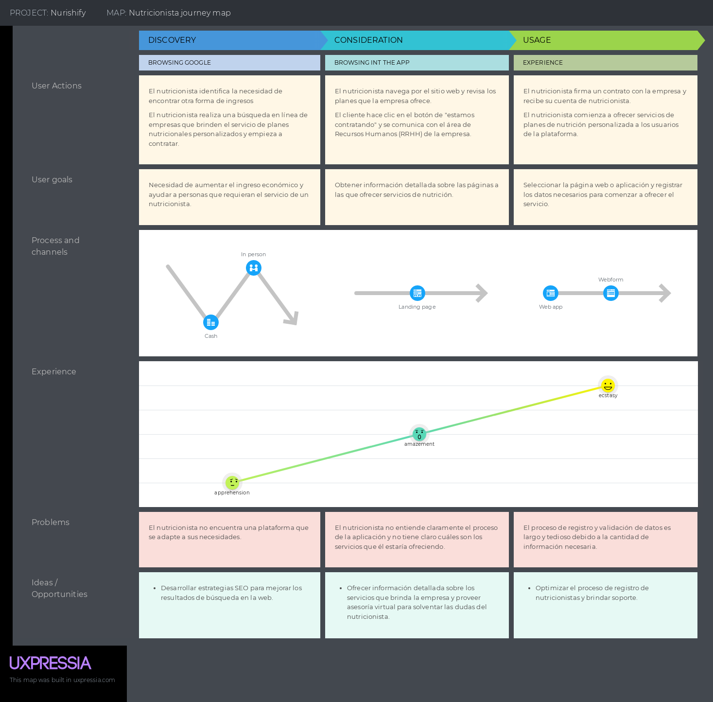

<h3>2.3.3. User Journey Mapping</h3>

### Cliente

   

### Nutricionista

   

     
   &lt;
   <a href="./4-user-task-matrix.md">Previous</a>
   &boxh;
   <a href="./6-empathy-mapping.md">Next</a>
   &gt;
     

