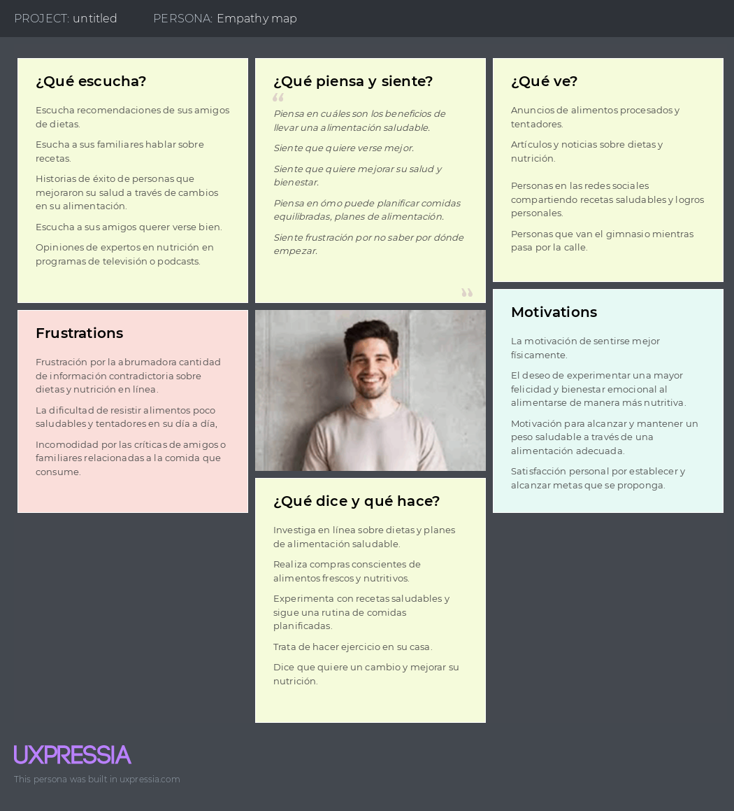
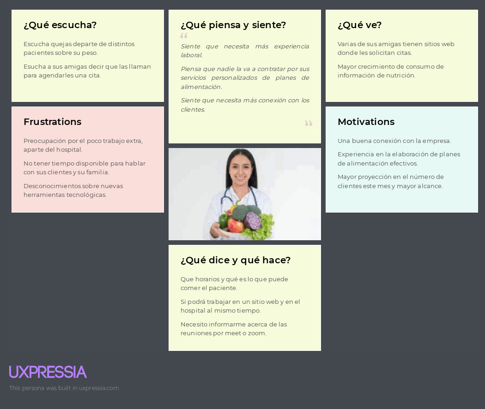

<h3>2.3.4. Empathy Mapping</h3>
En esta sección se presenta el Empathy Mapping de nuestros 3 segmentos objetivos. Esta herramienta se utilizó porque permite identificar nuestro público objetivo, conocer su entorno y sus necesidades, lo cual nos permite ver el mundo a través de su perspectiva.

 

<strong>Segmento 1: Cliente que desea mejorar su nutrición, bienestar y salud </strong> 

   

 

<strong>Segmento 2: Nutricionistas </strong> 

   

 

     
   &lt;
   <a href="./5-user-journey-mapping.md">Previous</a>
   &boxh;
   <a href="./7-as-is.md">Next</a>
   &gt;
     

