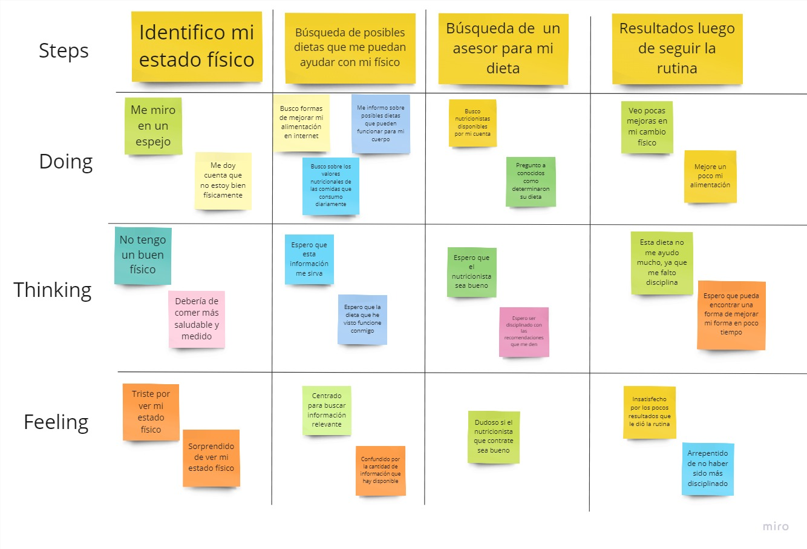
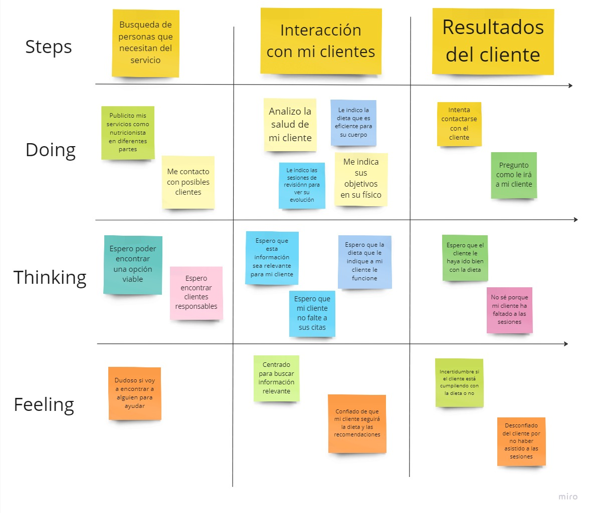

<h3>2.3.5. As-is Scenario Mapping</h3>
Segmento 1: Clientes  

   

 

Segmento 2: Nutricionistas 

   

 

     
   &lt;
   <a href="./6-empathy-mapping.md">Previous</a>
   &boxh;
   <a href="../chapter-3/1-to-be.md">Next</a>
   &gt;
     

