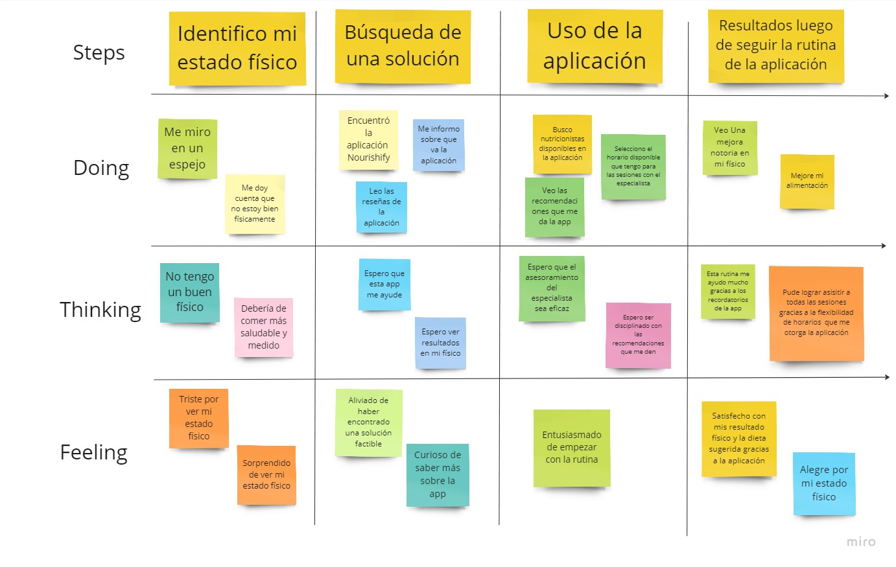
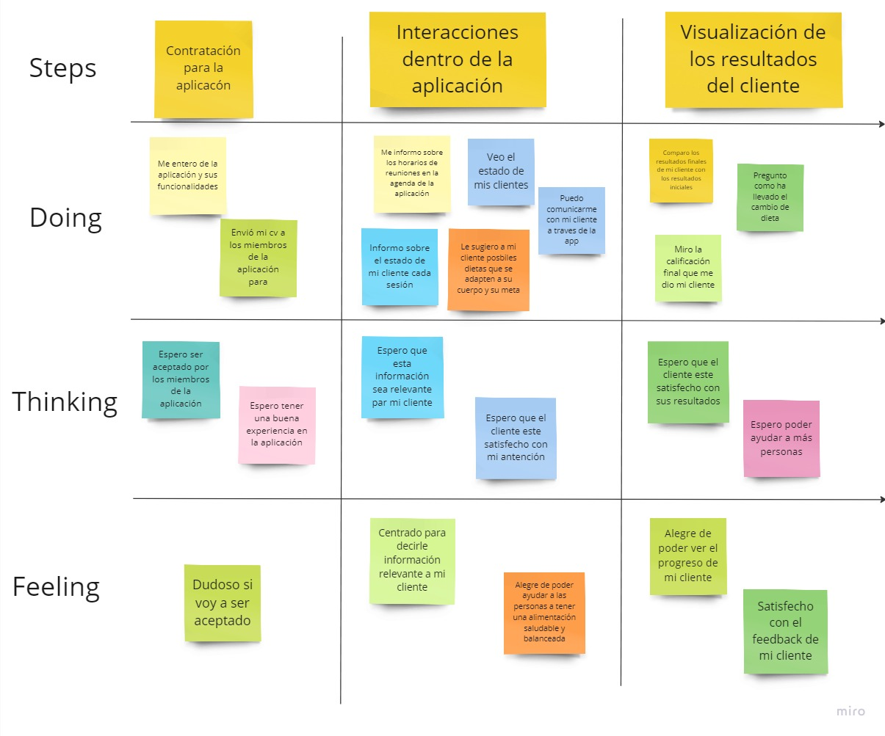

<h1>Capítulo III: Requirements Specification</h1>
<h3>3.1. To-Be Scenario Mapping</h3>
Segmento 1: Clientes  

   

 

Segmento 2: Nutricionistas  

   

 

<a href="https://miro.com/app/board/uXjVMnjpby0=/?share_link_id=381213353000">Enlace al Miro</a>  

     
   &lt;
   <a href="../chapter-2/7-as-is.md">Previous</a>
   &boxh;
   <a href="./2-user-stories.md">Next</a>
   &gt;
     

