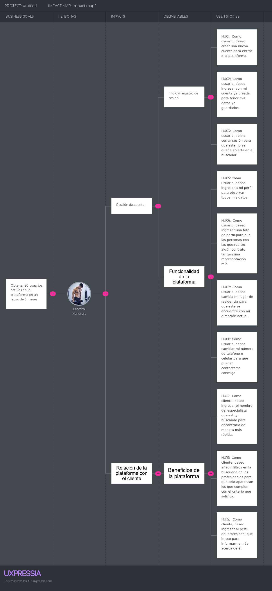
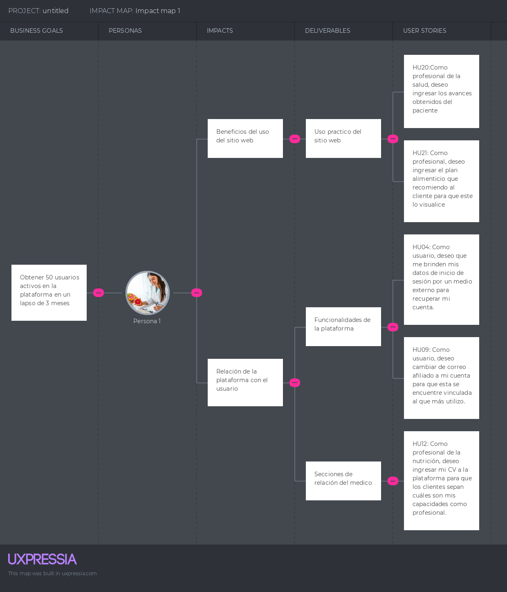

<h3>3.3. Impact Mapping</h3>
Impact Mapping es una metodología que ayuda de una forma visual a pensar en las metas que realmente queremos lograr para tener el alcance de nuestros usuarios. Por ello usamos esta herramienta con el fin de establecer enfoque y alcanzar las metas de nuestro objetivo principal. De tal manera, que al final del mapa mental identificamos las acciones y funcionalidades que debemos llevar a cabo para formar el proyecto de manera eficiente.
 
 
User: Cliente 
 
A continuación, se presenta el impact map del usuario cliente, en el cual se identifican los objetivos que se quieren lograr, las funcionalidades que se deben implementar para lograr los objetivos y las métricas que se deben tener en cuenta para medir el éxito de las funcionalidades.
 

   

 
 
User: Nutricionista
 
A continuación, se presenta el impact map del usuario nutricionista, en el cual se identifican los objetivos que se quieren lograr, las funcionalidades que se deben implementar para lograr los objetivos y las métricas que se deben tener en cuenta para medir el éxito de las funcionalidades.
 

   

     
   &lt;
   <a href="./2-user-stories.md">Previous</a>
   &boxh;
   <a href="./4-product-backlog.md">Next</a>
   &gt;
     

