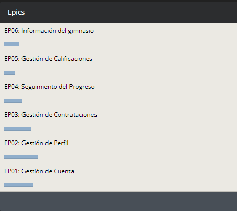

<h3>3.4. Product Backlog</h3>

Una vez ya redactadas todas las User Stories, debemos priorizarlas. El Product Backlog se encarga de generar un orden de importancia entre todas las historias de usuarios, mientras más Story Points contenga, más relevante será para la plataforma. Por esta razón, se antepondrá el desarrollo de las US que tengan más puntos
 

<table>
        <thead>
            <tr>
                <th>Orden</th>
                <th>User Story ID</th>
                <th>Título</th>
                <th>Descripción</th>
                <th>Story Points</th>
            </tr>
        </thead>
        <tbody>
            <tr>
                <td>19</td>
                <td>HU20</td>
                <td>Ingreso de plan alimenticio</td>
                <td>Como profesional, deseo ingresar el plan alimenticio que recomiendo al cliente para que este lo visualice.</td>
                <td>8</td>
            </tr>
            <tr>
                <td>20</td>
                <td>HU21</td>
                <td>Visualización de plan alimenticio</td>
                <td>Como cliente, deseo acceder al plan alimenticio.</td>
                <td>8</td>
            </tr>
            <tr>
                <td>11</td>
                <td>HU11</td>
                <td>Ingreso de Historial médico</td>
                <td>Como cliente con historial médico, deseo ingresar el historial para que el profesional que contrate sepa mi situación.</td>
                <td>5</td>
            </tr>
            <tr>
                <td>12</td>
                <td>HU12</td>
                <td>Ingreso de Curriculum Vitae</td>
                <td>Como profesional de la nutrición, deseo ingresar mi CV a la plataforma para que los clientes sepan cuáles son mis capacidades como profesional.</td>
                <td>5</td>
            </tr>
            <tr>
                <td>16</td>
                <td>HU17</td>
                <td>Selección del profesional</td>
                <td>Como cliente, deseo recibir ayuda del profesional y seleccionar horario.</td>
                <td>5</td>
            </tr>
            <tr>
                <td>17</td>
                <td>HU18</td>
                <td>Visualización de Calendario de Citas</td>
                <td>Como profesional, deseo tener una agenda con el horario de mis reuniones en la plataforma para saber mis horas de trabajo.</td>
                <td>5</td>
            </tr>
            <tr>
                <td>18</td>
                <td>HU19</td>
                <td>Registro de avances</td>
                <td>Como profesional de la salud, deseo ingresar los avances obtenidos del paciente.</td>
                <td>5</td>
            </tr>
            <tr>
                <td>25</td>
                <td>HU25</td>
                <td>Obtención de los datos personales del usuario</td>
                <td>Como developer, deseo poder obtener los datos personales del usuario desde la base de datos para que pueda visualizar su perfil.</td>
                <td>3</td>
            </tr>
            <tr>
                <td>24</td>
                <td>HU24</td>
                <td>Obtención de las credenciales del usuario</td>
                <td>Como developer, deseo poder recuperar las credenciales del usuario desde la base de datos para autenticar el inicio de sesión.</td>
                <td>3</td>
            </tr>
            <tr>
                <td>23</td>
                <td>HU23</td>
                <td>Registro de usuario en la base de datos</td>
                <td>Como developer, deseo poder almacenar un nuevo usuario dentro de la base de datos para registrar su cuenta.</td>
                <td>3</td>
            </tr>
            <tr>
                <td>26</td>
                <td>HU26</td>
                <td>Almacenamiento de la foto de perfil</td>
                <td>Como developer, deseo poder almacenar el archivo de la foto de perfil del usuario en la base de datos para mostrarla en su prefil.</td>
                <td>3</td>
            </tr>
            <tr>
                <td>27</td>
                <td>HU27</td>
                <td>Almacenamiento de historial de chat con el nutricionista</td>
                <td>Como developer, deseo poder almacenar el historial de chat con el nutricionista del usuario en la base de datos para que los usuarios tengan acceso a este desde la aplicación.</td>
                <td>3</td>
            </tr>
            <tr>
                <td>28</td>
                <td>HU28</td>
                <td>Agregar un nuevo plan nutricional</td>
                <td>Como developer, deseo poder agregar un nuevo plan nutricional dentro de la base de datos para que los usuarios puedan visualizarlo dentro de la aplicación.</td>
                <td>3</td>
            </tr>
            <tr>
                <td>29</td>
                <td>HU29</td>
                <td>Agregar una recomendación</td>
                <td>Como developer, deseo poder agregar un plan nutricional en la tabla de recomendados para presentarlo a los usuarios .</td>
                <td>3</td>
            </tr>
            <tr>
                <td>30</td>
                <td>HU30</td>
                <td>Almacenamiento de historial médico</td>
                <td>Como developer, deseo poder almacenar el historial médico del usuario en la base de datos para que los usuarios tengan acceso a este desde la aplicación.</td>
                <td>3</td>
            </tr>
            <tr>
                <td>31</td>
                <td>HU31</td>
                <td>Almacenamiento de curriculum vitae</td>
                <td>Como developer, deseo poder almacenar archivos de curriculum vitae del nutricionista en la base de datos para quie los usuarios tengan acceso a este desde la aplicación.</td>
                <td>3</td>
            </tr>
            <tr>
                <td>32</td>
                <td>HU32</td>
                <td>Visualizar planes nutricionales</td>
                <td>Como usuario, deseo visualizar los planes nutricionales para poder elegir el que mejor se adecua a mis requerimientos.</td>
                <td>3</td>
            </tr>
            <tr>
                <td>33</td>
                <td>HU33</td>
                <td>Visualizar planes de ejercicio</td>
                <td>Como usuario, deseo visualizar los planes de ejercicio para poder elegir el que mejor se adecua a mis requerimientos.</td>
                <td>3</td>
            </tr>
            <tr>
                <td>14</td>
                <td>HU15</td>
                <td>Agregación de Filtros</td>
                <td>Como cliente, deseo añadir filtros en la búsqueda de los profesionales para que solo aparezcan los que cumplen con el criterio que solicitó.</td>
                <td>3</td>
            </tr>
            <tr>
                <td>15</td>
                <td>HU16</td>
                <td>Visualización de Perfiles de Profesionales</td>
                <td>Como cliente, deseo ingresar al perfil del profesional que busco para informarme más acerca de él.</td>
                <td>3</td>
            </tr>
            <tr>
                <td>22</td>
                <td>HU23</td>
                <td>Añadido de Reseñas</td>
                <td>Como cliente, deseo agregar una reseña al profesional que contraté para que otros usuarios sepan qué tan bueno es su servicio.</td>
                <td>3</td>
            </tr>
            <tr>
                <td>13</td>
                <td>HU14</td>
                <td>Búsqueda por nombre</td>
                <td>Como cliente, deseo ingresar el nombre del especialista que estoy buscando para encontrarlo de manera más rápida.</td>
                <td>3</td>
            </tr>
            <tr>
                <td>21</td>
                <td>HU22</td>
                <td>Ingreso de Experiencias</td>
                <td>Como usuario, deseo ingresar mi experiencia en la plataforma para que otros clientes conozcan los beneficios de utilizarla.</td>
                <td>2</td>
            </tr>
            <tr>
                <td>1</td>
                <td>HU01</td>
                <td>Registrar Cuenta</td>
                <td>Como usuario, deseo crear una nueva cuenta para entrar a la plataforma.</td>
                <td>2</td>
            </tr>
            <tr>
                <td>2</td>
                <td>HU02</td>
                <td>Iniciar Sesión</td>
                <td>Como usuario, deseo ingresar con mi cuenta ya creada para tener mis datos ya guardados.</td>
                <td>2</td>
            </tr>
            <tr>
                <td>3</td>
                <td>HU03</td>
                <td>Cerrar Sesión</td>
                <td>Como usuario, deseo cerrar sesión para que esta no se quede abierta en el buscador.</td>
                <td>1</td>
            </tr>
            <tr>
                <td>4</td>
                <td>HU04</td>
                <td>Recuperar Cuenta</td>
                <td>Como usuario, deseo que me brinden mis datos de inicio de sesión por un medio externo para recuperar mi cuenta.</td>
                <td>2</td>
            </tr>
            <tr>
                <td>5</td>
                <td>HU05</td>
                <td>Visualización de Perfil</td>
                <td>Como usuario, deseo ingresar a mi perfil para observar todos mis datos.</td>
                <td>3</td>
            </tr>
            <tr>
                <td>6</td>
                <td>HU06</td>
                <td>Cambio de Foto</td>
                <td>Como usuario, deseo ingresar una foto de perfil para que las personas con las que realizó algún contrato tengan una representación mía.</td>
                <td>1</td>
            </tr>
            <tr>
                <td>7</td>
                <td>HU07</td>
                <td>Cambio de Ubicación</td>
                <td>Como usuario, deseo cambiar mi lugar de residencia para que este se encuentre con mi dirección actual.</td>
                <td>1</td>
            </tr>
            <tr>
                <td>8</td>
                <td>HU08</td>
                <td>Cambio de Número Telefónico</td>
                <td>Como usuario, deseo cambiar mi número de teléfono o celular para que puedan contactarse conmigo.</td>
                <td>1</td>
            </tr>
            <tr>
                <td>9</td>
                <td>HU10</td>
                <td>Cambio de Nombre</td>
                <td>Como usuario, deseo cambiar mi nombre en mi perfil para que este se encuentre escrito correctamente.</td>
                <td>1</td>
            </tr>
        </tbody>
    </table>

   

 <a href="https://www.pivotaltracker.com/n/projects/2674928">Enlace al pivotal tracker</a>

     
   &lt;
   <a href="./3-impact-mapping.md">Previous</a>
   &boxh;
   <a href="../chapter-4/1-style-guidelines.md">Next</a>
   &gt;
     

