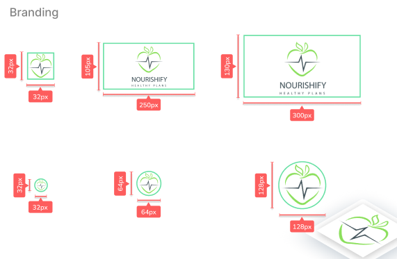
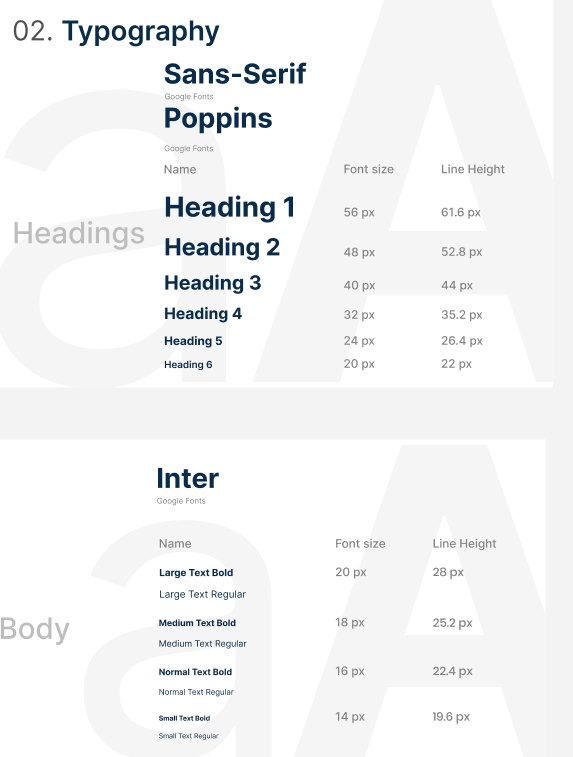
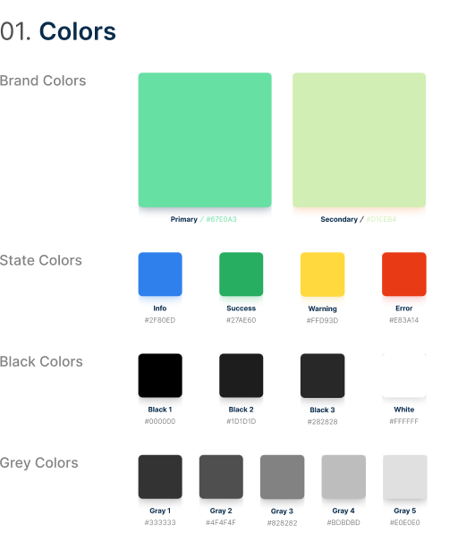
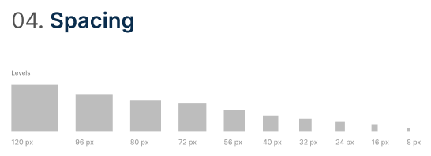
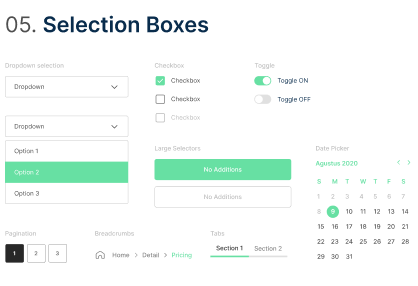
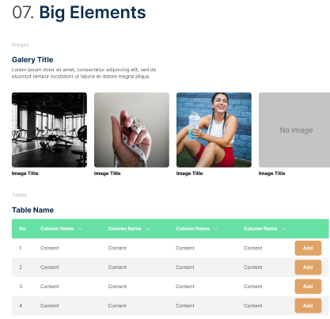
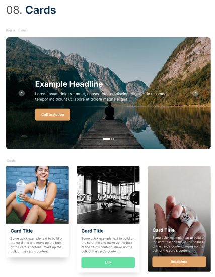

<h1>Capítulo IV: Product Design</h1>
<h3>4.1. Style Guidelines</h3>
<h3>4.1.1. General Style Guidelines</h3>
Brand Name  
El nombre del software identificado es Nourishify. Descomponiendo el nombre en dos, ‘nourishi’ que significa nutritivo y ‘hify’ que significa alto. Originalmente surgió a partir de la necesidad identificada, pues los usuarios requieren de personal especializado en nutrición, bienestar y salud. Por ello se optó por la búsqueda de nutricionistas, además de los dueños de gimnasios. Específicamente en el idioma inglés pues nos pareció más amigable y llamativo con los posibles usuarios. 
A continuación, se presenta el logo o marca de nuestra solución propuesta.

   

 
Con el propósito de dar estilo y reconocimiento, nuestra app web posee una gran variedad de ajustes en los temas de colores, las fuentes de tipografía y en el aspecto de diseño estructural.

 Typography

   

 

Colors
 

   

 
Spacing
 

   

 
 
Tono de comunicación y lenguaje aplicado
  
Color Primario: El verde, además de transmitir tranquilidad y calma, se asocia con la naturaleza, prosperidad, fertilidad, salud, y generosidad. Decidimos usar  el color verde para asociar nuestra marca con la naturaleza, vegetales y la nutrición.
  
Color Secundario: El color aguamarina transmite solo emociones positivas en el diseño. Al estar relacionado con el agua, su significado está asociado a la pureza y la inmensidad.
  
Blanco: Representa limpieza y claridad. Asimismo, se usa mucho en aplicaciones identificadas en el mismo rubro de cuidado de la salud.
  
Negro: Color serio y elegante.
El lenguaje a utilizar será serio, formal, respetuoso junto con entusiasmo y perseverancia. Puesto que se incluirán experiencias y recomendaciones que aumentarán las perspectivas del usuario.

<h3>4.1.2. Web Style Guidelines</h3>

Desarrollaremos una aplicación que se adeque a cualquier dispositivo tecnológico sin la necesidad de malograr el diseño del contenido. Por ello, se tendrá que tomar en cuenta cada tipo de dispositivo para que el contenido este estructurado de la mejor manera para cada uno.

  

   

 
 

   

 
 

   

 

 Link Figma: https://www.figma.com/file/yUavmzKkW2nMUMpxhpxDfL/Nourishify-style-guidelines?type=design&node-id=0%3A1&mode=design&t=ghLjnndHn9rHaL0e-1

     
   &lt;
   <a href="../chapter-3/4-product-backlog.md">Previous</a>
   &boxh;
   <a href="./2-information-architecture.md">Next</a>
   &gt;
     

