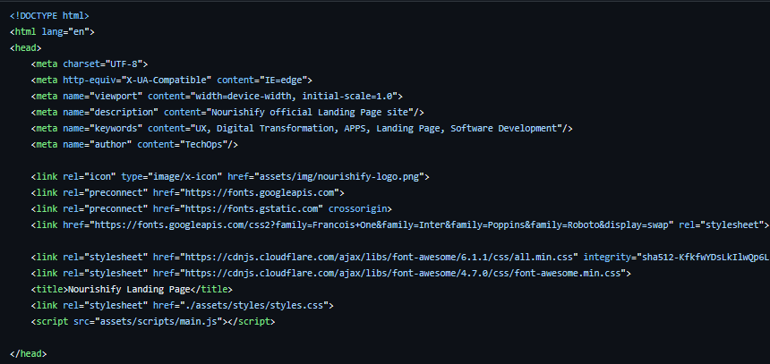

<h3>4.2. Information Architecture</h3>
En esta sección, definiremos la estructuración de nuestro producto para cada uno de nuestros segmentos objetivo. Abarcaremos diversos componentes que permitirán al usuario a organizar y encontrar su contenido: Organization systems, Labeling systems, SEO Tags and Meta Tags, Searching systems y Navigation systems.
<h3>4.2.1. Organization Systems</h3>
A continuación, explicaremos en qué grupos de información se aplicaron los distintos tipos de organización visual para los tres segmentos de Nourishify: clientes, nutricionistas y dueños de gimnasios, así como también en cuales se utiliza algún tipo de categorización.
  
<strong>Segmento 1: Clientes</strong>

Jerárquica:

<ul>
<li>Registro de comidas: Los clientes pueden registrar las comidas que consumen diariamente para hacer un seguimiento de su ingesta nutricional. Esta información se organiza por categorías de alimentos (proteínas, carbohidratos, grasas, etc.).</li>
<li>Plan de comidas: Los clientes pueden acceder a su plan de comidas personalizado. La información se organiza de manera jerárquica, con la comida del día actual en la parte superior, seguida de comidas futuras y pasadas.</li>
<li>Historial de ejercicios: Los clientes pueden ver su historial de ejercicios. La información se organiza cronológicamente, mostrando las sesiones de entrenamiento más recientes primero.</li>
<li>
Perfil del nutricionista: Los clientes pueden acceder al perfil de su nutricionista para obtener información relevante. La información se organiza de acuerdo con su relevancia.</li>
</ul>
Secuencial:
<ul>
<li>Consulta con el nutricionista: Este proceso se divide en pasos, incluyendo la elección de una fecha y hora para la consulta, la descripción de los síntomas o necesidades específicas, el pago y la confirmación de la cita.</li>
</ul>
 
<strong>Segmento 2: Nutricionistas</strong> 
Jerárquica:
<ul>

<li>Lista de clientes: Los nutricionistas pueden ver la lista de clientes asignados a ellos. La información se organiza cronológicamente, con los clientes que tienen citas próximas en la parte superior.</li>
<li>Historial de consultas: Los nutricionistas pueden acceder al historial de consultas de un cliente en particular. La información se organiza cronológicamente por sesiones de consulta.</li>
</ul>
Secuencial:
<ul>
<li>Registro de consulta: Los nutricionistas pueden registrar una nueva consulta con un cliente. El proceso incluye la selección del cliente, el registro de los detalles de la consulta y la emisión de recomendaciones.</li>
</ul>
<strong>Segmento 3: Dueños de gimnasios</strong> 
Jerárquica:
<ul>
<li>Información del gimnasio: Los dueños de gimnasios pueden acceder a la información relevante de su gimnasio, como la ubicación, los servicios ofrecidos y los horarios de apertura. Esta información se organiza de acuerdo con su relevancia.</li>
<li>Registro de empleados: Los dueños de gimnasios pueden registrar a sus empleados. La información se organiza en una lista, categorizada por roles (entrenadores, personal de recepción, etc.).</li>
<li>Estadísticas de membresía: Los dueños de gimnasios pueden ver estadísticas sobre la membresía de su gimnasio. La información se organiza en gráficos y tablas para una fácil visualización.
</li>
</ul>

Matricial:

<ul>
<li>
Panel de control: Los tres segmentos tienen acceso a un panel de control principal donde pueden seleccionar las funciones que desean realizar en ese momento. Estas opciones se organizan en categorías por tipo de función (registro de comidas, consultas, administración del gimnasio, etc.).</li>
<li>
Blog de salud y fitness: Los tres segmentos tienen acceso a un blog con artículos sobre salud y fitness. Los artículos se organizan por categorías (nutrición, ejercicios, consejos, etc.).</li>
</ul>

<h3>4.2.2. Labeling Systems</h3>
A continuación, se mostrará el sistema de etiquetado que permitirá a nuestros visitantes recibir la información que nuestra Landing page ofrece a través de una sola palabra.  
Contamos con cuatro “headings” con fuente sans-serif ubicadas en la parte superior del Landing page:  
<ul>
   <li>Home: Sección seleccionada por defecto dónde los usuarios verán la información más relevante, la cual captará su atención.</li>
   <li>About: Sección dónde el cliente podrá ver nuestra misión, visión, quienes somos y qué hacemos.</li>
   <li>Services: Sección enfocada en listar y detallar los servicios que ofrecemos.</li>
   <li>Contact: Sección dónde se detalla cuáles son nuestros canales de comunicación y nuestra ubicación.</li>
</ul>
<h3>4.2.3. SEO Tags and Meta Tags</h3>

A continuación, se mostrarán los SEO Tags y Meta Tags utilizados en el Landing Page con el propósito de aumentar su visibilidad en los motores de búsqueda.
Landing Page:

   

<h3>4.2.4. Searching Systems</h3>
A continuación, se mostrarán los sistemas de búsqueda implementados para ayudar a nuestros usuarios a encontrar la información que están buscando. 
Para el Landing Page, no se ha implementado un sistema de búsqueda, ya que la información esta segmentada y enlaza con el menú principal. Por esto mismo, podrán buscar toda la información necesaria para poder identificar lo más importante de nuestra solución, como a que nos dedicamos o cuales son nuestros servicios o principalmente podrán buscar los contactos para que puedan comunicarse con nosotros.

<h3>4.2.5. Navigation Systems</h3>
A continuación, se mostrarán los sistemas de navegación que le permitirán a nuestros usuarios moverse a través de las distintas piezas de contenido o información.  
Como se mencionó anteriormente en el Labeling Systems, contamos con cuatro “headings” en el Landing Page entre los cuales tenemos a Home, About, Services y Contact. Estas secciones son ubicadas como un menú global horizontal a lo largo de la parte superior del Landing page, se dividió la información en estas cuatro secciones con la finalidad de que el cliente no estuviera recorriendo hacia abajo, a través de la barra de desplazamiento vertical, la inmensidad de información disponible. Esto le facilitaría movilizarse a través de nuestro contenido. Por supuesto, la estrategia es que revise primero el Home, dónde se encuentra la información más relevante y la que llamará más su atención, y luego viaje a través del resto del menú de izquierda a derecha.

     
   &lt;
   <a href="./1-style-guidelines.md">Previous</a>
   &boxh;
   <a href="./3-landing-page-ui-design.md">Next</a>
   &gt;
     

