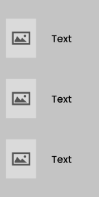

<h3>4.3. Landing Page UI Design</h3>
Las Landing Pages son herramientas que se utilizan para convertir a los visitantes en potenciales clientes a través de diversas maneras como mensajes llamativos, información sobre tu producto entre otras cosas. Por ello se decidió hacer uso de esta herramienta, en la que diseñamos la versión preliminar para la versión del móvil y para computadoras.  
Para la versión móvil, se presenta el mismo contenido que en la versión de computadoras, pero esta presenta un diseño reorganizado para el tamaño de los dispositivos móviles, presentando un botón que el usuario podrá utilizar para navegar de una forma más cómoda a través de la Landing Page. Además de que es práctico el manejo de las opciones y el diseño que ayuda de forma visual para el usuario.
Para la versión de computadora, se diseñó ventanas con opciones especificadas que ayuden al entendimiento del usuario, con la descripción de cada opción que posee el sitio web para que el usuario no tenga problemas, además la barra de navegación se encuentra en una posición estática para que se encuentre disponible para el usuario en todo momento y pueda navegar a través de la Landing Page de una forma cómoda.

<h3>4.3.1. Landing Page Wireframe</h3>
En esta sección, se presentará base para el diseño del sitio web de nuestro software. Con bases que permitan dar una mejor idea del contenido que mostrará la plataforma y la versión móvil.
El Landing Page debe ser del tamaño adecuado para las pantallas de cada ordenador por lo que la información estará centrada en la pantalla para que sea fácilmente visible para el usuario. 
Buscamos colocar la información precisa sin abrumar para realizar este trabajo. Para esto ayudamos al usuario ofreciéndole una barra de navegación estática que lo facilitará en la navegación por la Landing Page.

 
 
<strong>Desktop Web</strong>

   

 
Diseño del menú del sitio web: Se presenta la base que incluirá las opciones más destacadas para la atención del usuario.

   

Opción que muestra datos para conocer mejor la plataforma.
Servicios para segmentos gimnasio y cliente:

   

Página de referencia para dar a conocer como contactar y la actualidad de la plataforma.

   

Link: https://www.figma.com/file/FnK2DykjCBefplAsaeeLKV/Untitled?type=design&node-id=0%3A1&mode=design&t=gJgfzbRImRbSLSfF-1

<strong>Mobile Web</strong>

Se observa el diseño del bloque de menú de inicio para la accesibilidad del usuario, mostrando el botón que despliega las opciones de navegación.

   

Se visualiza un bloque que indica opciones que incluye en la lista de herramientas del servidor, en un caso determinado, información de la aplicación.

   

   

Se visualiza los servicios para el segmento de gimnasio y cliente.

   

Se muestra el bloque final de la aplicación, detallando contenido de comunicación del servicio y el usuario

   

 
Link:  https://www.figma.com/file/FnK2DykjCBefplAsaeeLKV/Untitled?type=design&node-id=0%3A1&mode=design&t=gJgfzbRImRbSLSfF-1

<h3>4.3.2. Landing Page Mock-up</h3>
Se presenta la versión preliminar en qué consistirá nuestro sitio web, detallando el contenido que tendrá, agregándole los colores respectivos según nuestra guía de estilos y añadiendo imágenes coherentes a la información mostrada para facilitar al usuario un entendimiento más claro de las ideas que tratamos de mostrar. 
  
<strong>Desktop Web Browser</strong>
Se muestra la versión menú de la plataforma, detallando los principales contenidos, opciones que permiten conocer más nuestro sistema al usuario.

   

Al elegir la opción “Meet Us” de la barra de herramientas del menú principal, se muestra 3 elecciones como adquisición del usuario que tendrá libertad de elegir cuál opción es su necesidad para informarse acerca de nuestro proyecto.

   

Se presenta los servicios que posee el usuario a lo largo del consumo del software.
 
 
<strong>Usuarios: Clientes y gimnasios</strong>

   

Se presenta como bloque final de la plataforma, información breve de contacto, y la opción de contactarnos y comentarnos sus dudas y/o necesidades.

   

Link: https://www.figma.com/file/4xDxh5FYrqfFsA5q0P2OWh/Untitled?type=design&node-id=0%3A1&mode=design&t=KNIulrTFAMUSeGXi-1 
  
<strong>Mobile Web Browser</strong> 
Se presenta el bloque de menú principal de la Landing Page en su versión Mobile, junto con sus opciones de mayor interés para nuestro público objetivo y una breve descripción de nuestro software.

   

Se muestra el bloque de “Meet Us”, con información del proceso de nuestros tratamientos asignado, consultas acerca de nuestro proceso del sistema, información de nuestra misión y de nuestras consultas.

   

Se muestra el bloque de servicios que se ofrecen para los clienntes y los gimnasios interesados en nuestro software.

   

   

Se presenta como bloque final de la plataforma, información breve de contacto, y la opción de contactarnos y comentarnos sus dudas y/o necesidades.

   

Link: https://www.figma.com/file/4xDxh5FYrqfFsA5q0P2OWh/Untitled?type=design&node-id=0%3A1&mode=design&t=KNIulrTFAMUSeGXi-1

     
   &lt;
   <a href="./2-information-architecture.md">Previous</a>
   &boxh;
   <a href="./4-web-app-ux-ui-design.md">Next</a>
   &gt;
     

