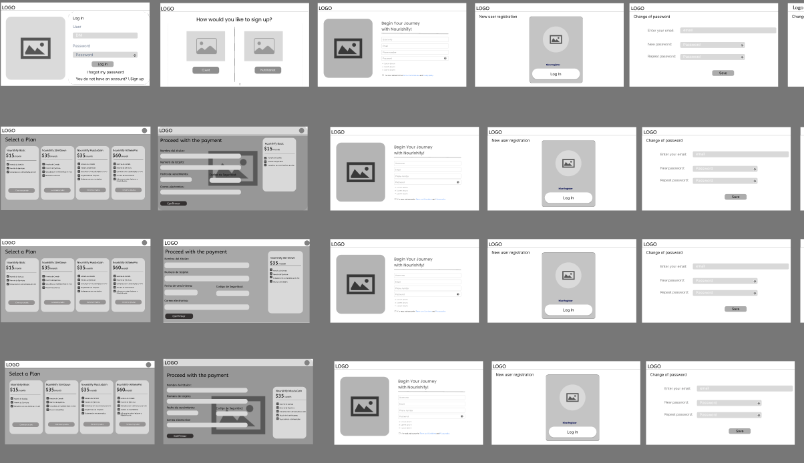
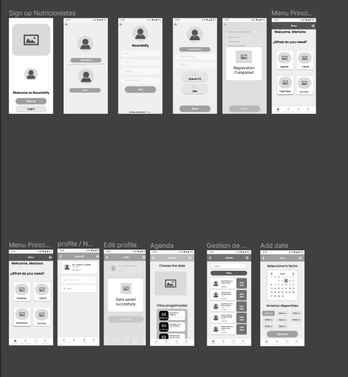
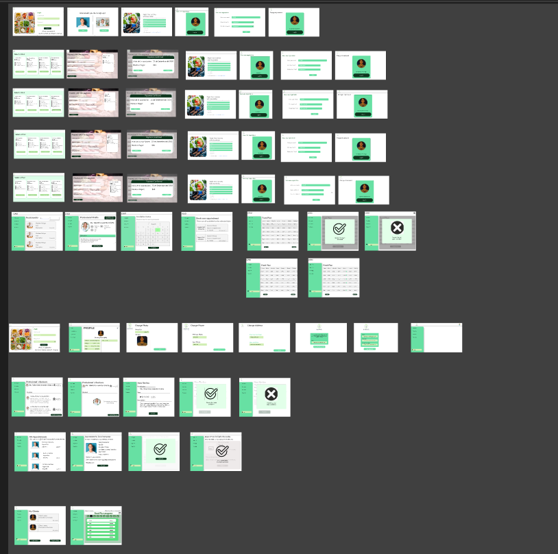
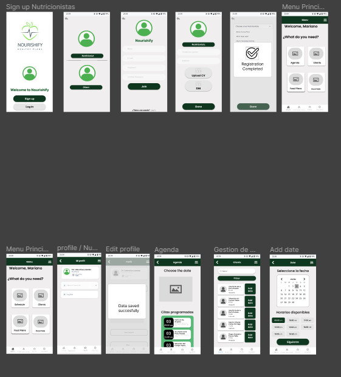
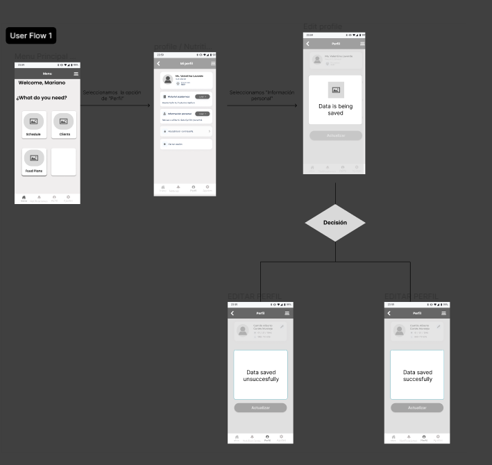

<h3>4.4. Web Applications UX/UI Design</h3>
<h3>4.4.1. Web Applications Wireframes</h3>
 

            

 

            

<h3>4.4.2. Web Applications Wireflow Diagrams</h3>
<h3>4.4.2. Web Applications Mock-ups</h3>
      

      
      

 

      
      

<h3>4.4.3. Web Applications User Flow Diagrams</h3>
 

      
      

     
   &lt;
   <a href="./3-landing-page-ui-design.md">Previous</a>
   &boxh;
   <a href="./5-web-app-prototyping.md">Next</a>
   &gt;
     

