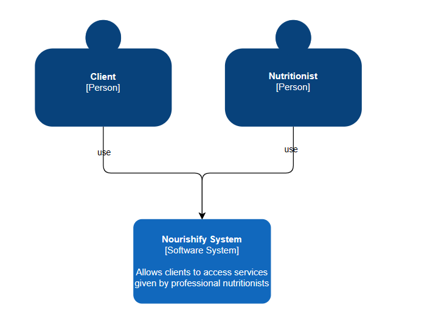

<h3>4.6. Domain-Driven Software Architecture</h3>

En esta sección, se presentarán los respectivos diagramas correspondientes al diseño de software basados en lo que utilizará nuestra aplicación web. Para dichos diseños, hemos aplicado patrones tanto de alta como de bajo nivel siguiendo el enfoque del Domain-Driven; por lo que, de esta manera, podremos explayar de manera más concisa y eficiente la arquitectua la cual Nourishify está compuesta. 

<h3>4.6.1. Software Architecture Context Diagram</h3>

Este apartado, mayormente se centra en la presentacion del diagrama de contexto del cual abarca nuestro software. Esto nos permite identificar el sistema y sus multiples relaciones con el mundo de su alrededor (en referencia a los usuarios con la aplicación), mostrando los principales puntos en su arquitectura.

 

 

<h3>4.6.2. Software Architecture Container Diagrams</h3>

A continuación, se mostrará el respectivo diagrama de contenedores lo cual esta basado en nuestro sistema; es por ello, que este artefacto presenta los componentes técnicos de alto nivel - generando un enfoque más maximizado acerca de la visión de la arquitectura del software -.

 

 

<h3>4.6.3. Software Architecture Components Diagrams</h3>

En este último apartado, se presenta el diagrma de componentes de nuestra arquitectura de software en que se detallan los componentes  de nuestros contenedores ya maquetados anteriormente; por consiguiente, se señalan sus responsabilidades y los detalles en veredicto al enlace tecnológico e implementación.

 

 

     
   &lt;
   <a href="./5-web-app-prototyping.md">Previous</a>
   &boxh;
   <a href="./7-software-object-oriented-design.md">Next</a>
   &gt;
     

