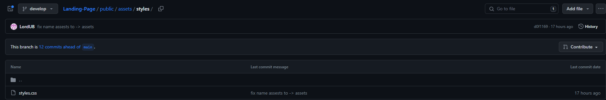
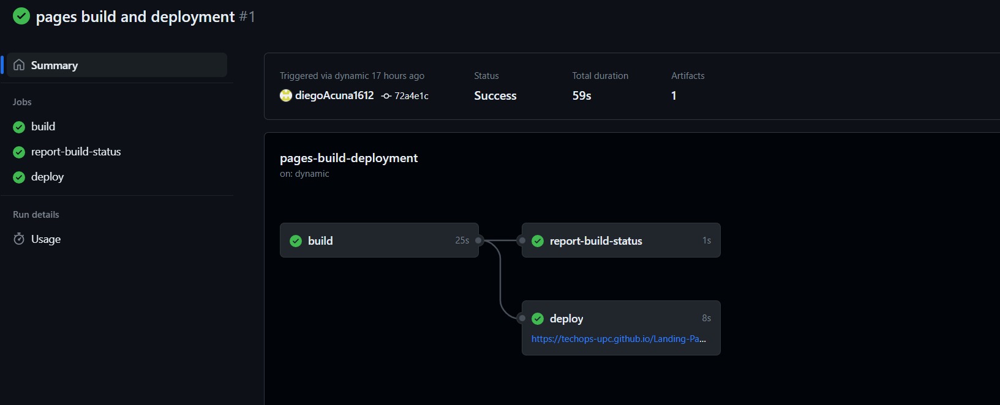

<h1>Capítulo V: Product Implementation, Validation & Deployment</h1>
<h3>5.1. Software Configuration Management</h3>
A continuación, se presentará un repositorio central y organizado que servirá como guía para el desarrollo enfocado y consistente de nuestra solución.
<h3>5.1.1. Software Development Environment Configuration</h3>
En esta sección se incluye los links de las aplicaciones, productos de software realizadas durante el ciclo del proyecto en los programas que se utilizaron. 
Para ello se clasificará en las siguientes secciones:
  
<strong>Requirements Management</strong> 
Es el proceso de garantizar que una organización documente verifique y satisfaga las necesidades, expectativas de sus clientes con las partes interesadas internas o externas.  
<ul>
<li><strong>Pivotal Tracker</strong>: Esta herramienta se define como una plataforma en la que se realiza la gestión de user stories, agrupándoles en epics y clasificando su presencia en el programa, por puntaje. Se usó porque permite que cada miembro del equipo comparte la misma vista en tiempo real de lo que está sucediendo con cada proyecto, ya sea aportando con diferentes secciones o corrigiendo el flujo del proyecto. https://www.pivotaltracker.com/n/projects/2603049
</li>
</ul>

<strong>Product UX/UI Design</strong>

<ul>
<li><strong>Uxpressia:</strong> es una herramienta en línea para el mapeo de la trayectoria del cliente que crea mapas de impacto y personas. Sus herramientas nos permitieron establecer las bases del modelado de User Persona, Empathy Map y Journey Map. 
https://uxpressia.com/

</li>
<li><strong>Figma:</strong> es una pizarra digital colaborativa en línea, que puede ser usada para la investigación, la ideación, la creación de lluvias de ideas, mapas mentales y una variedad de otras actividades colaborativas. https://www.figma.com/design/ 
</li>
<li><strong>Structurizr:</strong> es una herramienta de diseño que soporta el modelo C4, para visualizar la arquitectura de software de nuestra solución.  https://structurizr.com/  
</li>
<li><strong>Lucid Chart:</strong> es una herramienta de diagramación basada en la web, que permite a los usuarios colaborar y trabajar juntos en tiempo real, creando diseños UML, mapas mentales, prototipos de software y muchos otros tipos de diagrama.  https://lucid.app/documents#/dashboard 
</li>
<li><strong>MIRO:</strong> es una pizarra digital colaborativa en línea, que puede ser usada para la investigación, la ideación, la creación de lluvias de ideas, mapas mentales y una variedad de otras actividades colaborativas.  https://miro.com/app/dashboard/ 
</li>
</ul>
 
<strong>Software Development</strong> 
Es una estructura aplicada al desarrollo de un producto de software. Se utiliza para el establecimiento de un proceso para el desarrollo de software, cada uno de los cuales describe un enfoque diferente para diferentes actividades que tienen lugar durante el proceso. 
<ul>

<li><strong>Github:</strong> Es un repositorio comunitario cuya función es almacenar los avances de un proyecto elaborado por un grupo de personas.  
https://github.com/TechOps-upc
</li>

<li>
<strong>Web Storm:</strong> Es un entorno de JetBrains, empresa desarrolladora de Software, orientado en el desarrollo web en JavaScript. Este nos ofrece facilidad en probar nuestro entorno web en navegadores como Google. Para el proyecto se implementará la ayuda de los lenguajes HTML, CSS , JavaScript y TypeScript. 
https://www.jetbrains.com/webstorm/promo/?source=google&medium=cpc&campaign=9641686239&term=webstorm&gclid=CjwKCAjwv-GUBhAzEiwASUMm4ncU-aP3HPxUWVYTPMthApgSMowOvvfEAoJMFvwf1O_gQdv0HtWOrhoCdacQAvD_BwE
</li>

<li>
<strong>Visual Studio Code:</strong> Es un editor potente que brinda extensiones que nos permiten personalizar y agregar funcionalidades para que la función del desarrollador sea más eficiente. Asimismo, se empleará para poder construir el backend de nuestro web Applications. 
https://code.visualstudio.com/ 
</li>

<li>
<strong>HTML:</strong> Es un lenguaje que sirve como desarrollador de plataformas web que trabaja con hipertextos, que enlace a otros documentos. Este lenguaje ofrece herramientas para el diseño del sitio web. Asimismo, la disponibilidad de trabajar HTML junto con CSS y JavaScript. Este lenguaje será utilizado en el presente proyecto para implementar la documentación de la página web.  https://www.jetbrains.com/help/webstorm/editing-html-files.html 
</li>

<li>
<strong>CSS:</strong> Es un lenguaje de diseño para el entorno web. Permite elaborar el interfaz de usuario diseñada anteriormente, agregando colores, tamaños entre otros elementos. Además, se puede diseñar un estilo en CSS y compartirlo en el web elaborado en HTML. Este lenguaje se utilizará para la implementación del diseño de nuestra plataforma web. 
https://www.jetbrains.com/help/webstorm/style-sheets.html#ws_css_completion 
</li>
</ul>
<strong>Software Deployment</strong>
<ul>
<li>
<strong>Github pages:</strong>Servicio de Github que nos permitió alojar nuestra lading page y nos permitirá alojar nuestro web applications. 
https://pages.github.com/  
https://github.com/ 
</li>
</ul>

<h3><a id="source-code-management">5.1.2. Source Code Management</a></h3>
A continuación, se presenta la gestión de código fuente o como es conocido por sus siglas en ingles SCM (Source Code Management). Su función principal es realizar un seguimiento de las modificaciones que el equipo realizara a lo largo del desarrollo de sus proyectos en los repositorios de código fuente. Se empleará como un sistema de control de versiones que permite dar seguimiento a los cambios que cada integrante o desarrollador realice en el proyecto. Asimismo, cabe resaltar que para el sistema de control de versiones emplearemos GitHub.
<ul>
<li>
<strong>URL de la Organización:</strong> https://github.com/TechOps-upc
</li>
<li><strong>URL del Repositorio del Landing Page:</strong>https://diegoacuna1612.github.io/diegoAcuna1612land.github.io/public/index.html</li>
</ul>
<strong>GitFlow</strong>
El enfoque de desarrollo de ramas en Git que ha ganado una gran importancia en los últimos años es un método alternativo que muchos desarrolladores consideran esencial. Este flujo de trabajo de control de versiones, que se basa en el uso de ramas, fue introducido y promovido por Vincent Driessen. Su propósito principal es facilitar la gestión y organización de las diferentes versiones de un código, permitiendo la creación ordenada de nuevas características (features) y correcciones urgentes (hotfixes).
  

   

Como se mencionó anteriormente, GitFlow trabaja con branches o ramas. A continuación, se muestran las ramas que se emplearan en el flujo de trabajo de nuestro proyecto.  

<strong>Main Branches</strong>

<ul>
<li><strong>main:</strong> es la rama principal, a partir de ella se recorrerán todas las ramas y contendrá la última versión y las anteriores creadas por los desarrolladores. Almacenara el historial de publicación oficial.
</li>
<li><strong>develop:</strong> Esta rama puede ser creada a partir de la master Branch, contara con todos los Features estables. Esto significa que a través de esta rama el equipo podrá integrar las funciones.</li>
</ul>
 
<strong>Support Branches</strong> 
A diferencia de las ramas principales, estas branches tienen un tiempo de vida limitado, ya que se eliminar al realizar el merge con sus ramas primarias. 
<ul>
<li>
   <strong>Feature:</strong>
      <ul>
      <li>Se ramifica de: develop</li>
      <li>Debe fusionarse de nuevo en: develop</li>
      </ul>
   Se emplean para desarrollar las nuevas funciones que se integraran en una versión siguiente. Cabe resaltar, que esta rama existe mientras este en proceso de desarrollo. Sin embargo, cuando el desarrollador culmine con esa función, se fusionará nuevamente a develop. 
</li>
  

   

<li>
   <strong>Release:</strong>
      <ul>
      <li>Se ramifica de: develop</li>
      <li>Debe fusionarse de nuevo en: develop / master</li>
      </ul>
      Son aquellas que admiten la preparación de una nueva versión de producción. A través de esta rama, se permite corregir errores menores que surgieron en la etapa de desarrollo y preparar metadatos para su lanzamiento. Esto último genera que la develop Branch se autoriza para recibir nuevas funciones para la próxima versión, pues se generara cuando se acerque una fecha de publicación determinada. 
</li>
 

   

</ul>

<strong>Principales motivos para usar Gitflow</strong>
  
Este flujo de trabajo es ideal para el equipo, puesto que nuestro proyecto se basa en publicaciones en un determinado sprint.
  
Esta centralizado como subversión (SVN) y descentralizado, que permite que el equipo trabaje individualmente. Pues no todos tienen el mismo horario. Sin embargo, todos deben mantener las actualizaciones en el repositorio central en GitHub.

<h3>5.1.3. Source Code Style Guide & Conventions</h3>
En esta sección, se presentarán las directrices, estándares, estilos y principios que se aplicarán a cada uno de los lenguajes utilizados en el desarrollo de nuestra aplicación, Nourishify. La adopción de este conjunto de normas es fundamental, ya que tienen como objetivo mantener la calidad estructural del software, mejorar la legibilidad del código fuente y simplificar el proceso de mantenimiento del código.
  
Dado que en este proyecto se utilizarán HTML, CSS, JavaScript para la codificación de la plataforma web y Gherkin para el proceso de prueba del programa, a continuación, se enumerarán y explicarán las reglas y recomendaciones generales que se seguirán al trabajar con estos lenguajes:
  

<b>Nomenclatura
General<o:p></o:p></b>

A los nombres de las variables, objetos, elementos y
funciones que se utilicen, se les designarán términos en inglés que estén
relacionados y puedan describir a lo que están representando. No se usarán
mayúsculas porque de acuerdo con W3Schools (s.f.), la mezcla de estas con las
letras minúsculas luce mal y, además, el uso exclusivo de minúsculas otorga
mayor legibilidad al código.<o:p></o:p>

<o:p>&nbsp;</o:p>

Ejemplo de nomenclatura estándar según Google (s.f.):<o:p></o:p>

.gallery {}<o:p></o:p>

.video {}<o:p></o:p>

.login {}<o:p></o:p>

<b><o:p>&nbsp;</o:p></b>

<b>Sangría<o:p></o:p></b>

En el momento de utilizar HTML, CSS y/o JavaScript se
aplicará un espaciado antes de cada línea que se encuentre dentro de un bloque.
Este espacio debe ser de dos y según W3Schools (s.f.) no se debe hacer uso de
la tecla “Tabulación”.<o:p></o:p>

<o:p>&nbsp;</o:p>

Ejemplo de nomenclatura estándar de la sangría en HTML
según W3Schools (s.f.):<o:p></o:p>

<o:p>&nbsp;</o:p>

&lt;table&gt; 
&nbsp;&nbsp;&lt;tr&gt; 
&nbsp;&nbsp;&nbsp;&nbsp;&lt;th&gt;Name&lt;/th&gt; 
&nbsp;&nbsp;&nbsp;&nbsp;&lt;th&gt;Description&lt;/th&gt;<o:p></o:p>

  &lt;/tr&gt; 
&lt;/table&gt;<o:p></o:p>

<o:p>&nbsp;</o:p>

Ejemplo de nomenclatura estándar de la sangría en CSS
según W3Schools (s.f.):<o:p></o:p>

<o:p>&nbsp;</o:p>

html { 
&nbsp;&nbsp;background: #fff; 
&nbsp;&nbsp;color: #404; 
}<o:p></o:p>

<o:p>&nbsp;</o:p>

Ejemplo de nomenclatura estándar de la sangría en
JavaScript según W3Schools (s.f.):<o:p></o:p>

<o:p>&nbsp;</o:p>

function&nbsp;toCelsius(fahrenheit) { 
&nbsp;&nbsp;return&nbsp;(5&nbsp;/&nbsp;9) * (fahrenheit
-&nbsp;32); 
}<o:p></o:p>

<o:p>&nbsp;</o:p>

Seguidamente, explicaremos las reglas específicas que
se necesitan en cada lenguaje para entender el código de nuestro programa, Nourishify.  <o:p></o:p>

<b>HTML<o:p></o:p></b>

Llamado así por las siglas del nombre en inglés HyperText Markup Language. HTML es un lenguaje de marcado que define la
estructura de una página web. Además, cuenta con funciones capaces de
determinar el comportamiento de distintas partes del contenido de la página,
tales como el cambiar el tamaño del texto, aplicar cursiva, entre otros. Nosotros
emplearemos HTML5, y las características y pautas a seguir para hacer uso de
este lenguaje son las siguientes:<o:p></o:p>

<o:p>&nbsp;</o:p>

<o:p>&nbsp;</o:p>

<![if !supportLists]>·&nbsp;&nbsp;&nbsp;&nbsp;&nbsp;&nbsp;
<![endif]><b>Declare Document Type</b><o:p></o:p>

El
tipo de documento debe declararse en la primera línea de código. De acuerdo con
Google (s.f.) HTML5 es de preferencia la mejor sintaxis para todo documento
HTML, para declararla sólo es necesario copiar lo siguiente:<o:p></o:p>

<o:p>&nbsp;</o:p>

&lt;!DOCTYPE&nbsp;html&gt; <o:p></o:p>

<o:p>&nbsp;</o:p>

<![if !supportLists]>·&nbsp;&nbsp;&nbsp;&nbsp;&nbsp;&nbsp;
<![endif]><b>Blank Lines </b><o:p></o:p>

Cada
vez que, luego de un bloque, lista o tabla de gran longitud se inicie uno
nuevo, se debe saltar la siguiente línea y dejarla en blanco para brindar mayor
legibilidad y amenidad, así manifiesta W3Schools (s.f.).  <o:p></o:p>

<o:p>&nbsp;</o:p>

Ejemplo:<o:p></o:p>

&lt;body&gt; 
 
&lt;h1&gt;Famous Cities&lt;/h1&gt; 
 
&lt;h2&gt;Tokyo&lt;/h2&gt; 
&lt;p&gt;Tokyo is the capital of
Japan, the center of the Greater Tokyo Area, and the most populous metropolitan
area in the world.&lt;/p&gt; 
 
&lt;h2&gt;London&lt;/h2&gt; 
&lt;p&gt;London is the capital
city of England. It is the most populous city in the United Kingdom.&lt;/p&gt; 
 
&lt;h2&gt;Paris&lt;/h2&gt; 
&lt;p&gt;Paris is the capital of
France. The Paris area is one of the largest population centers in Europe.&lt;/p&gt; 
 
&lt;/body&gt;<o:p></o:p>

<![if !supportLists]>·&nbsp;&nbsp;&nbsp;&nbsp;&nbsp;&nbsp;
<![endif]><b>Quote Attribute Values</b><o:p></o:p>

Para
los valores de los atributos se utilizan comillas dobles alrededor. De acuerdo
con W3Schools (s.f.) Aunque esta característica no sea obligatoria, le da más
legibilidad al código y es muy frecuente entre los desarrolladores.<o:p></o:p>

Ejemplo: 
&lt;table&nbsp;class=&quot;striped&quot;&gt;<o:p></o:p>

 

<o:p>&nbsp;</o:p>

<o:p>&nbsp;</o:p>

<![if !supportLists]>·&nbsp;&nbsp;&nbsp;&nbsp;&nbsp;&nbsp;
<![endif]><b>Multimedia Fallback</b><o:p></o:p>

Asegurar
un acceso alterno a los objetos multimedia por si este fallara al cargar. De la
misma forma, según la W3Schools (s.f.), es recomendable añadir las dimensiones
del elemento porque así los navegadores guardan el espacio que utilizará antes
de comenzar a cargarlo.<o:p></o:p>

<o:p>&nbsp;</o:p>

Ejemplo:<o:p></o:p>

&lt;img&nbsp;src=&quot;html5.gif&quot;&nbsp;alt=&quot;HTML5&quot;&nbsp;style=&quot;width:128px;height:128px&quot;&gt;<o:p></o:p>

<o:p>&nbsp;</o:p>

<![if !supportLists]>·&nbsp;&nbsp;&nbsp;&nbsp;&nbsp;&nbsp;
<![endif]><b>Never Skip the &lt;tittle&gt; Element</b><o:p></o:p>

El
elemento &lt;tittle&gt; permite que las páginas
aparezcan en la lista de resultados al momento de buscar en un navegador web.
Asimismo, esta es la que da el nombre de la página si se la añade a favoritos.<o:p></o:p>

<o:p>&nbsp;</o:p>

Ejemplo:<o:p></o:p>

&lt;title&gt;HTML Style Guide and
Coding Conventions&lt;/title&gt;<o:p></o:p>

<![if !supportLists]>·&nbsp;&nbsp;&nbsp;&nbsp;&nbsp;&nbsp;
<![endif]><b>HTML Line-Wrapping</b><o:p></o:p>

El
hecho de que en un documento HTML no haya un límite de palabras por línea, no
quiere decir que sea recomendable generar líneas muy extensas de código. Al
contrario, esto dificulta la lectura del código. Para pasar a la siguiente
línea es necesario utilizar al menos cuatro espacios para diferenciar de
elementos hijos.<o:p></o:p>

<o:p>&nbsp;</o:p>

Ejemplo
según Google (s.f.):<o:p></o:p>

&lt;button mat-icon-button
color=&quot;primary&quot; class=&quot;menu-button&quot;<o:p></o:p>

    (click)= &quot;openMenu()&quot;&gt;<o:p></o:p>

  &lt;mat-icon&gt;menu&lt;/mat-icon&gt;<o:p></o:p>

&lt;/button&gt;<o:p></o:p>

 

<o:p>&nbsp;</o:p>

<o:p>&nbsp;</o:p>

<b>CSS<o:p></o:p></b>

Llamado así por las siglas del nombre en inglés Cascading Style Sheets. CSS es un
lenguaje de marcado que se centra en definir y mejorar la presentación de un
documento que se basa en HTML. Las pautas que a seguir al momento de usar CSS
son las siguientes:<o:p></o:p>

  <o:p></o:p>

<![if !supportLists]>·&nbsp;&nbsp;&nbsp;&nbsp;&nbsp;&nbsp;
<![endif]><b>Shorthand Properties</b><o:p></o:p>

Hay
que utilizar abreviación de propiedades, declarar los campos de los elementos
en la menor cantidad de líneas posibles. De acuerdo con Google (s.f.), esto
aumenta la eficacia del código y lo hace más entendible. De la misma manera,
debemos evitar el colocar las unidades luego del valor cero.<o:p></o:p>

<o:p>&nbsp;</o:p>

Ejemplo:<o:p></o:p>

border-top: 0;<o:p></o:p>

font: 100%/1.6 palatino, georgia, serif; <o:p></o:p>

padding: 0 1em 2em;<o:p></o:p>

<![if !supportLists]>·&nbsp;&nbsp;&nbsp;&nbsp;&nbsp;&nbsp;
<![endif]><b>Declaration Stops</b><o:p></o:p>

Hay
que colocar un punto y coma luego de cada declaración al igual que gran parte
de lenguajes de programación. Según Google (s.f.). esta característica ayuda a
que haya más consistencia en el código<o:p></o:p>

<o:p>&nbsp;</o:p>

Ejemplo:<o:p></o:p>

html { 
&nbsp;&nbsp;background: #fff; 
&nbsp;&nbsp;color: #404; 
}<o:p></o:p>

 

<o:p>&nbsp;</o:p>

<o:p>&nbsp;</o:p>

<![if !supportLists]>·&nbsp;&nbsp;&nbsp;&nbsp;&nbsp;&nbsp;
<![endif]><b>Property Name Stops</b><o:p></o:p>

Debe
existir un espacio entre los dos puntos que están luego del nombre de una
propiedad y el valor ingresado. Siempre solo un espacio luego de los dos
puntos, mas no antes.<o:p></o:p>

<o:p>&nbsp;</o:p>

Ejemplo
estándar según Google (s.f.):<o:p></o:p>

html { 
&nbsp;&nbsp;background: #fff; 
&nbsp;&nbsp;color: #404; 
}<o:p></o:p>

<o:p>&nbsp;</o:p>

<![if !supportLists]>·&nbsp;&nbsp;&nbsp;&nbsp;&nbsp;&nbsp;
<![endif]><b>Declaration Block Separation</b><o:p></o:p>

El
uso de un separador de un espacio es necesario luego del nombre de un elemento
seleccionado y la llave que inicia un bloque. Además, esta llave tiene que
estar en la misma línea.<o:p></o:p>

<o:p>&nbsp;</o:p>

Ejemplo
estándar según Google (s.f.):<o:p></o:p>

html { 
&nbsp;&nbsp;background: #fff; 
&nbsp;&nbsp;color: #404; 
}<o:p></o:p>

<![if !supportLists]>·&nbsp;&nbsp;&nbsp;&nbsp;&nbsp;&nbsp;
<![endif]><b>CSS Quotation Marks</b><o:p></o:p>

No
se deben emplear las comillas dobles (“”), solo están permitidas las simples
(‘’) para el uso exclusivo de selectores de atributos y valores de propiedades.<o:p></o:p>

<o:p>&nbsp;</o:p>

Ejemplo
estándar según Google (s.f.):<o:p></o:p>

html { 
&nbsp;&nbsp;font-family: ‘open
sans’, arial, sans-serif; 
}<o:p></o:p>

 

<o:p>&nbsp;</o:p>

<o:p>&nbsp;</o:p>

<b>JavaScript<o:p></o:p></b>

Es un lenguaje de programación que otorga la
posibilidad de indicar exactamente las acciones que debe ejecutar el navegador,
indicando el orden de las tareas y el número de veces que se realizarán. Las
indicaciones para usar JavaScript en nuestro proyecto son las siguientes:<o:p></o:p>

<o:p>&nbsp;</o:p>

<![if !supportLists]>·&nbsp;&nbsp;&nbsp;&nbsp;&nbsp;&nbsp;
<![endif]><b>Spaces around operators</b><o:p></o:p>

Se
debe colocar un espacio alrededor de cada operador matemático que se introduzca
en el código. Esto también aplica a las comas.<o:p></o:p>

<o:p>&nbsp;</o:p>

Ejemplo
estándar según W3Schools (s.f.):<o:p></o:p>

let&nbsp;x = y + z; 
const&nbsp;myArray = [&quot;Volvo&quot;,&nbsp;&quot;Saab&quot;,&nbsp;&quot;Fiat&quot;];<o:p></o:p>

<o:p>&nbsp;</o:p>

<![if !supportLists]>·&nbsp;&nbsp;&nbsp;&nbsp;&nbsp;&nbsp;
<![endif]><b>Simple Statement’s End</b><o:p></o:p>

Una
indicación simple debe terminar en un punto y coma, esto se cumple también en
muchos otros lenguajes de programación.<o:p></o:p>

<o:p>&nbsp;</o:p>

Ejemplo
estándar según W3Schools (s.f.):<o:p></o:p>

let&nbsp;x = y + z; 
const&nbsp;myArray = [&quot;Volvo&quot;,&nbsp;&quot;Saab&quot;,&nbsp;&quot;Fiat&quot;];<o:p></o:p>

<![if !supportLists]>·&nbsp;&nbsp;&nbsp;&nbsp;&nbsp;&nbsp;
<![endif]><b>Beginning and End of a Function</b><o:p></o:p>

Un
bloque de función debe contar con una llave al final de la primera línea, para
que el cierre de esta se encuentre sola en la última. Una función termina en
llave y no en punto y coma. Lo mismo aplica para condicionales o bucles.<o:p></o:p>

<o:p>&nbsp;</o:p>

Ejemplo
estándar según W3Schhol (s.f):<o:p></o:p>

function&nbsp;toCelsius(fahrenheit) { 
&nbsp;&nbsp;return&nbsp;(5&nbsp;/&nbsp;9) * (fahrenheit
-&nbsp;32); 
}<o:p></o:p>

 

<o:p>&nbsp;</o:p>

<o:p>&nbsp;</o:p>

<![if !supportLists]>·&nbsp;&nbsp;&nbsp;&nbsp;&nbsp;&nbsp;
<![endif]><b>Object Rules</b><o:p></o:p>

Para
la construcción de un objeto, al igual que en una función, se comienza con una
llave al final de la primera línea, pero, esta vez, la llave de cierre debe
estar acompañada de un punto y coma. Para las propiedades, se colocan dos
puntos y un espacio para indicar su valor, el cual debe estar entre comillas
dobles si este es un <i>string</i>.<o:p></o:p>

<o:p>&nbsp;</o:p>

Ejemplo
estándar según W3School (s.f.):<o:p></o:p>

const&nbsp;person = { 
&nbsp; firstName:&nbsp;&quot;John&quot;, 
&nbsp;&nbsp;lastName:&nbsp;&quot;Doe&quot;, 
&nbsp; age:&nbsp;50, 
&nbsp; eyeColor:&nbsp;&quot;blue&quot; 
};<o:p></o:p>

<b>Gherkin</b><b><o:p></o:p></b>

Es un Lenguaje Específico de Dominio (DSL por sus
siglas en inglés) que tiene como objetivo la resolución de un problema en
específico. Para ello, se generan casos para la validación de la característica
en distintos escenarios. Gherkin cuenta con múltiples
elementos, de los cuales, los más famosos y, además, más utilizados son&nbsp;<i>Feature</i><i>,&nbsp;Scenario,&nbsp;Example,&nbsp;Scenario, Given, When </i>y<i>
Then. </i>Las indicaciones para tomar en cuenta en el
uso de Gherkin en nuestro código son las siguientes.<o:p></o:p>

<i><o:p>&nbsp;</o:p></i>

<![if !supportLists]>·&nbsp;&nbsp;&nbsp;&nbsp;&nbsp;&nbsp;
<![endif]><b>Discernible Given-When-Then Blocks</b><o:p></o:p>

Aplicar
sangría para los elementos que indiquen pasos a seguir del escenario. En el
caso de <i>And</i>, aplicar dos veces. De acuerdo con Keiblinger (2021), Esto ayuda a detectar rápidamente las partes que
forman un escenario.<o:p></o:p>

<o:p>&nbsp;</o:p>

Ejemplo:<o:p></o:p>

    Scenario: Ingreso los requisitos con claridad<o:p></o:p>

        Given que en el
formulario de ingreso de oferta laboral<o:p></o:p>

        When escribo
claramente los requisitos<o:p></o:p>

        Then se mostrará el mensaje <o:p></o:p>

        And mi oferta solo aparecerá a quienes cumplan con estos     
<o:p></o:p>

        And se habilita la opción<o:p></o:p>

<o:p>&nbsp;</o:p>

<![if !supportLists]>·&nbsp;&nbsp;&nbsp;&nbsp;&nbsp;&nbsp;
<![endif]><b>Step with Tables</b><o:p></o:p>

Según
Keiblinger
(2021), para las partes del escenario que necesiten la introducción de valores,
hay que agregar una tabla o crear un propio formulario que recree esa parte del
escenario. Antes de esta representación se deben colocar dos puntos. <o:p></o:p>

<o:p>&nbsp;</o:p>

Ejemplo:<o:p></o:p>

        Then se mostrará el mensaje:<o:p></o:p>

| mensaje                                         
|                        <o:p></o:p>

| Se completaron los requisitos adecuadamente      | <o:p></o:p>

<o:p>&nbsp;</o:p>

<![if !supportLists]>·&nbsp;&nbsp;&nbsp;&nbsp;&nbsp;&nbsp;
<![endif]><b>Reducing Noise</b><o:p></o:p>

Con
el fin de reducir la acumulación de demasiadas líneas de código en un
escenario, se deben colocar valores por defecto dentro de los pasos para los
campos que no sean muy relevantes para este. Los valores “estándar” que
coloquemos, deben ir entre comillas simples. De acuerdo con Keiblinger (2021), esta acción reduce considerablemente el tamaño del código.<o:p></o:p>

<o:p>&nbsp;</o:p>

Ejemplo:<o:p></o:p>

        When escribo
claramente los requisitos ‘dominio en C’<o:p></o:p>

<o:p>&nbsp;</o:p>

<![if !supportLists]>·&nbsp;&nbsp;&nbsp;&nbsp;&nbsp;&nbsp;
<![endif]><b>Scenarios Separator</b><o:p></o:p>

Para
la separación de dos escenarios, se debe insertar un salto de línea y, según Keiblinger (2021), de ser posible, hay que agregar una línea de
comentario para facilitar la visualización de estos. De esta forma se halla
rápidamente el inicio y fin de un escenario.<o:p></o:p>

 

<o:p>&nbsp;</o:p>

<o:p>&nbsp;</o:p>

Ejemplo:<o:p></o:p>

          #-----------------------------------------------------------------------------------<o:p></o:p>

    Scenario: Ingreso los requisitos con claridad<o:p></o:p>

        Given que en el
formulario de ingreso de oferta laboral<o:p></o:p>

        When escribo
claramente los requisitos<o:p></o:p>

        Then se mostrará el mensaje <o:p></o:p>

        And mi oferta solo aparecerá a quienes cumplan con estos     
<o:p></o:p>

        And se habilita la opción<o:p></o:p>

 <o:p></o:p>

         
#-----------------------------------------------------------------------------------<o:p></o:p>

    Scenario: Ingreso los requisitos con claridad<o:p></o:p>

        Given que en el formulario
de ingreso de oferta laboral<o:p></o:p>

        When escribo
claramente los requisitos<o:p></o:p>

        Then se mostrará el mensaje <o:p></o:p>

        And mi oferta solo aparecerá a quienes cumplan con estos     
<o:p></o:p>

        And se habilita la opción<o:p></o:p>

<b>TypeScript</b><b><o:p></o:p></b>

El
equipo usara los siguientes estilos para determinadas categorías:<o:p></o:p>

<b>UpperCamelCase</b><b>: </b>clase/interfaz/tipo/enum/decorador/parámetros de tipo<o:p></o:p>

<b>lowerCamelCase</b>: variable
/ parámetro / función / método / propiedad / alias de módulo <o:p></o:p>

<b>CONSTANT_CASE:
</b>valores constantes globales, incluidos los valores de enumeración<o:p></o:p>

<o:p>&nbsp;</o:p>

*Nunca se utilizan identificadores privados.<o:p></o:p>

<o:p>&nbsp;</o:p>

<![if !supportLists]>§&nbsp; <![endif]><u>Variables y Funciones<o:p></o:p></u>

<b>Mala Nomenclatura:<o:p></o:p></b>

<![if !supportLists]>Ø <![endif]>let RandomName:
string = ‘Juan’;<o:p></o:p>

<![if !supportLists]>Ø <![endif]>function RandomFunction() {}<o:p></o:p>

<b>Buena Nomenclatura:<o:p></o:p></b>

<![if !supportLists]>Ø <![endif]>let randomName:
string = ‘Juan’;<o:p></o:p>

<![if !supportLists]>Ø <![endif]>function randomFunction() {}<o:p></o:p>

<o:p>&nbsp;</o:p>

<![if !supportLists]>§&nbsp; <![endif]><u>Clases<o:p></o:p></u>

<b>Mala Nomenclatura:<o:p></o:p></b>

<![if !supportLists]>Ø <![endif]>class view{}<o:p></o:p>

<b>Buena Nomenclatura:<o:p></o:p></b>

<![if !supportLists]>Ø <![endif]>class View{}<o:p></o:p>

<o:p>&nbsp;</o:p>

<u>Propiedades y métodos de la clase<o:p></o:p></u>

<b>Mala Nomenclatura:<o:p></o:p></b>

<![if !supportLists]>Ø <![endif]>class test{<o:p></o:p>

Name: string;<o:p></o:p>

GetFullName(){}<o:p></o:p>

}<o:p></o:p>

<b>Buena Nomenclatura:<o:p></o:p></b>

<![if !supportLists]>Ø <![endif]>class test{<o:p></o:p>

name: string;<o:p></o:p>

getFullName(){}<o:p></o:p>

}<o:p></o:p>

<![if !supportLists]>§&nbsp; <![endif]><u>Interfaces <o:p></o:p></u>

No
emplear el prefijo I para nombrar interfaces<o:p></o:p>

<b>Mala Nomenclatura:<o:p></o:p></b>

<![if !supportLists]>Ø <![endif]>interface IPerson{<o:p></o:p>

Name:string;<o:p></o:p>

}<o:p></o:p>

<b>Buena Nomenclatura:<o:p></o:p></b>

<![if !supportLists]>Ø <![endif]>interface Person{<o:p></o:p>

name:string;<o:p></o:p>

}<o:p></o:p>

<![if !supportLists]>§&nbsp; <![endif]><u>Enums</u><u> <o:p></o:p></u>

No
emplear el prefijo I para nombrar interfaces<o:p></o:p>

<b>Mala Nomenclatura:<o:p></o:p></b>

<![if !supportLists]>Ø <![endif]>enum clientType{<o:p></o:p>

person = “p”;<o:p></o:p>

business = “b”;<o:p></o:p>

}<o:p></o:p>

<b>Buena Nomenclatura:<o:p></o:p></b>

<![if !supportLists]>Ø <![endif]>enum ClientType{<o:p></o:p>

Person = “P”;<o:p></o:p>

Age
= “A”;<o:p></o:p>

}<o:p></o:p>

<![if !supportLists]>§&nbsp; <![endif]><u>Visibility</u><u> <o:p></o:p></u>

Restringir
la visibilidad de propiedades, métodos y tipos ayudaran a mantener el código
desacoplado.<o:p></o:p>

<b>Mala Nomenclatura:<o:p></o:p></b>

<![if !supportLists]>Ø <![endif]>enum clientType{<o:p></o:p>

person = “p”;<o:p></o:p>

business = “b”;<o:p></o:p>

}<o:p></o:p>

<b>Buena Nomenclatura:<o:p></o:p></b>

<![if !supportLists]>Ø <![endif]>enum ClientType{<o:p></o:p>

Person = “P”;<o:p></o:p>

Age
= “A”;<o:p></o:p>

}<o:p></o:p>

<![if !supportLists]>§&nbsp; <![endif]><u>Getters</u><u> and Setters<o:p></o:p></u>

Se
pueden utilizar los getters y setters
para los miembros de la clase. También son útiles como medio para restringir la
visibilidad de los detalles de implementación internos, aplicando la
Programación Orientada a Objetos;<o:p></o:p>

<b>Nomenclatura:<o:p></o:p></b>

<![if !supportLists]>Ø <![endif]>Class Foo {<o:p></o:p>

constructor(private readonly someService:SomeService) {}<o:p></o:p>

<o:p>&nbsp;</o:p>

get someMember():string{<o:p></o:p>

return this.someService.someVariable;<o:p></o:p>

}<o:p></o:p>

<o:p>&nbsp;</o:p>

set someMember(newValue:string){<o:p></o:p>

  this.someService.someVariable
= newValue;<o:p></o:p>

}<o:p></o:p>

<o:p>&nbsp;</o:p>

<![if !supportLists]>§&nbsp; <![endif]><u>Variables<o:p></o:p></u>

Uso
de const o let para
declarar variables. Utilice const de forma
predeterminada, a menos que sea necesario reasignar una variable.<o:p></o:p>

No
usar var para declarar variables. <o:p></o:p>

<b>Nomenclatura</b><b>:<o:p></o:p></b>

<![if !supportLists]>Ø <![endif]>const foo = otherValue;  // Use if
&quot;foo&quot; never changes.<o:p></o:p>

<![if !supportLists]>Ø <![endif]>let
bar = someValue;     // Use if &quot;bar&quot; is ever assigned into
later on.<o:p></o:p>

<o:p>&nbsp;</o:p>

<![if !supportLists]>§&nbsp; <![endif]><u>Imports</u><u>                  Nomenclatura <o:p></o:p></u>

<b>Module</b>:              import * as foo from '...';<o:p></o:p>

<b>Destructuring</b>:  import {SomeThing} from '...';    <o:p></o:p>

<b>Default</b>:              import SomeThing
from '...';       <o:p></o:p>

<b>Side-effect:</b>         import '...';     Only to import libraries for their side-effects on load (such as
custom elements)<o:p></o:p>

<o:p>&nbsp;</o:p>

Vue.js <o:p></o:p>

Vue.js es un framework
de JavaScript ampliamente utilizado para crear aplicaciones web interactivas y
dinámicas. Aquí están las pautas y características que se seguirán al trabajar
con Vue.js:<o:p></o:p>

<![if !supportLists]>·&nbsp;&nbsp;&nbsp;&nbsp;&nbsp;&nbsp; <![endif]>Nombres de Componentes:<o:p></o:p>

Se utilizará un formato estándar para nombrar
los componentes en el proyecto.<o:p></o:p>

Los nombres de los componentes seguirán la
convención de camelCase.<o:p></o:p>

Los nombres de los componentes se escribirán en
singular.<o:p></o:p>

Un ejemplo estándar sería: &quot;informationComponent.vue&quot;.<o:p></o:p>

Para las referencias en el código, se utilizará
la estructura &quot;kebab-case&quot;.<o:p></o:p>

Ejemplo de referencia: &quot;information-component&quot;.<o:p></o:p>

<![if !supportLists]>·&nbsp;&nbsp;&nbsp;&nbsp;&nbsp;&nbsp; <![endif]>Nombres de Servicios:<o:p></o:p>

Los nombres de los servicios seguirán un
formato estándar.<o:p></o:p>

Se añadirá el sufijo &quot;Service&quot;
al nombre.<o:p></o:p>

Cada palabra en el nombre del servicio comenzará
con mayúscula.<o:p></o:p>

Ejemplos: &quot;dataService&quot;,
&quot;paymentService&quot;.<o:p></o:p>

<![if !supportLists]>·&nbsp;&nbsp;&nbsp;&nbsp;&nbsp;&nbsp; <![endif]>Nombres de Archivos de Pruebas Unitarias:<o:p></o:p>

Los nombres de los archivos de pruebas
unitarias seguirán un formato similar al de los componentes, pero con la adición
de &quot;.spec&quot; antes
de &quot;.vue&quot;.<o:p></o:p>

Ejemplo: &quot;information-component.spec.vue&quot;.<o:p></o:p>

<![if !supportLists]>·&nbsp;&nbsp;&nbsp;&nbsp;&nbsp;&nbsp; <![endif]>Declaración de Funciones:<o:p></o:p>

Se seguirán las siguientes pautas al declarar
funciones:<o:p></o:p>

Siempre especificar la visibilidad de la función
(pública, protegida o privada).<o:p></o:p>

Si hay múltiples operadores, especificar el
orden utilizando corchetes.<o:p></o:p>

Evitar usar &quot;this.&quot;
cuando no sea necesario.<o:p></o:p>

Ejemplo de declaración de función correcta:<o:p></o:p>

javascriptCopy code<o:p></o:p>

public setGroupNames(group, name)
{ // Código de la función } <o:p></o:p>

<![if !supportLists]>·&nbsp;&nbsp;&nbsp;&nbsp;&nbsp;&nbsp; <![endif]>División de Líneas:<o:p></o:p>

Al dividir una expresión en múltiples líneas,
se seguirán las siguientes pautas:<o:p></o:p>

Hacer un salto de línea después de una coma.<o:p></o:p>

Dividir antes de un operador.<o:p></o:p>

Alinear la nueva línea con el comienzo de la
expresión en la línea anterior.<o:p></o:p>

Si las reglas anteriores resultan en un código
confuso o demasiado ajustado al margen derecho, se agregará una sangría de 8
espacios en su lugar.<o:p></o:p>

<![if !supportLists]>·&nbsp;&nbsp;&nbsp;&nbsp;&nbsp;&nbsp; <![endif]>Contadores de Bucles:<o:p></o:p>

Las variables locales en bucles seguirán la
convención de nombres estándar, como i, j, k, l, en todos los casos.<o:p></o:p>

Estas pautas y características se aplicarán al
desarrollar aplicaciones Vue.js para mantener un código limpio, legible y
coherente.<o:p></o:p>

<o:p>&nbsp;</o:p>

<h3>5.1.4. Software Deployment Configuration</h3>
Como ya se ha mencionado, la gestión de nuestro código fuente se realizará a través de GitHub. Asimismo, se utilizará GitHub Pages para la publicación y despliegue de la página. Cada sección del Landing Page que se ha creado deberá aparecer en el siguiente vínculo: https://diegoacuna1612.github.io/diegoAcuna1612land.github.io/public/index.html
  
Para el desarrollo del Landing Page de Nourishify se han utilizado las siguientes herramientas: 
   <ul>
      <li>
         <strong>Html:</strong> Es el lenguaje de marcado que estructuro nuestro Landing Page. Evidencia: Archivos HTML, el principal es index.html donde todos los integrantes juntaron el contenido realizado en su rama individual. 
      </li>
       
         

         
         

      <li>
         <strong>Css:</strong> Es aquel que nos ayudó con el diseño gráfico para que el Landing Page sea agradable e interactúale Evidencia: Se presenta el file styles.css, donde el grupo implemento el diseño de toda la estructura realizada con html. 
      </li> 
         

            
         

      <li>
         <strong>JS:</strong> Nos ayudó a desarrollar la lógica necesaria para el Landing Page. Evidencia: Se muestra el documento main.js.
      </li> 
         

            
         

   </ul>
El despliegue del Landing Page de Nourishify no pudo ser posible sin utilizar las siguientes tecnologías:

   <ul>
      <li><strong>Git:</strong> Sistema de control de versiones que está pensado en la eficiencia y compatibilidad de versiones. El cual nos ayudó a trabajar en equipo durante el desarrollo del Landing Page. 
      </li> 
         

            
         

      <li>
         <strong>Github:</strong> Plataforma de desarrollo colaborativo
      </li> 
       

            
         

      <li>
         <strong>Git Flow:</strong>Nos permitió controlar el avance de cada uno de nuestros integrantes con respecto al desarrollo del Landing Page
      </li> 
      <li>
         <strong>Git Hub Pages</strong>Servicio de Github que nos permitió alojar nuestra Landing page.
      </li>  
         

            
         

   </ul>
    
   Asimismo, se han realizado los siguientes pasos: 
   <ul>
      <li><strong>Dirigirse al repositorio de la página</strong>: Dado que se ha empleado Github, debemos ir al repositorio creado en este sitio web para publicar el Landing Page que ha desarrollado el equipo. Desde aquí, se podrá iniciar la configuración del vínculo de la página dirigiéndonos al apartado de Settings.</li> 
        

            
         

      <li><strong>Ir a la opción de páginas:</strong> Una vez presentes la configuración del repositorio, debemos dirigirnos a la sección de Pages. Esto se debe a que ahí se encuentran todas las opciones de configuración de publicación de la página en un link o vínculo.</li> 
        

            
         

      <li><strong>Elección de rama y carpeta de guardado: </strong>Dentro de pages, se debe seleccionar la rama o branch que se va a publicar en el vínculo. De la misma manera, se tiene que elegir la carpeta donde se localizará esta publicación a realizar. Finalmente podremos acceder a nuestra página con el link que aparece en la parte superior de este apartado de configuración</li> 
        

            
         

   </ul>
   Siguiendo los pasos, obtenemos el siguiente enlace: 
   https://diegoacuna1612.github.io/diegoAcuna1612land.github.io/public/index.html
    
   <strong>Evidencia de Deployment</strong>  
        

            
         

   Se puede visualizar el link en la barra de búsqueda y que está en modo público desde un computador x. 
     
   Se muestran las acciones realizadas en el github para el lanzamiento del Landing Page.  
        

            
         

     
   &lt;
   <a href="../chapter-4/8-database-design.md">Previous</a>
   &boxh;
   <a href="./sprint-1/1-sprint-planing-1.md">Next</a>
   &gt;
     

