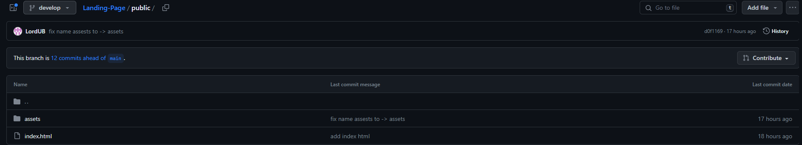
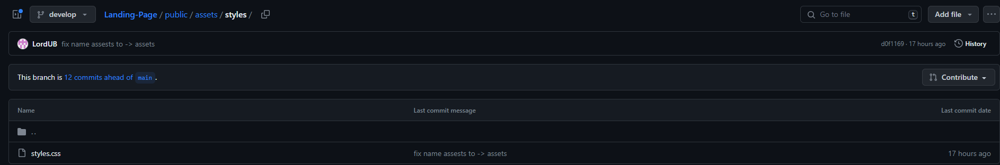
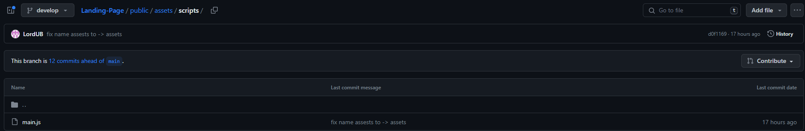
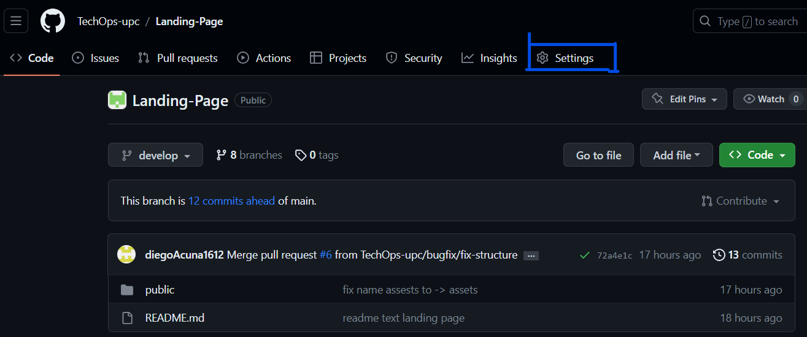
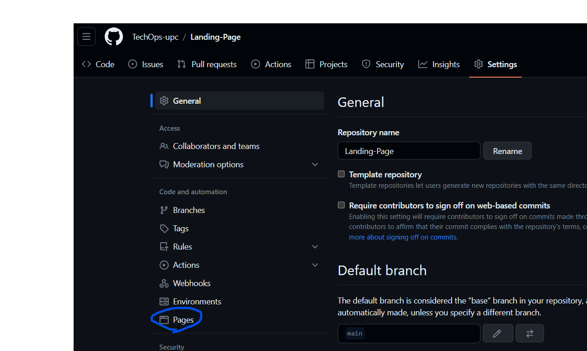
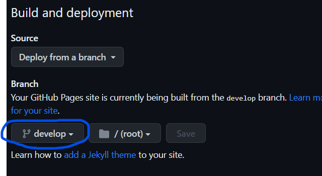
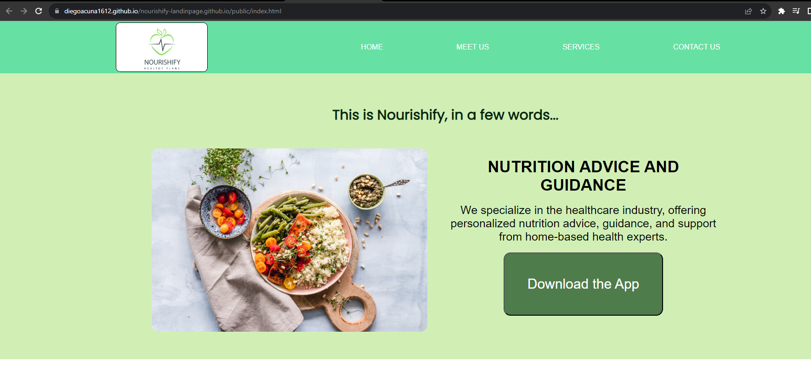
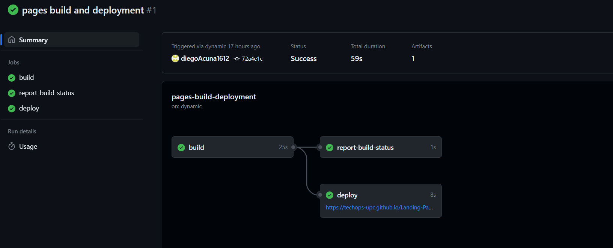

<h3>5.2.1.7. Software Deployment Evidence for Sprint Review</h3>
Como ya se ha mencionado, la gestión de nuestro código fuente se realizará a través de GitHub. Asimismo, se utilizará Github Pages para la publicación y despliegue de la página. Cada sección del Landing Page que se ha creado deberá aparecer en el siguiente vínculo:  https://diegoacuna1612.github.io/diegoAcuna1612land.github.io/public/index.html

Para el desarrollo del Landing Page de Nourishify se han utilizado las siguientes herramientas:  

 <ul>
      <li>
         <strong>Html:</strong> Es el lenguaje de marcado que estructuro nuestro Landing Page. Evidencia: Archivos HTML, el principal es index.html donde todos los integrantes juntaron el contenido realizado en su rama individual. 
      </li>
       
         

         
         

      <li>
         <strong>Css:</strong> Es aquel que nos ayudó con el diseño gráfico para que el Landing Page sea agradable e interactúale Evidencia: Se presenta el file styles.css, donde el grupo implemento el diseño de toda la estructura realizada con html. 
      </li> 
         

            
         

      <li>
         <strong>JS:</strong> Nos ayudó a desarrollar la lógica necesaria para el Landing Page. Evidencia: Se muestra el documento main.js.
      </li> 
         

            
         

   </ul>
El despliegue del Landing Page de Nourishify no pudo ser posible sin utilizar las siguientes tecnologías:

   <ul>
      <li><strong>Git:</strong> Sistema de control de versiones que está pensado en la eficiencia y compatibilidad de versiones. El cual nos ayudó a trabajar en equipo durante el desarrollo del Landing Page. 
      </li> 
         

            
         

      <li>
         <strong>Github:</strong> Plataforma de desarrollo colaborativo
      </li> 
       

            
         

      <li>
         <strong>Git Flow:</strong>Nos permitió controlar el avance de cada uno de nuestros integrantes con respecto al desarrollo del Landing Page
      </li> 
      <li>
         <strong>Git Hub Pages</strong>Servicio de Github que nos permitió alojar nuestra Landing page.
      </li>  
         

            
         

   </ul>
    
   Asimismo, se han realizado los siguientes pasos: 
   <ul>
      <li><strong>Dirigirse al repositorio de la página</strong>: Dado que se ha empleado Github, debemos ir al repositorio creado en este sitio web para publicar el Landing Page que ha desarrollado el equipo. Desde aquí, se podrá iniciar la configuración del vínculo de la página dirigiéndonos al apartado de Settings.</li> 
        

            
         

      <li><strong>Ir a la opción de páginas:</strong> Una vez presentes la configuración del repositorio, debemos dirigirnos a la sección de Pages. Esto se debe a que ahí se encuentran todas las opciones de configuración de publicación de la página en un link o vínculo.</li> 
        

            
         

      <li><strong>Elección de rama y carpeta de guardado: </strong>Dentro de pages, se debe seleccionar la rama o branch que se va a publicar en el vínculo. De la misma manera, se tiene que elegir la carpeta donde se localizará esta publicación a realizar. Finalmente podremos acceder a nuestra página con el link que aparece en la parte superior de este apartado de configuración</li> 
        

            
         

   </ul>
   Siguiendo los pasos, obtenemos el siguiente enlace: 
  https://diegoacuna1612.github.io/diegoAcuna1612land.github.io/public/index.html
    
   <strong>Evidencia de Deployment</strong>  
        

            
         

   Se puede visualizar el link en la barra de búsqueda y que está en modo público desde un computador x. 
     
   Se muestran las acciones realizadas en el github para el lanzamiento del Landing Page.  
        

            
         

     
   &lt;
   <a href="./6-services-documentation-evicence-1.md">Previous</a>
   &boxh;
   
   &gt;
     

