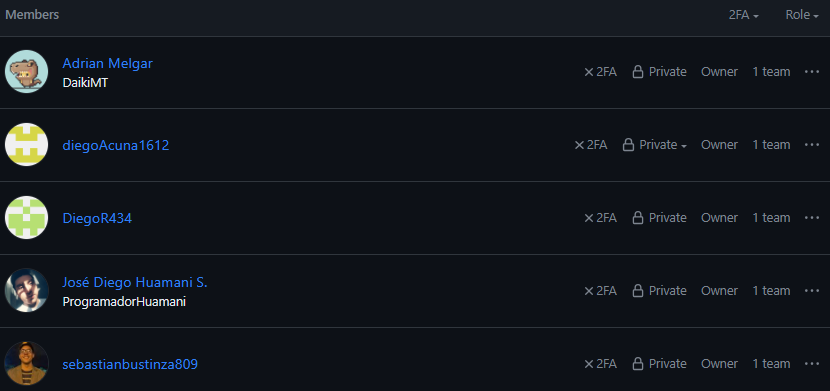
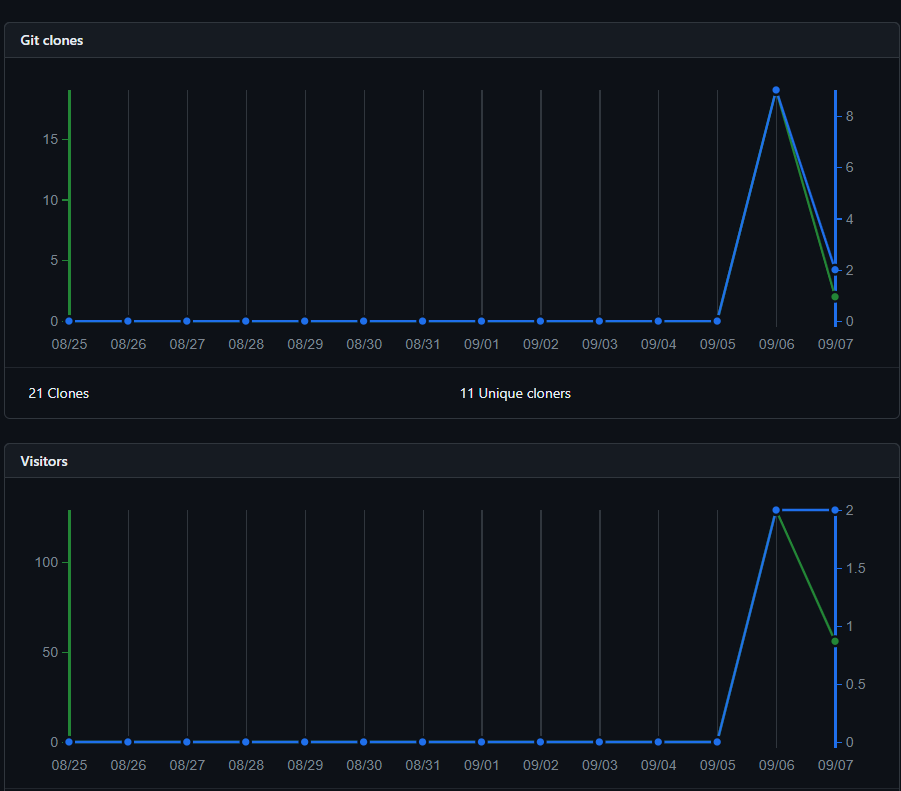
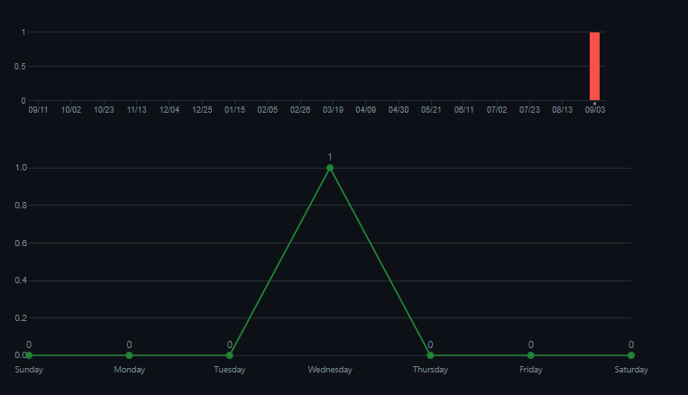
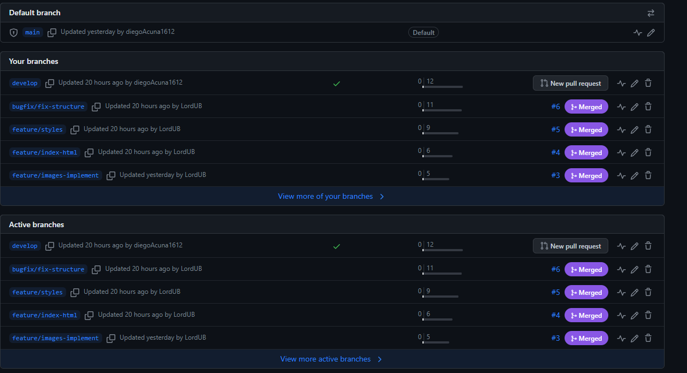
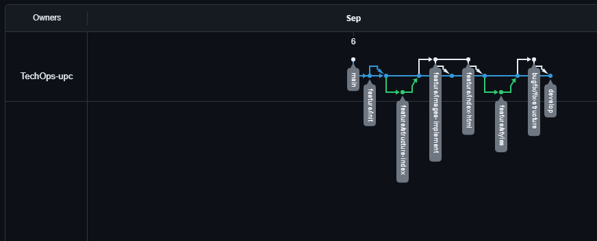

<h3>5.2.1.8. Team Collaboration Insights during Sprint</a></h3> 
Organización creada en GitHub, con dominio público para que el profesor pueda visualizar el proyecto.  
Repositorio Principal: LandingPageDS:https://github.com/TechOps-upc/Landing-Page 
Landing Page: https://diegoacuna1612.github.io/nourishify-landinpage.github.io/public/index.html
  
<strong>Integrantes y aportantes:</strong>
  
        

            
         

         
  
Semana de desarrollo para el Sprint 1: se puede ver que todos los integrantes contribuyeron.
   

               
            

  

Así, el equipo comenzó el desarrollo y la conclusión del Sprint 1.
Lenguaje por utilizar es HTML, con CSS y un poco de JS.
  
<strong>Insigths GitHub:</strong>
  

Tráfico: se clonó el repositorio para comenzar a trabajar, y se efectuaron updates.

  

               
            

  
Visitors: número de visitantes en el repositorio y se realizaron 885 vistas, para visualizar si los commits y los merges se agregaban de manera correcta.
  
Commits: estos son los públicos en el martes 12 de abril de 2023, por el equipo de desarrolladores.
  
  

               
            

 
A continuación, se presentan algunos commits:
  

               
            

  
Network: se muestran los últimos commits, los push y los merge que el equipo desarrollador efectuó.

               
            

Link de Landing Page actual:  https://diegoacuna1612.github.io/nourishify-landinpage.github.io/public/index.html

     
   &lt;
   <a href="./7-software-deplayment-evidence-1.md">Previous</a>
     

