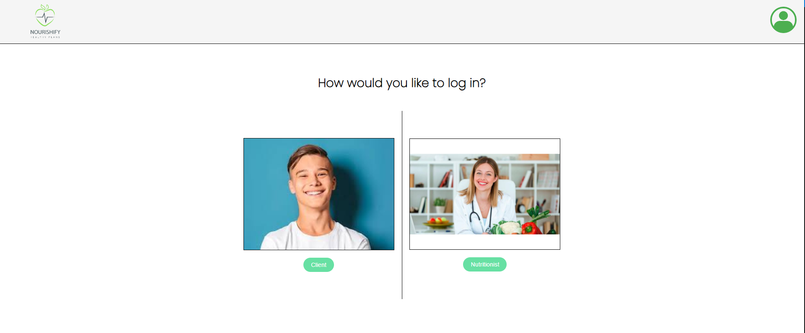
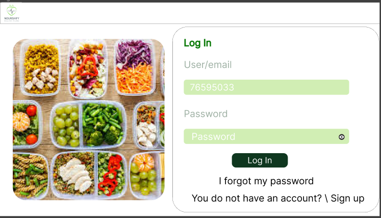
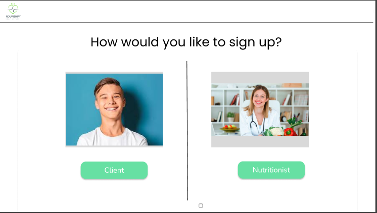
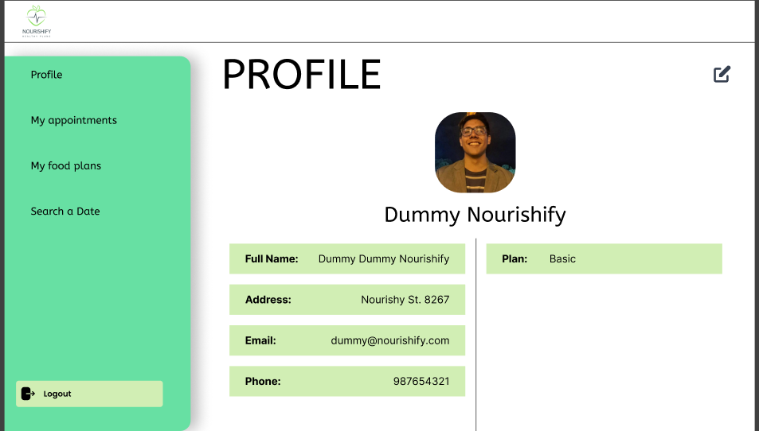
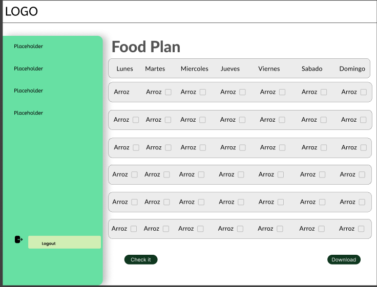

<h3>5.2.2.5. Execution Evidence for Sprint Review</h3>
<strong>Log in View by user</strong>
 
Se muestra la view se Log in, donde el usuario debera elegir como logearse

   

 

<strong>Log in View general</strong>
 

   

  
<strong>Sign in</strong>
 

   

<strong>Profile</strong>
 

   

<strong>Food plan</strong>
 

   

  

Link: https://www.figma.com/file/4xDxh5FYrqfFsA5q0P2OWh/Untitled?type=design&node-id=0%3A1&mode=design&t=KNIulrTFAMUSeGXi-1 
  

     
   &lt;
   <a href="./2.4-testing-suite-evidence.md">Previous</a>
   &boxh;
   <a href="./2.6-services-documentation-evidence.md">Next</a>
   &gt;
     

