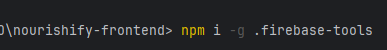
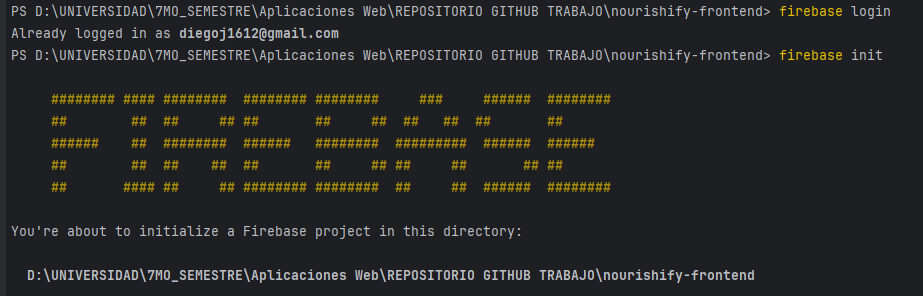
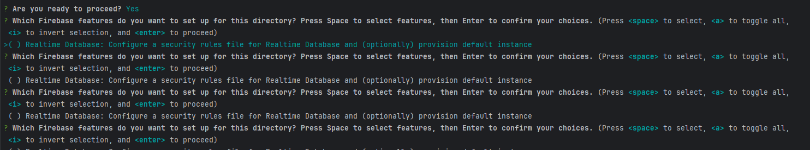
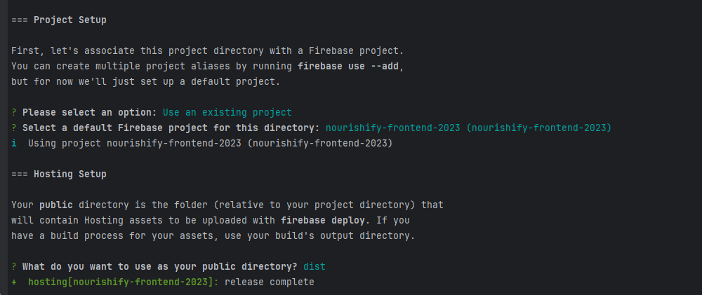
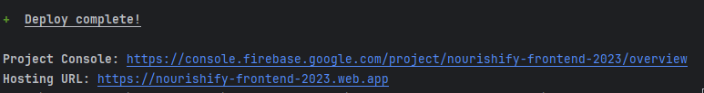
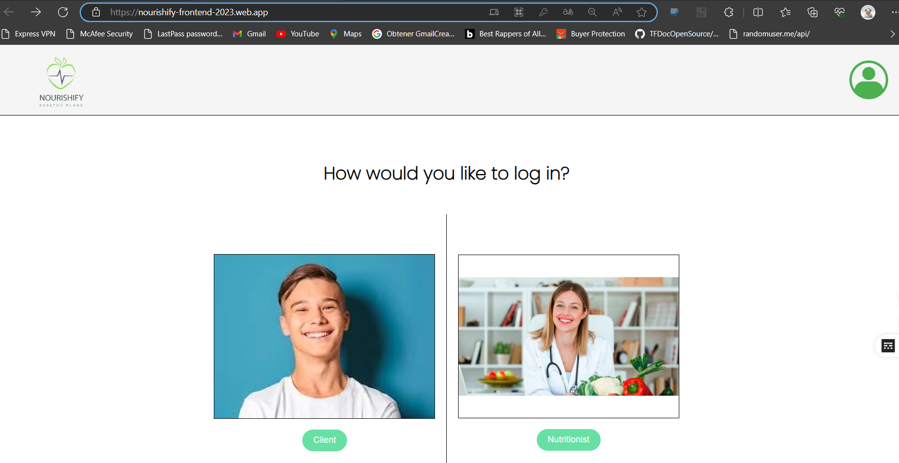

<h3>5.2.1.3. Development Evidence for Sprint Review</h3>
 
A continuación procederemos a mostrar los pasos del deployment de la aplicación web Frontend.
 
 
1.-Instalamos Firebase CLI en la raiz del proyecto
   

            
         

2.- Procedemos a usar <strong>firebase login</strong> con nuestro correo y luego inicializamos el proyecto en el directorio raiz

            
         

  
3.- Leemos y seleccionamos las instrucciones de procedimiento

            
         

            
         

  
4.-Si hemos hecho los pasos correctos no saldra dos links, uno de la consola del proyecto y el otro la URL del Hosting:

            
         

5.-Vista de aplicacion web deployada:

            
         

Link:https://nourishify-frontend-2023.web.app/