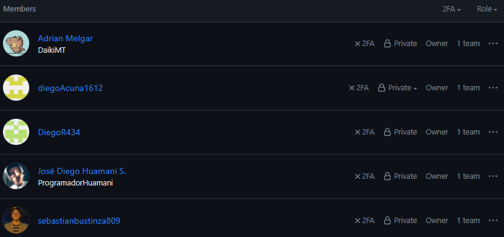

<h3>5.2.2.8. Team Collaboration Insights during Sprint</a></h3> 

Progreso y Refinamiento en la Elaboración del Informe:

En la fase subsiguiente de nuestro trabajo, el equipo persistió en la evolución y perfeccionamiento del informe del proyecto. Se llevaron a cabo una serie de actividades cruciales que impulsaron el desarrollo integral del documento:

Desarrollo Sustancial del Contenido: Se completaron las secciones pendientes del informe, abordando aspectos cruciales como los resultados detallados, el análisis profundo de datos y la formulación de conclusiones definitivas. Para enriquecer la presentación de estos elementos, se integraron gráficos y tablas que respaldan de manera visual los hallazgos y agregan profundidad al contenido.

Revisión Rigurosa y Edición Precisa: Se ejecutó una revisión minuciosa del contenido del informe con el objetivo de garantizar claridad, coherencia y una estructura bien definida. Se realizaron correcciones pertinentes para abordar errores gramaticales y se perfeccionó la redacción para mejorar la fluidez y comprensión del lector.

Mantenimiento del Registro de Versiones: Se aseguró la actualización constante del registro de versiones en el repositorio de GitHub, reflejando de manera detallada y organizada cada modificación realizada en el informe desde su primera entrega. Este historial de versiones actúa como un registro preciso de la evolución del documento a lo largo del tiempo, proporcionando una trazabilidad clara de los cambios implementados. Este enfoque contribuye a la transparencia y coherencia en el proceso de elaboración del informe.

Organización creada en GitHub, con dominio público para que el profesor pueda visualizar el proyecto. 

#### Organizacion de GitHub: [Link to TechOps-UPC organization](https://github.com/TechOps-upc)

#### Landing Page Desplegada:  [Link to Our Landing Page](https://diegoacuna1612.github.io/diegoAcuna1612land.github.io/public/index.html)

#### Repositorio del FrontEnd: [Link to our GitHub Repository](https://github.com/TechOps-upc/nourishify-frontend)

  
### Evidencias
   

            
             
            Participantes del sprint
              
   

   

       
             
       Contribuyentes en el repositorio
         
   

   

       
             
       Commits en el repositorio
         
   

   

      
             
        Ultimoms commits
        
   

   

      
             
       Trafico
   
     
  