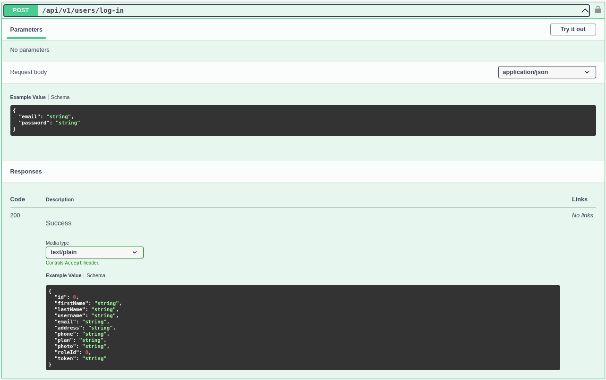
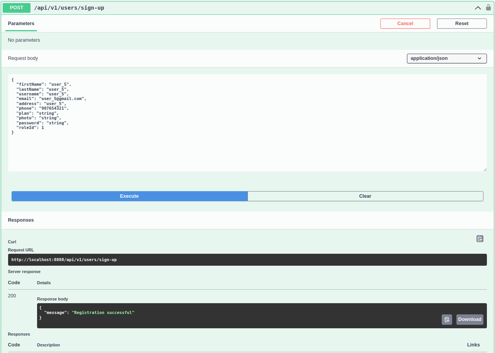
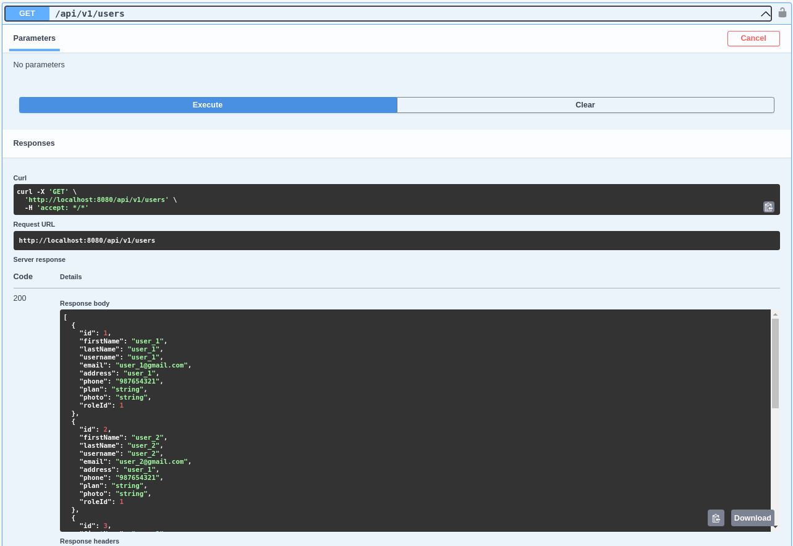
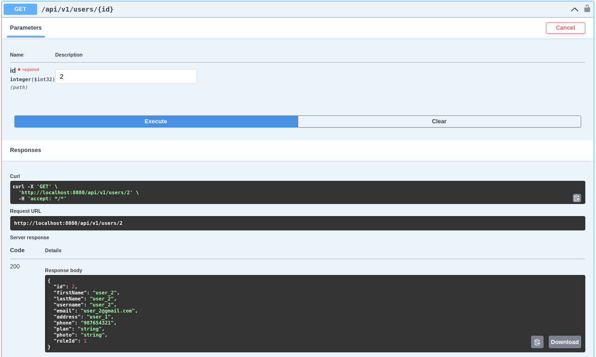
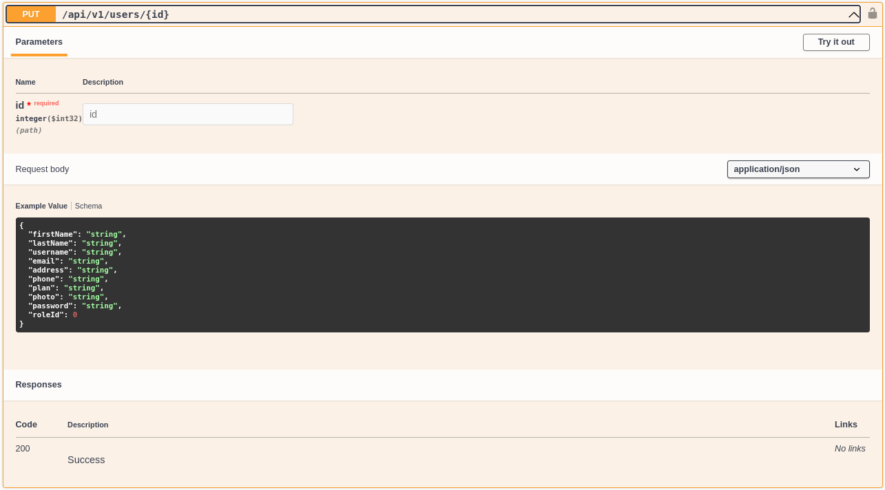
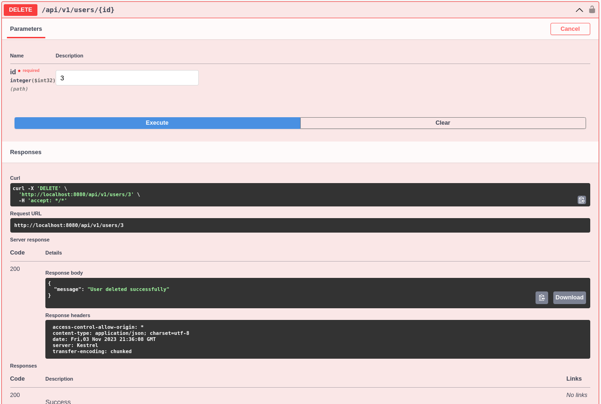

<h3>5.2.3.6. Services Documentation Evidence for Sprint Review</h3>

Hemos desarrollado una serie de endpoints para la gestión de roles y usuarios en nuestra aplicación. A continuación, se detallan estos endpoints y cómo interactuar con ellos:

<h3>Roles</h3>
<h4>GET</h4>
<strong>Path: </strong>/roles 
<strong>Parámetros: Ninguno</strong> 
Este endpoint recupera todos los roles disponibles en la aplicación.

   

<h4>POST</h4>
<strong>Path: </strong>/roles 
<strong>Parámetros: </strong>Ninguno 
Este endpoint permite la creación de un nuevo rol en la aplicación.

   

<h3>USERS</h3>
<h4>POST</h4>
<strong>Path: </strong>/users/log-in 
Este endpoint permite a los usuarios iniciar sesión en la aplicación.

   

<h4>POST</h4>
<strong>Path: </strong>/users/sign-up 
<strong>Parámetros:  </strong>Se debe proporcionar el nombre del nuevo rol en el cuerpo de la solicitud. 
Este endpoint permite a los usuarios registrarse en la aplicación.

   

<h4>POST</h4>
<strong>Path: </strong>/users 
<strong>Parámetros:  </strong>Ninguno. 
Este endpoint recupera una lista de todos los usuarios registrados en la aplicación.

   

<h4>POST</h4>
<strong>Path: </strong>/users/{id} 
<strong>Parámetros:  </strong>Se debe proporcionar el id del usuario que se quiere recuperar. 
Este endpoint recupera un usuario específico por su ID.

   

<h4>PUT</h4>
<strong>Path: </strong>/users/{id} 
<strong>Parámetros:  </strong>Debe proporcionarse la información actualizada del usuario en el cuerpo de la solicitud. 
 Este endpoint permite actualizar la información de un usuario por su ID.

   

<h4>Delete</h4>
<strong>Path: </strong>/users/{id} 
<strong>Parámetros:  </strong>Se debe proporcionar el id del usuario que se quiere eliminar. 
Este endpoint permite eliminar a un usuario por su ID.

   

<h3>Repositorio del Web Service:</h3>
<a>https://github.com/TechOps-upc/nourshify-backend</a>
  
<strong>Last commits:</strong>

<strong>id:</strong> a4bf98875091b40ddafe731335f00efbd4b7962a 
Changed login parameter to email and added more information for the user model

<strong>id:</strong> ba46522c2f7ae1703e8d86ae572f5e7ba57156b7 
Merged worked bounded context to develop

<strong>id:</strong> 05bfcef47747c93c324545c8b7bb53a70a322ff5 
Merged develop to master before deployment

<strong>id:</strong> 87b80c33a3444d6eecf083017dbb9c852f79734f 
Deployment
