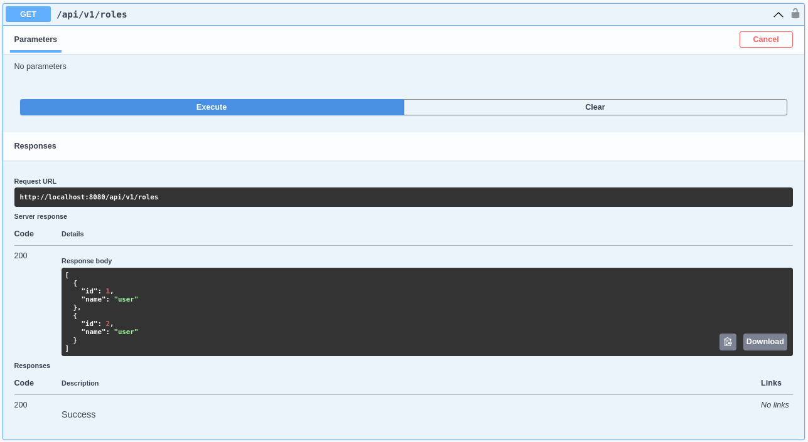

<h3>5.2.3.6. Services Documentation Evidence for Sprint Review</h3>

Hemos desarrollado una serie de endpoints para la gestión de roles y usuarios en nuestra aplicación. A continuación, se detallan estos endpoints y cómo interactuar con ellos:

<h3>Roles</h3>
<h4>GET</h4>
<strong>Path: /roles</strong> 
Este endpoint recupera todos los roles disponibles en la aplicación.

   

<h4>POST</h4>
<strong>Path: /roles</strong> 
Este endpoint permite la creación de un nuevo rol en la aplicación.

   

