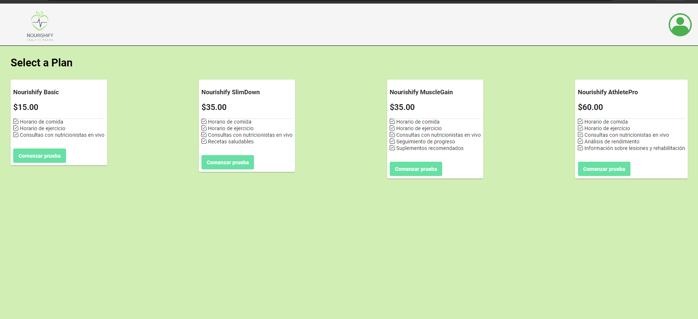
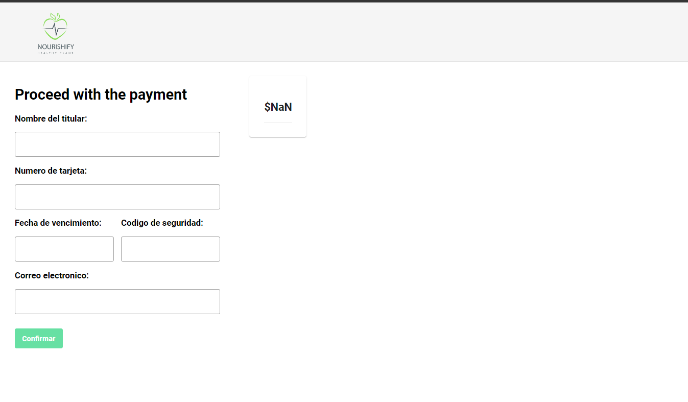
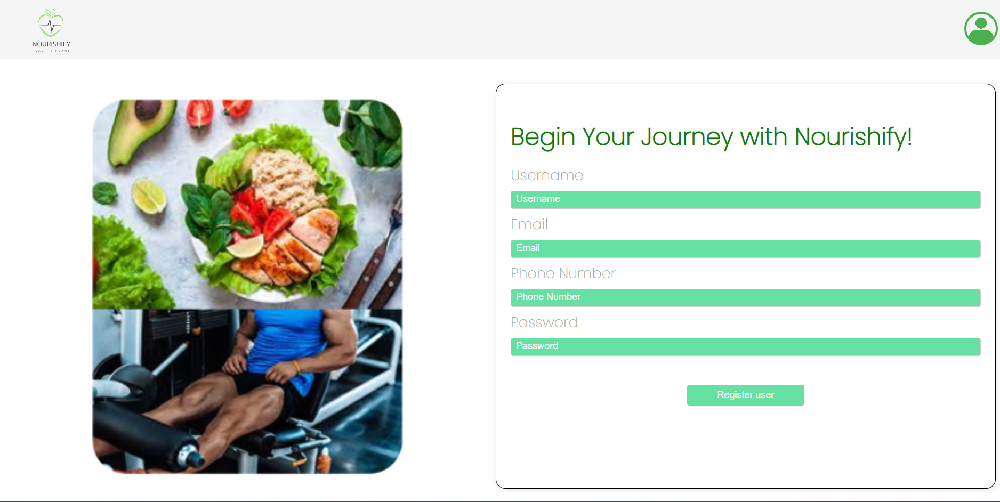
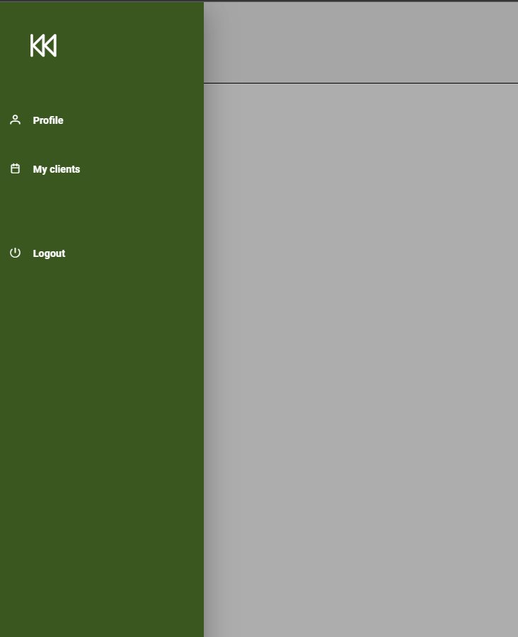
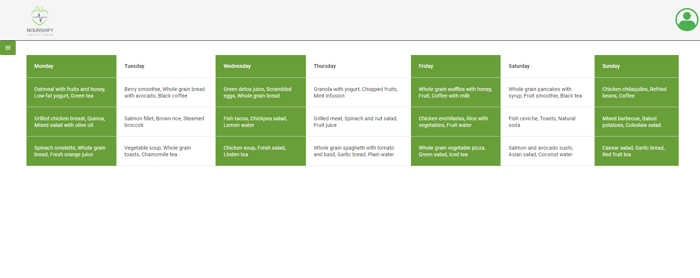
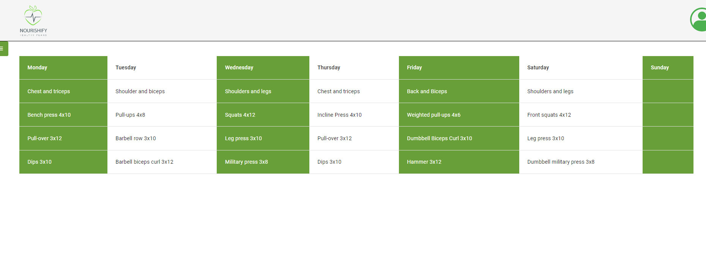
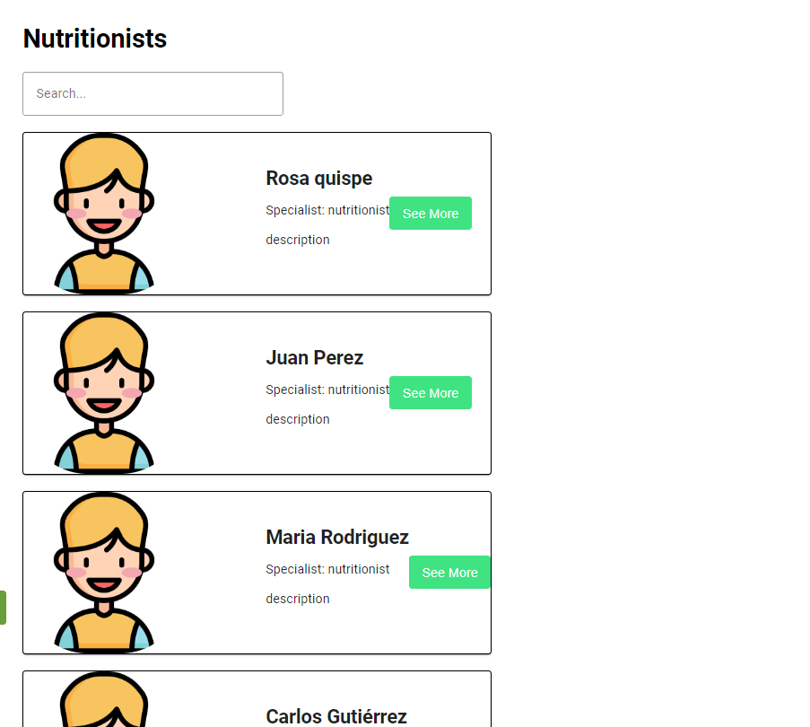
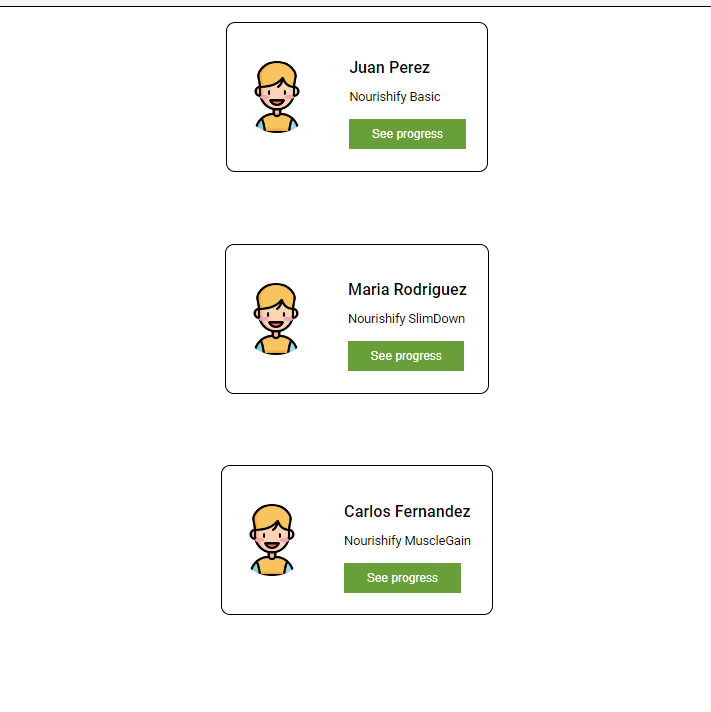

<h3>5.2.3.5. Execution Evidence for Sprint Review</h3>
Vistas implementadas para este sprint se realizaron para el segmento pacientes y nutricionistas.
  
<strong>Subscription plans</strong>
 
Se muestra la view de planes de subscripcion, donde el usuario debera elegir como subscribirse

   

 

<strong>Payment</strong>
 

   

  
<strong>Register form</strong>
 

   

<strong>Sidebar</strong>
 

   

<strong>Food plan</strong>
 

   

<strong>Work out plan</strong>
 

   

<strong>Search nutritionist</strong>
 

   

<strong>Appointments for nutritionist</strong>
 

   

 

Link: https://www.figma.com/file/4xDxh5FYrqfFsA5q0P2OWh/Untitled?type=design&node-id=0%3A1&mode=design&t=KNIulrTFAMUSeGXi-1 
  

     
   &lt;
   <a href="./3.4-testing-suite-evidence.md">Previous</a>
   &boxh;
   <a href="./3.6-services-documentation-evidence.md">Next</a>
   &gt;
     

