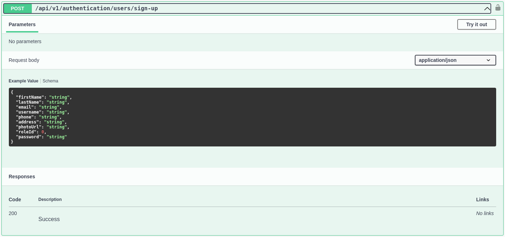
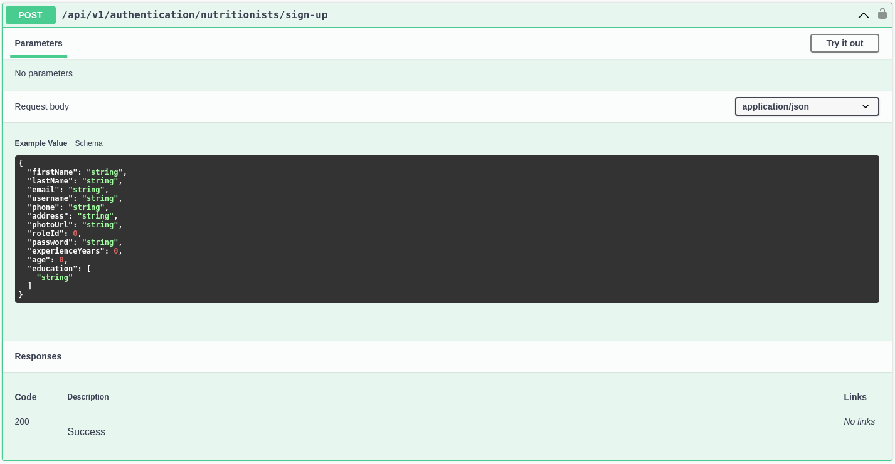
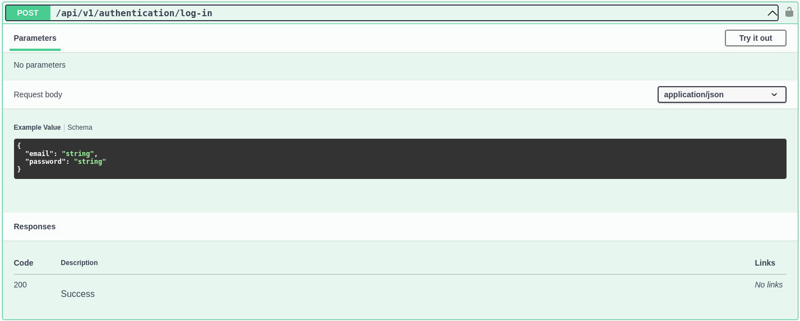
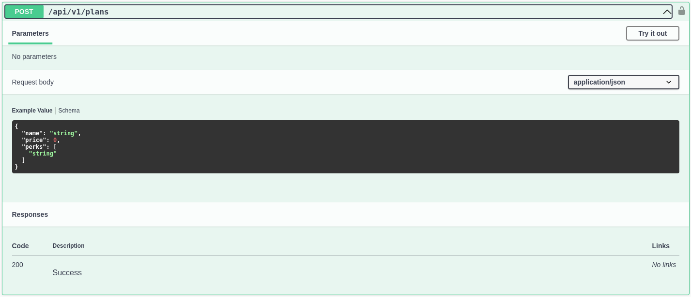
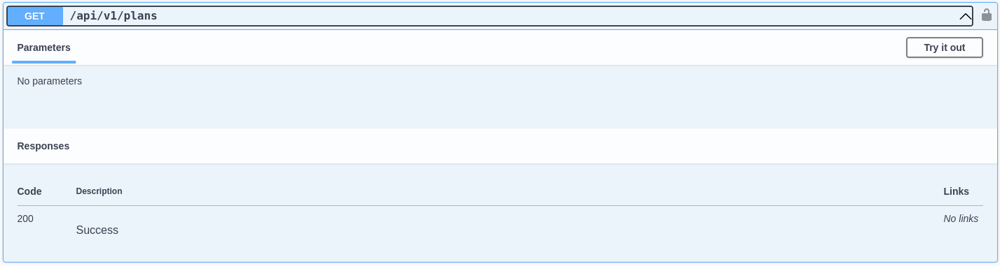
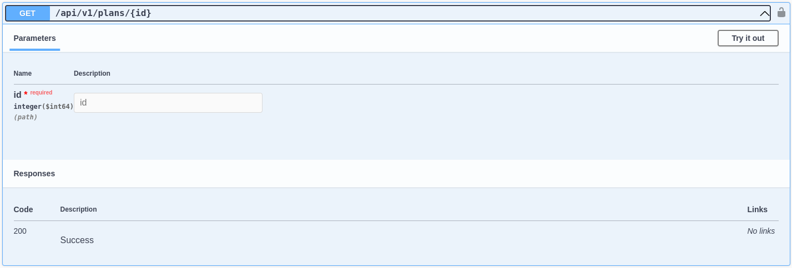
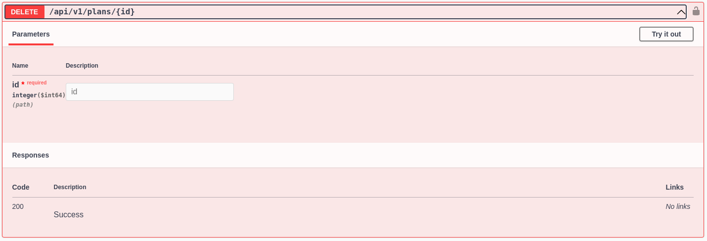
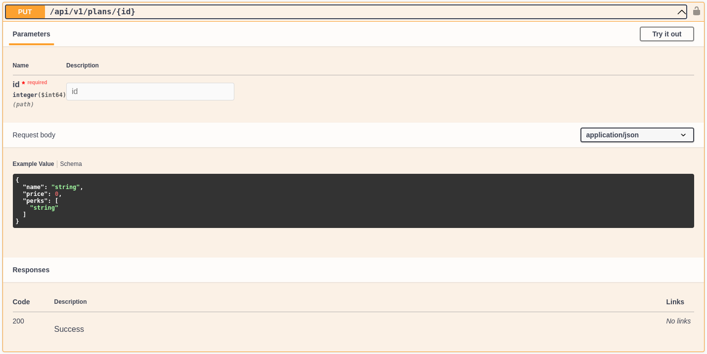
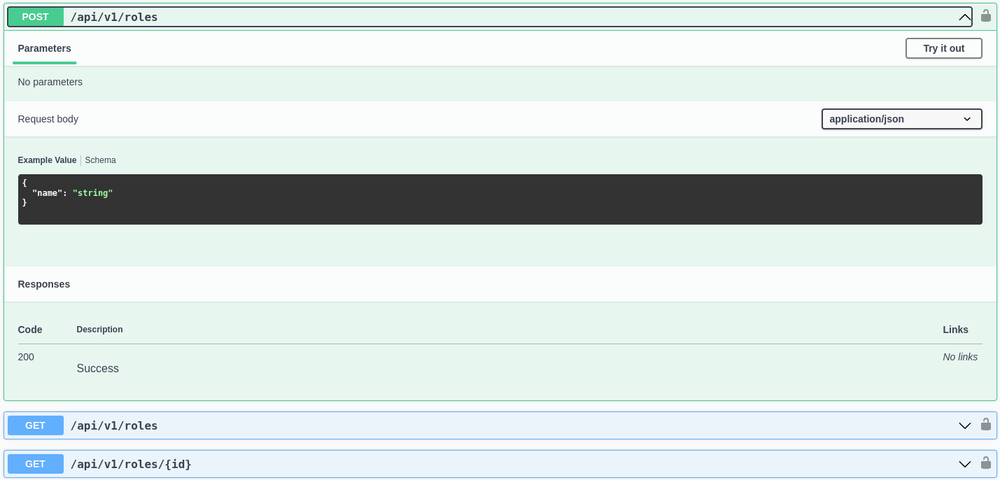
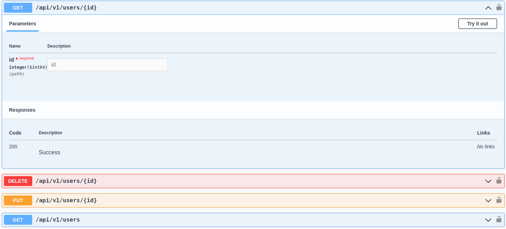

<h3>5.2.3.6. Services Documentation Evidence for Sprint Review</h3>

Hemos desarrollado una serie de endpoints para la gestión de roles y usuarios en nuestra aplicación. A continuación, se detallan estos endpoints y cómo interactuar con ellos:

<h3>Authentification</h3>
<h4>POST</h4>
<strong>Path: </strong>/authentication/users/sign-up 
<strong>Parámetros:</strong> 

{ 
  "firstName": "string", 
  "lastName": "string", 
  "email": "string", 
  "username": "string", 
  "phone": "string", 
  "address": "string", 
  "photoUrl": "string", 
  "roleId": 0, 
  "password": "string" 
}

Este permite crear un usuario.

   

<h4>POST</h4>
<strong>Path: </strong>/authentication/nutritionist/sign-up 
<strong>Parámetros:</strong> 

{ 
  "firstName": "string", 
  "lastName": "string", 
  "email": "string", 
  "username": "string", 
  "phone": "string", 
  "address": "string", 
  "photoUrl": "string", 
  "roleId": 0, 
  "password": "string", 
  "experienceYears": 0, 
  "age": 0,  
  "education": [
    "string" 
  ] 
}

Este endpoint permite la creación de un nutricionista.

   

<h3>USERS</h3>
<h4>POST</h4>
<strong>Path: </strong>/users/log-in 
Este endpoint permite a los usuarios iniciar sesión en la aplicación.

   

<h4>POST</h4>
<strong>Path: </strong>/users/sign-up 
<strong>Parámetros:  </strong>Se debe proporcionar el nombre del nuevo rol en el cuerpo de la solicitud. 
Este endpoint permite a los usuarios registrarse en la aplicación.

   

<h4>POST</h4>
<strong>Path: </strong>/users 
<strong>Parámetros:  </strong>Ninguno. 
Este endpoint recupera una lista de todos los usuarios registrados en la aplicación.

   

<h4>POST</h4>
<strong>Path: </strong>/users/{id} 
<strong>Parámetros:  </strong>Se debe proporcionar el id del usuario que se quiere recuperar. 
Este endpoint recupera un usuario específico por su ID.

   

<h4>PUT</h4>
<strong>Path: </strong>/users/{id} 
<strong>Parámetros:  </strong>Debe proporcionarse la información actualizada del usuario en el cuerpo de la solicitud. 
 Este endpoint permite actualizar la información de un usuario por su ID.

   

<h4>Delete</h4>
<strong>Path: </strong>/users/{id} 
<strong>Parámetros:  </strong>Se debe proporcionar el id del usuario que se quiere eliminar. 
Este endpoint permite eliminar a un usuario por su ID.

   

   

   

<h3>Repositorio del Web Service:</h3>
<a>https://github.com/TechOps-upc/nourshify-backend</a>
  
<strong>Last commits:</strong>

<strong>id:</strong> 7d8943dc3d34d096d93042fc55977a07a3ca7de5 
Update appsettings.Development.json

<strong>id:</strong> 305b22bc067a091496822e6a842e85e7ede1b5f4 
Update appsettings.json

<strong>id:</strong> c04e82392d3d977bb3c47f2c5f3ef67f3ae8c64b 
Merge pull request #11 from TechOps-upc/feature/subscription-plans Feature/subscription plans

<strong>id:</strong> 42e0b3ac2e8ebfa70ee1c97c6c88312e43c5fde0 
Implemented missing plans endpoint verbs
