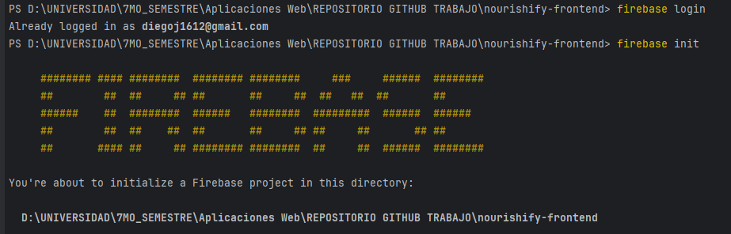
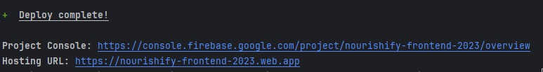
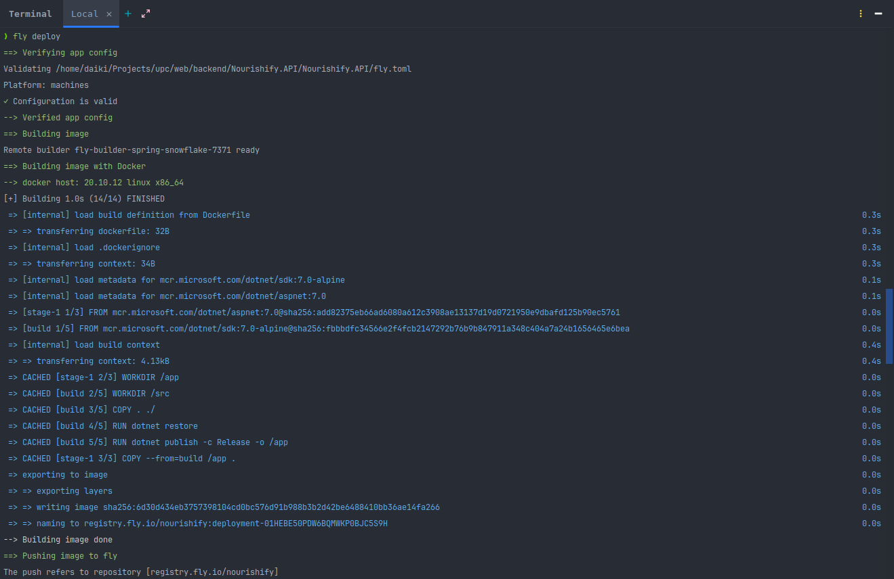
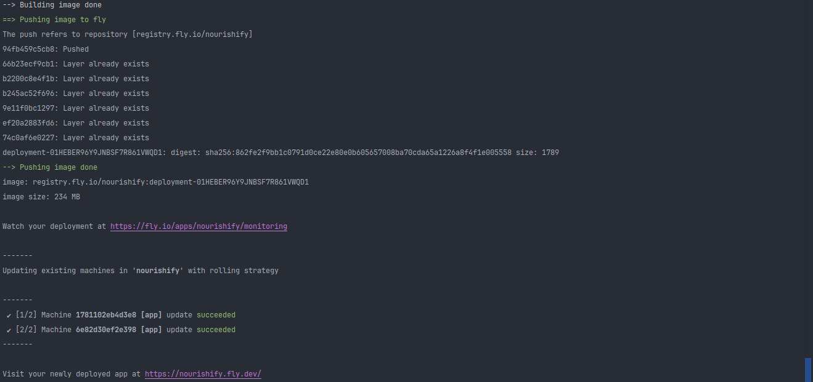
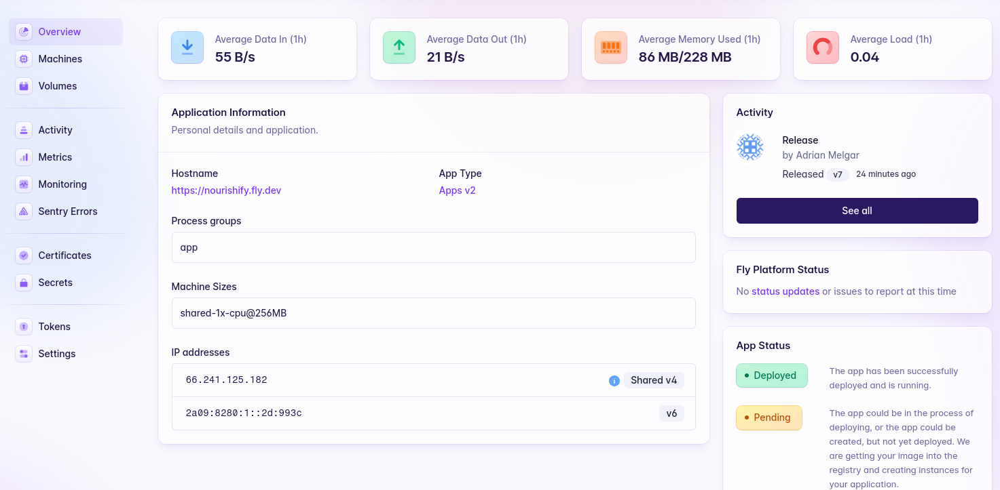
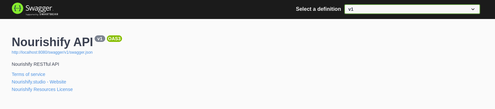
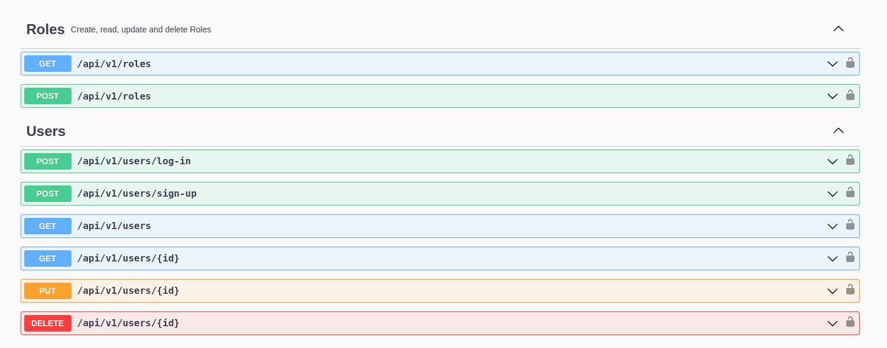
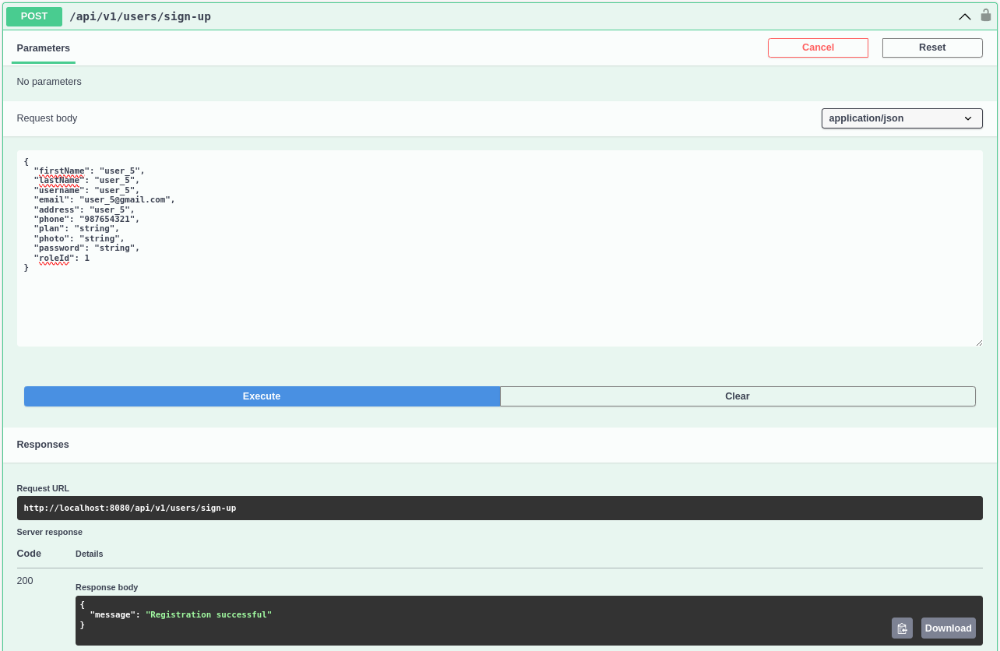
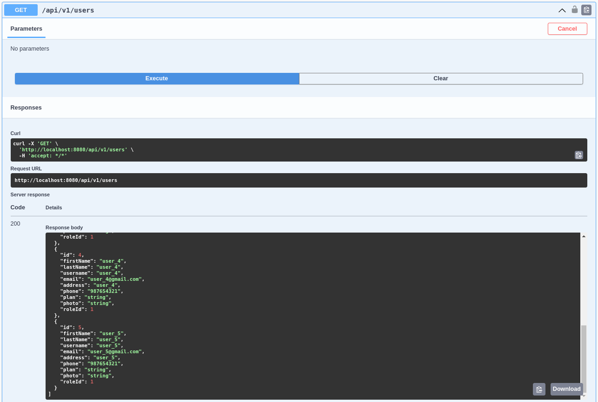

<h3>5.2.3.7. Development Evidence for Sprint Review</h3>
 
A continuación procederemos a mostrar los pasos del deployment de la aplicación web Frontend.
 
 

1.- Procedemos a usar <strong>firebase login</strong> con nuestro correo y luego inicializamos el proyecto en el directorio raiz

            
         

  
2.- Leemos y seleccionamos las instrucciones de procedimiento

            
         

  
3.-Si hemos hecho los pasos correctos no saldra dos links, uno de la consola del proyecto y el otro la URL del Hosting:

            
         

4.-Vista de aplicacion web deployada:

            
         

Link:https://nourishify-frontend-2023.web.app/

 
A continuación procederemos a mostrar los pasos del deployment de la aplicación web Backend.
 

1. El deploy del backend fue hecho en <strong>fly.io</strong> y se uso el comando <strong>fly launch</strong> y <strong>fly deploy</strong>.

            
            
         

2. Monitoreamos el deployment desde el link proporsionado por fly.io

   

3. Vista del swagger de la API deployada:

   
   
   
   

