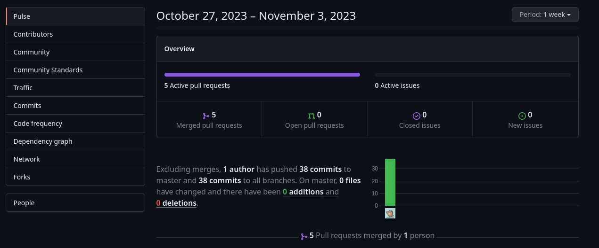
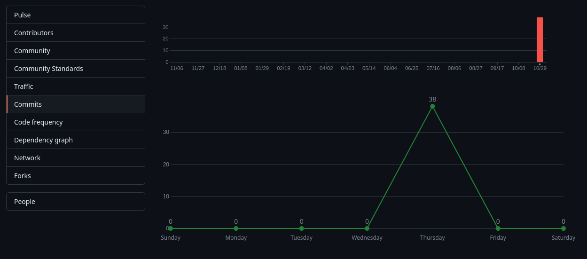

<h3>5.2.2.8. Team Collaboration Insights durante el Sprint</h3> 
Se creó una organización en GitHub con un dominio público para que el profesor pueda visualizar el proyecto. .

Cabe destacar la participación activa de todo el equipo en el desarrollo del proyecto, abarcando desde el Landing Page hasta las capas técnicas del Frontend y Backend, como se evidencia en las imágenes que muestran sus commits. *Team Collaboration Insights* se erige como un recurso fundamental, no solo para comprender la eficacia del equipo desde una perspectiva técnica, sino también para apreciar el esfuerzo conjunto que ha llevado al éxito del proyecto.

<strong></strong>
  
FrontEnd Web Application
Se muestra la cantidad de merge pull request y los autores que participaron en el FrontEnd
        

            
         

         Contribuidores en la rama main
        

            
         

         Commits en el repositorio de github y como se interactua con las otras ramas
        

            

        Se visualizan la frecuencia de los commits
        

            

BackEnd Web Application
  

Se muestra la cantidad de merge pull request y los autores que participaron en el BackEnd
            
              Contribuidores en la rama main
            
              Commits en el repositorio de github y como se interactua con las otras ramas
            
             Se visualizan la frecuencia de los commits
            
         

