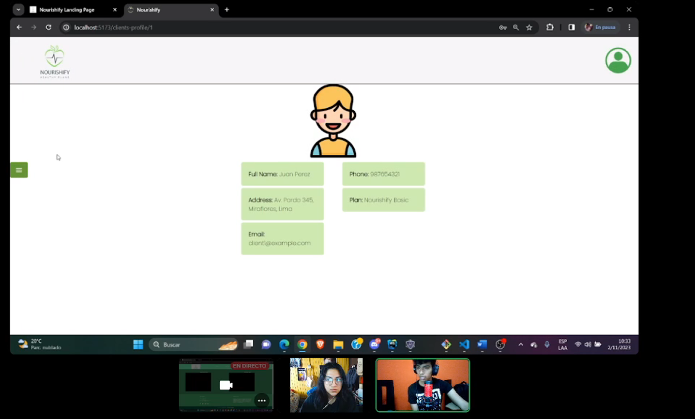
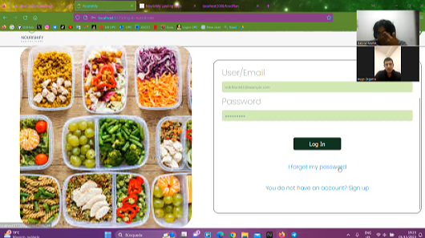

<h3>5.3.2 Registro de entrevistas. </a></h3> 

### **Usuario cliente**

<h4>Entrevista 1</h4>

| Nombre  | Apellido | Edad |
| :------ | :------- | :--: |
| Aracely | Sanches  |  21  |

Resumen entrevista: La entrevista se llevo a cabo con Aracely Sanchez. Durante la demostración, Aracely, resalta la claridad y fluidez de la aplicación. Aracely afirma que la aplicación es clara, detallada, organizada y fácil de usar. Sin embargo, sugiere mejoras en la calidad y diseño de las imágenes, considerándolas simples y con demasiados cuadrados. A pesar de estos detalles, Araceli encuentra que la aplicación tiene un diseño visual agradable y no abrumador
  
<h4>Entrevista 2</h4>

| Nombre  | Apellido | Edad |
| :------ | :------- | :--: |
| Christian  | Barzola  |  21  |

Resumen entrevista: La entrevista se llevó a cabo con Christian Barzola, un joven de 21 años residente en Lima, específicamente en el distrito de San Martín de Porres. Actualmente, Christian está cursando el séptimo ciclo de la carrera de Ingeniería de Sistemas en la Universidad Peruana de Ciencias Aplicadas.
Durante la conversación, Christian compartió sus impresiones sobre la aplicación desde la perspectiva del usuario. Destacó que encuentra la aplicación satisfactoria y que cumple con las expectativas de un usuario exigente. Le pareció interesante y elogió su interfaz intuitiva. Sin embargo, también señaló algunas áreas de mejora potencial en la aplicación. En particular, mencionó la necesidad de reducir la redundancia en la interfaz, ya que considera que esto puede generar confusión entre los usuarios. Sus comentarios ofrecen valiosas sugerencias para perfeccionar aún más la experiencia del usuario en la aplicación.

### **Usuario nutricionista**

 
<h4>Entrevista 1</h4>

| Nombre  | Apellido | Edad |
| :------ | :------- | :--: |
|  Hugo |  Isidro  | 29  |

Resumen entrevista:El entrevistado fue Hugo Isidro Zegarra. Tiene 29 años y reside en el distrito de Surquillo. Actualmente es asesor nutricional con una cartera de 25 clientes. Nos comenta que la landing page presenta de manera eficiente el producto y es de un diseño bastante fluido y armonico. Resalta que la informacion importante es facil de identificar sin mucho esfuerzo. Con respecto a la aplicacion web, considera que el diseño es un tanto simple y minimalista. Luego nos comenta que la aplicacion le brinda lo necesario para dar un buen servicio a sus clientes.
  
<h4>Entrevista 2</h4>

| Nombre  | Apellido | Edad |
| :------ | :------- | :--: |
|  Shirley |  Muñoz  | 45    |

Resumen entrevista: La licenciada Shirley Marlene Muñoz Ibañez, es nutricionista clínica en el hospital Cayetano Heredia, tiene 45 años y reside en Los Olivos. Shirley se mostró interesada en nuestro landing page, le gustó nuestros tipos de planes para los clientes, le gustó el diseño y no tuvo dudas respecto a nuestro landing page. Respecto a nuestra Aplicación Web, pudo ingresar a su cuenta fácilmente, se visualizó correctamente su perfil junto con los datos que ingresó y su lista de clientes. Indicó que la aplicación es amigable y se puede saber en qué parte te encuentras en todo momento, es sencillo usar la aplicación y puede realizar todas las tareas, puede navegar tranquila por la aplicación, en toda la aplicación los elementos son consistentes, es sencillo corregir su error, no es necesario recordar la ubicación de todas las opciones y funciones, puede navegar libremente y cree que sería mejor si colocamos más imágenes u otro color de fondo para que se más llamativo. 
  
<h4>Entrevista 3</h4>

| Nombre  | Apellido | Edad |
| :------ | :------- | :--: |
| Maria  | Ibañez   | 69    |

Resumen entrevista: La licenciada Maria Esther Ibañez, es nutricionista en el hospital Cayetano Heredia, tiene 69 años y reside en Los Olivos. Maria Esther se mostró sorprendida por nuestro buen landing page, no tuvo dudas respecto a eso y le gustó el diseño. Respecto a nuestra Aplicación Web, pudo ingresar a su cuenta fácilmente, se visualizó correctamente su perfil junto a los datos que ingresó y su lista de clientes. Indicó que es sencillo siempre ver en qué parte se encuentra, la aplicación le permite realizar todas las tareas, la aplicación le permite moverse libremente, los elementos de la interfaz son consistentes en toda la aplicación, es sencillo corregir sus errores, no es necesario recordar la ubicación de cada elemento porque la aplicación es amigable y es sencillo usarla, no se siente limitada en la interacción y cree que podemos mejorar el atractivo visual colocando más imágenes sobre nutrición en las vistas pero señala que le gustó y está bien por ahora.

 

<a href="https://upcedupe-my.sharepoint.com/personal/u20201c794_upc_edu_pe/_layouts/15/stream.aspx?id=%2Fpersonal%2Fu20201c794%5Fupc%5Fedu%5Fpe%2FDocuments%2Fupc%2Dpre%2D202302%2Dsi730%2DSW52%2DNourishify%2Dvalidation%2Dsprint%2D3%2Emp4&referrer=StreamWebApp%2EWeb&referrerScenario=AddressBarCopied%2Eview">Link Validation Interviews </a>