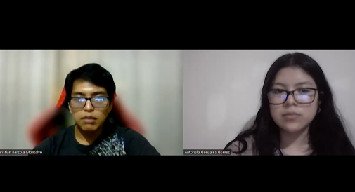

<h3>5.3.2 Registro de entrevistas. </a></h3> 

### **Usuario cliente**

<h4>Entrevista 1</h4>

| Nombre  | Apellido | Edad |
| :------ | :------- | :--: |
| Aracely | Sanches  |  21  |

Resumen entrevista:
  
<h4>Entrevista 2</h4>

| Nombre  | Apellido | Edad |
| :------ | :------- | :--: |
| Christian  | Barzola  |  21  |

Resumen entrevista: La entrevista se llevó a cabo con Christian Barzola, un joven de 21 años residente en Lima, específicamente en el distrito de San Martín de Porres. Actualmente, Christian está cursando el séptimo ciclo de la carrera de Ingeniería de Sistemas en la Universidad Peruana de Ciencias Aplicadas.
Durante la conversación, Christian compartió sus impresiones sobre la aplicación desde la perspectiva del usuario. Destacó que encuentra la aplicación satisfactoria y que cumple con las expectativas de un usuario exigente. Le pareció interesante y elogió su interfaz intuitiva. Sin embargo, también señaló algunas áreas de mejora potencial en la aplicación. En particular, mencionó la necesidad de reducir la redundancia en la interfaz, ya que considera que esto puede generar confusión entre los usuarios. Sus comentarios ofrecen valiosas sugerencias para perfeccionar aún más la experiencia del usuario en la aplicación.

### **Usuario nutricionista**

 
<h4>Entrevista 1</h4>

| Nombre  | Apellido | Edad |
| :------ | :------- | :--: |
|  Hugo |  Isidro  | 29  |

Resumen entrevista:El entrevistado fue Hugo Isidro Zegarra. Tiene 29 años y reside en el distrito de Surquillo. Actualmente es asesor nutricional con una cartera de 25 clientes. Nos comenta que la landing page presenta de manera eficiente el producto y es de un diseño bastante fluido y armonico. Resalta que la informacion importante es facil de identificar sin mucho esfuerzo. Con respecto a la aplicacion web, considera que el diseño es un tanto simple y minimalista. Luego nos comenta que la aplicacion le brinda lo necesario para dar un buen servicio a sus clientes.
  
<h4>Entrevista 2</h4>

| Nombre  | Apellido | Edad |
| :------ | :------- | :--: |
|  |   |    |

Resumen entrevista:
  
<h4>Entrevista 3</h4>

| Nombre  | Apellido | Edad |
| :------ | :------- | :--: |
|  |   |    |

Resumen entrevista:

 